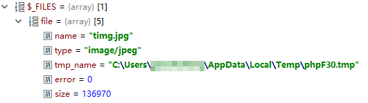

# 处理表单

## 接收表单参数

PHP中，可以通过全局变量`$_GET`和`$_POST`接收GET请求和POST请求的参数。它们使用方式类似关联数组，我们的请求参数会以键值对的形式存储在这些全局变量中。

注：别被这个夸张的命名方式和到处乱飞的全局变量吓倒，PHP这种随意的语法反倒特别适合小项目

下面例子中，我们通过POST方式提交一些表单参数：

index.php
```php
<!DOCTYPE html>
<html lang="en">
<head>
	<meta charset="UTF-8">
	<title>测试表单</title>
</head>
<body>
	<form method="post" action="form.php">
		<fieldset>
			<input type="text" name="username" placeholder="用户名"/>
			<input type="text" name="password"  placeholder="密码"/>
			<input type="submit" value="提交" />
		</fieldset>
	</form>
</body>
</html>
```

form.php
```php
<?php
$username = $_POST["username"];
$password = $_POST["password"];

echo "Hello, ".$username.". Your password is ".$password;
```

上面代码非常简单，就是通过POST向`form.php`传一些参数，然后通过`echo`显示出来。

## 文件上传

PHP中小文件上传非常简单，因为PHP提供了`$_FILES`这个全局变量，提交到服务器的文件会直接缓存在服务器的临时文件夹中，然后交给PHP脚本处理，而不像Java中我们要从输入流那一步开始处理。

下面例子中，我们表单上传一个文件：

index.php
```html
<!DOCTYPE html>
<html lang="en">
<head>
	<meta charset="UTF-8">
	<title>上传文件</title>
</head>
<body>
	<form method="post" action="form.php" enctype="multipart/form-data">
		<fieldset>
			<input type="file" name="file"/>
			<input type="submit" value="提交" />
		</fieldset>
	</form>
</body>
</html>
```

form.php
```php
<?php
$file = $_FILES["file"];
move_uploaded_file($file["tmp_name"], "upload/".$file["name"]);
```

上面的代码其实就是将上传的文件保存在项目根目录的`upload`文件夹中（要提前创建这个文件夹），我们用到了`move_uploaded_file`这个函数，它传入的参数是临时文件的地址和目标要存储的文件地址。

程序运行时，我们可以断点调试一下这个`$_FILES`全局变量，看看里面都有什么，我们表单上传文件的`name`是`file`，`$_FILES`中就可以看到对应的内容。



* 注意：`$_FILES["file"]["type"]`是根据上传文件后缀判断的，根本没做二进制校验，因此我们不能凭这个type就认定用户上传的文件类型，这是非常危险的。

如图所示，这个变量中包含了上传文件的基本信息，包括文件名，文件类型，临时文件夹位置，错误码，文件字节数。通过这些信息，我们可以对上传文件进行一些更加详细的处理，这里就不多演示了。
