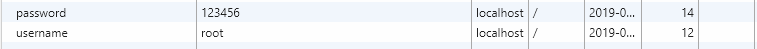
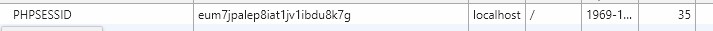

# Cookie和Session

这篇文章我们介绍如何在PHP中使用Cookie和Session。

## Cookie

Cookie用于以键值对的形式记录一些小块的信息。

### 设置Cookie

在PHP中，`setcookie`函数用于设置Cookie，它的实际实现其实是通过添加Cookie的响应HTTP报头，因此我们手动使用`header`也是完全可以的，但是既然PHP为我们封装好了Cookie的设置操作，我们就不用手动实现了。

```php
setcookie(name, value, expire, path, domain);
```

下面例子中，我们向用户的Cookie中写入了用户名和密码（当然实际开发中我们不会这么做的，现代的前后端分离项目中，登录状态一般都是通过token和sessionStorage实现的）：

```php
<?php
setcookie("username","root", time() + 3600);
setcookie("password","123456", time() + 3600);
?>

<!DOCTYPE html>
<html lang="en">
<head>
	<meta charset="UTF-8">
	<title>上传文件</title>
</head>
<body>
</body>
</html>
```

我们可以在Chrome浏览器的开发者工具中，看到设置的Cookie：



注意：如果是PHP和HTML模板一起写的情况，设置Cookie一定要写在HTML之前。

### 读取Cookie

读取Cookie和读取HTTP请求参数差不多，使用的是`$_COOKIE`全局变量。

下面例子在上面的基础上，读取设置的Cookie：

```php
<?php
setcookie("username", "root", time() + 3600);
setcookie("password", "123456", time() + 3600);
?>

<!DOCTYPE html>
<html lang="en">
<head>
	<meta charset="UTF-8">
	<title>上传文件</title>
</head>
<body>
<h1>你好</h1>
<p>您的用户名是</p> <?php echo $_COOKIE["username"]; ?>
<p>您的密码是</p> <?php echo $_COOKIE["password"]; ?>
</body>
</html>
```

### 删除Cookie

删除Cookie和其它框架或语言的写法都是一样的，将超时时间设置为过去就可以了，这样浏览器就会为我们自动移除超时的Cookie，比如`setcookie("username","root", time() - 3600);`。

## Session

Session用于保存一些会话信息，Session也是通过Cookie实现的，但是Session的Cookie只保存一个键值，对应的值存储在服务器端，因此安全性较高。另外，Session会在浏览器关闭时销毁，而Cookie的销毁则是依据手动设置的超时时间。

### 设置Session

```php
<?php
session_start();
$_SESSION["username"] = "root";
$_SESSION["password"] = "123456";
?>

<!DOCTYPE html>
<html lang="en">
<head>
	<meta charset="UTF-8">
	<title>上传文件</title>
</head>
<body>
<h1>你好</h1>
<p>您的用户名是</p> <?php echo $_SESSION["username"]; ?>
<p>您的密码是</p> <?php echo $_SESSION["password"]; ?>
</body>
</html>
```

运行上面的代码，我们可以在浏览器中了看到设置了一个叫`PHPSESSID`的Cookie，它和Java中的`jsessionid`是一个意思：



### 销毁Session

销毁Session一般只有一个用途，就是用户退出登录，销毁Session可以通过`session_destroy()`函数实现。
