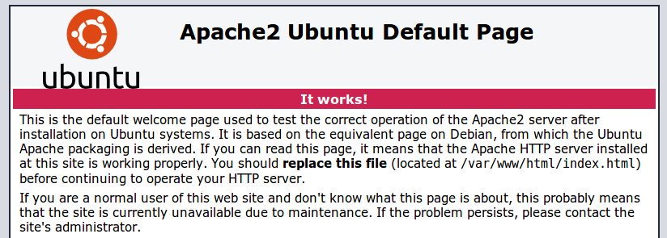
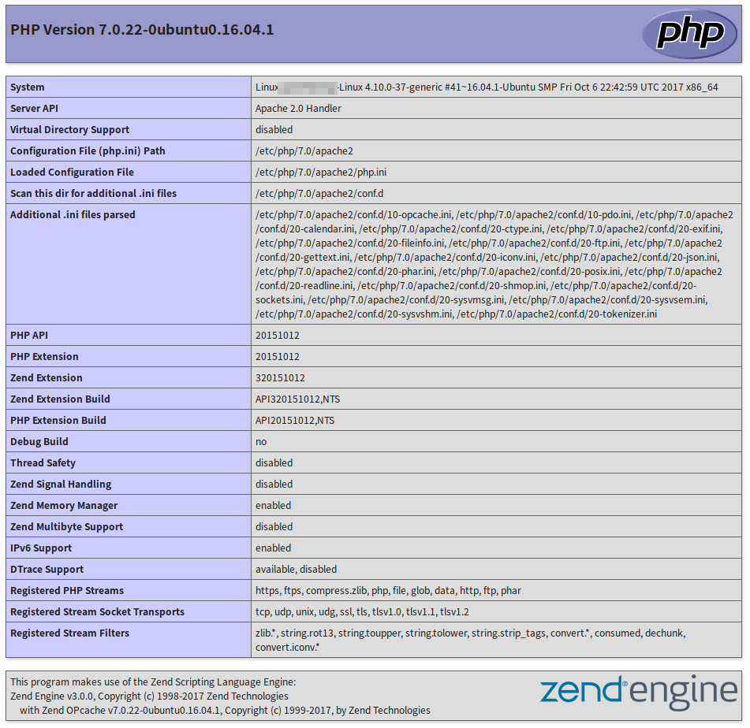
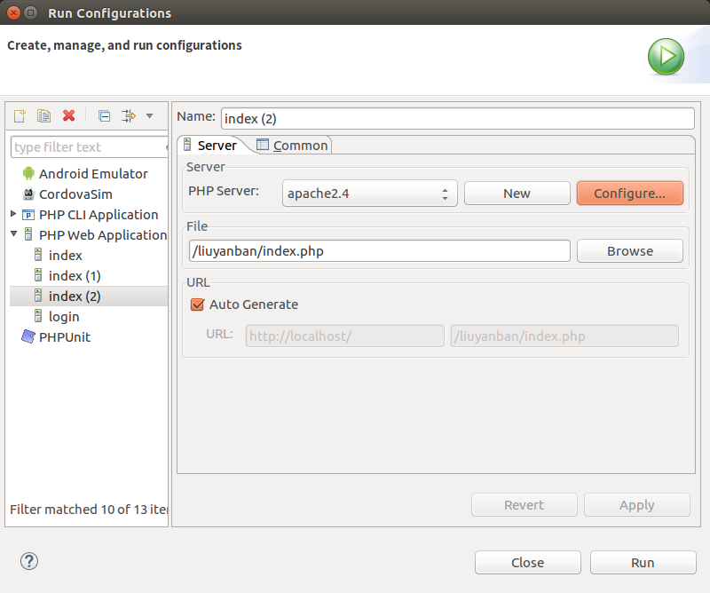
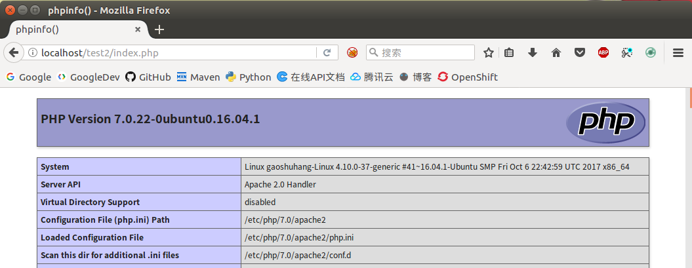
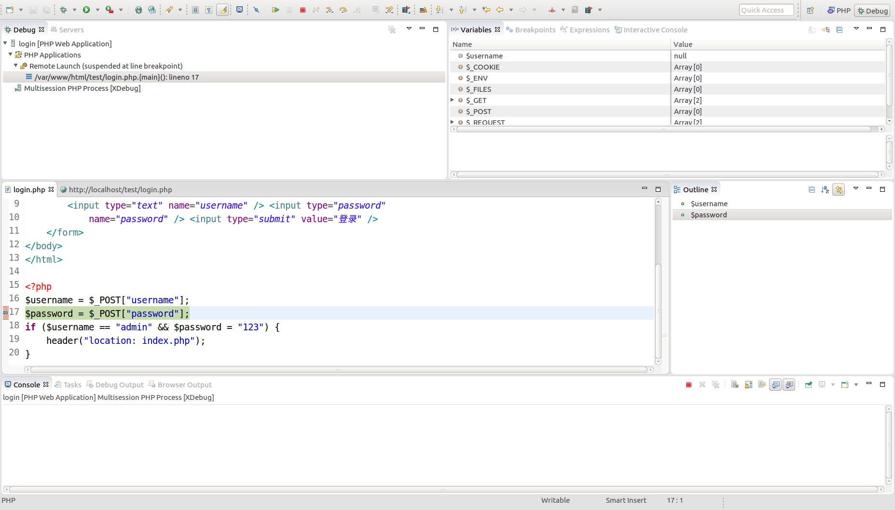
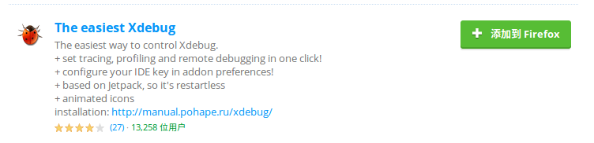
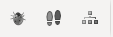
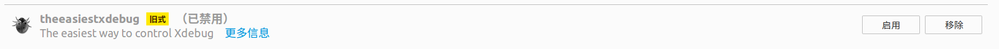

# LAMP环境搭建

LAMP指Linux，Apache，MySQL（社区版），PHP。LAMP这四个软件，可以说是中小型网站的全套免费解决方案。

这篇笔记记录了在Ubuntu 16.04下，如何搭建LAMP环境。

## 安装apache2

```
sudo apt-get install apache2
```

安装完成后，用浏览器访问`http://localhost`，可以看到默认网页。网页的默认路径是`/var/www/html`，开发的时候，我们可以把这个`html`文件夹的权限变成我们自己的，方便把网页复制进去，或者修改apache的配置文件，使用我们自己的目录作为部署环境。



管理Apache2服务，可以使用`systemctl`命令，具体请参考`Linux系统维护`相关章节。

## 安装php7

Ubuntu16.04的软件源已经不提供php5.x了，因此我们直接安装php7即可。

```
sudo apt-get install php7.0
sudo apt-get install libapache2-mod-php7.0
```

第一个是php7相关的解释器，命令行等软件，第二个是apache的php插件。

安装完成后，我们在`/var/www/html`下创建一个`test.php`。

```php
<?php
phpinfo();
?>
```

然后在浏览器里访问`http://localhost/test.php`，可以看到`phpinfo()`的输出网页，说明php和apache2执行成功。



## 安装MySQL

具体请参考`数据库系统/MySQL数据库管理系统/MySQL简介和环境搭建`。

## 配置ZendStudio

ZendStudio是Zend官方基于Eclipse开发的IDE，功能比较强大。这里假设我们已经完成上述步骤，搭建好了LAMP环境，下面介绍下如何在ZendStudio中配置，使IDE中的项目能够在apache下运行。

apache默认的web root路径是`/var/www/html`，假设我们打算让工作空间（workspace）在`/home/ciyaz/workspace/zendstudio`，那么直接把`/var/www/html`文件夹软链接到`/home/ciyaz/workspace`，然后重命名为`zendstudio`就行了，这样省去了改apache配置文件的麻烦。

```
ln -s /var/www/html /home/ciyaz/workspace/zendstudio
```

我们还需要给ZendStudio配置一下Apache，点击`Run configuration`，如图，按照提示添加Apache配置文件路径即可。ZendStudio不会改动配置文件，因此只要确保ZendStudio有读权限。



这样，我们在workspace里修改程序，点击ZendStudio的`Run as->PHP Web Application`即可打开IDE内置浏览器，或者直接打开我们自己的浏览器进行访问。



## 配置XDebug

首先需要安装XDebug，Ubuntu下从源中安装`php-xdebug`包即可。

```
sudo apt-get install php-xdebug
```

然后需要改动一下php的配置文件，在`/etc/php/7.0/apache2/php.ini`中，找到`[PHP]`段落，然后在其最后加上如下配置：

```
zend_extension=/usr/lib/php/20151012/xdebug.so
xdebug.remote_enable=1
xdebug.remote_handler=dbgp
xdebug.remote_mode=req
xdebug.remote_host=127.0.0.1
xdebug.remote_port=9000
xdebug.max_nesting_level=300
```

重启apache服务器后，XDebug就生效了。接下来，我们需要在ZendStudio中，对XDebug进行配置。如图，双击PHP Servers中我们之前配好的apache服务器，弹出服务器配置对话框后，选择`Debugger`，然后选择`XDebug`，再确认下调试端口等配置就可以了。

想要调试PHP文件时，在PHP文件上打好断点，然后使用`Debug As`功能，调试器就可以正常运行了。



## 安装火狐浏览器的XDebug插件

前面安装好XDebug后，只能使用ZendStudio内置的浏览器进行调试，很不方便。在firefox扩展中心中，找到`The easiest xdebug`，如图，进行安装（后面还有`Easy XDebug`据说也是差不多的插件，但是前面的这个用的人多）。



在火狐浏览器上，点击`enable`的虫子图标，这样刷新火狐浏览器，XDebug也会开始断点调试，ZendStudio的调试界面也会出现。



不使用的时候，禁用即可。



## 将Apache换成Nginx

现在Nginx已经越来越流行了，尤其是在生产环境中的Linux服务器上。下面简单介绍一些如何在Ubuntu16.04上部署Nginx和PHP。

安装Nginx：

```
sudo apt-get install nginx
```

安装`php`和`php-fpm`这两个包：

```
sudo apt-get install php7.0 php7.0-fpm
```

安装一些其它的扩展，比如基本都会用到的`php-mbstring`：

```
sudo apt-get install php7.0-mbstring
```

修改Nginx配置文件其实非常简单，Nginx已经把需要的配置写好了，只不过给注掉了，没有生效，下面是一个例子：

```
# server中添加一个默认的index.php文件
index index.html index.php;
```

```
# 开启这些注释，使Nginx能够和php-fpm通信
location ~ \.php$ {
  include snippets/fastcgi-php.conf;
  fastcgi_pass unix:/run/php/php7.0-fpm.sock;
}
```
