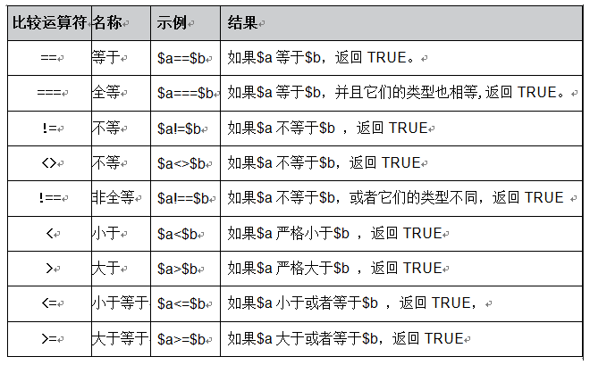
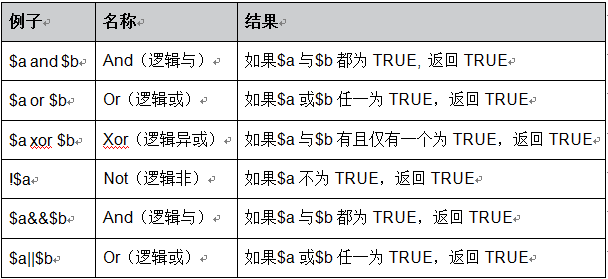

# 基本语法

本篇笔记的部分代码来自慕课网的php教程。

下面是最简单的php程序示例。

```php
<?php
echo "hello, world!";
?>
```

注意：

* php代码必须包裹在`<?php ?>`中
* 每句php代码以分号结尾

## echo语句输出

php使用echo语句进行输出。上面代码中，我们使用echo输出了一个字符串。除了字符串，数字，变量等也都可以进行输出。

## 变量的数据类型

php是一门弱类型语言，我们定义变量时，不需要显示制定数据类型。变量的数据类型甚至能随时改变。php有八种数据类型：整型，浮点型，字符串，布尔类型，资源类型，空类型，类，数组。

### 整型

整型可以定义正负，十进制，八进制，十六进制整数。

```php
<?php
$data_int1 = 123;
echo $data_int1;
echo "<br />";
$data_int2 = -123;
echo $data_int2;
echo "<br />";
$data_int3 = 0123;
echo $data_int3;
echo "<br />";
$data_int4 = 0x123;
echo $data_int4;
echo "<br />";
?>
```

### 浮点型

浮点型可以定义小数，php支持科学计数法表示的小数，用`e`或`E`表示底数`10`。

```php
<?php
$num_float1 = 1.234;
echo $num_float1;
echo "<br />";
$num_float2 = 1.2e3;
echo $num_float2;
echo "<br />";
$num_float3 = 7.0E-3;
echo $num_float3;
echo "<br />";
?>
```

### 布尔类型

php中，布尔类型用大写或小写的`true`或`false`表示均可。

```php
<?php
$var1 = true;
$var2 = false;
?>
```

### 字符串

php中使用引号包裹字符串作为字面值。

#### 字符串的单引号和双引号

单引号包裹的字符串会原样输出，而双引号包裹的字符串会被解析，下面代码中，双引号包裹的字符串里，有一个变量。

```php
<?php
$str = 'aaa';
echo "$str";
echo '$str';
?>
```

输出
```
aaa
$str
```

如果不希望双引号中的`$`被解析，可以使用`\`对`$`进行转义。

如果双引号包裹中，某些字符干扰了变量的引用，可以使用`{}`对变量进行包裹。

```php
<?php
$str = 'aaa';
echo "b{$str}b";
?>
```

输出
```
baaab
```

#### Heredoc

PHP和HTML经常要互相嵌套，当HTML字符串很长时，嵌在PHP代码里十分难看也十分难写，这时可以使用Heredoc。

```php
<?php
$string1 = <<<GOD
我有一只小毛驴，我从来也不骑。
有一天我心血来潮，骑着去赶集。
我手里拿着小皮鞭，我心里正得意。
不知怎么哗啦啦啦啦，我摔了一身泥.
GOD;

echo $string1;
?>
```

注：`GOD`是标识符，可以是任意字符串，但是要保证和开头和结束标识符相同。除此之外，即使Heredoc里有换行，php也不会自动输出`<br />`，但是却会输出`\n`。

### 资源类型

数据库连接，文件句柄等，都属于`资源类型`。php中，归类为特殊类型。

```php
<?php
//首先采用“fopen”函数打开文件，得到返回值的就是资源类型。
$file_handle = fopen("/data/webroot/resource/php/f.txt","r");
if ($file_handle){
    //接着采用while循环（后面语言结构语句中的循环结构会详细介绍）一行行地读取文件，然后输出每行的文字
    while (!feof($file_handle)) { //判断是否到最后一行
        $line = fgets($file_handle); //读取一行文本
        echo $line; //输出一行文本
        echo "<br />"; //换行
    }
}
fclose($file_handle);//关闭文件
?>
```

### 空类型

php中，可以用`null`或`NULL`表示空。声明但未赋值的变量默认也是null。下面代码中，四个输出都是NULL。

```php
<?php
 error_reporting(0); //禁止显示PHP警告提示
 $var;
 var_dump($var);
 $var1 = null;
 var_dump($var1);
 $var2 = NULL;
 var_dump( $var2);
 $var3 = "节日快乐！";
 unset($var3);
 var_dump($var3);
?>
```

## 常量

像C语言的`#define`编译指令定义的宏，可以作为“常量”使用一样，php也可以定义常量。

```php
<?php
$p = "PII";
define("PI",3.14);
define($p,3.14);
echo PI;
echo "<br />";
echo PII;
?>
```

输出
```
3.14
3.14
```

常量不能重复定义，defined()函数可以查看常量是否已经被定义过。

```
bool defined(string constants_name)
```

## 系统常量

php预定义了一些系统常量，包括运行环境等等信息，我们可以直接使用。下面代码是几个例子。

```php
<?php
echo __FILE__;
echo "<br />";
echo __LINE__;
echo "<br />";
echo PHP_VERSION;
echo "<br />";
echo PHP_OS;
echo "<br />";
?>
```

输出
```
/home/ciyaz/workspace/phpstorm/test/test.php
4
7.0.22-0ubuntu0.16.04.1
Linux
```

## 运算符

php中的运算符分为：算术运算符，赋值运算符，比较运算符，三元运算符，逻辑运算符，字符串连接运算符，错误控制运算符。

### 算术运算符

```
+ 加
- 减
* 乘
/ 除
% 取余
```

注：和Python不同，php没有乘方运算符，乘方需要函数`pow()`。

### 赋值运算符

```
= 直接赋值
& 引用赋值
```

注：引用的意思和C++的引用一样，下面代码中，`$var`和`$p`指向同一个内存地址。

```php
<?php
$var = 1;
$p = &$var;
$p = 2;
echo $var;
?>
```

输出
```
2
```

### 比较运算符



### 三元运算符

```php
<?php
    $a = 78;//成绩
	$b = $a >= 60 ? "及格" : "不及格";
	echo $b;
?>
```

输出
```
及格
```

### 逻辑运算符



### 连接运算符

```
连接运算符(“.”)：它返回将右参数附加到左参数后面所得的字符串
连接赋值运算符(“.=”)：它将右边参数附加到左边的参数后
```

php中，字符串常用`.`连接。

```php
<?php
echo "hello,"." world!";
?>
```

连接赋值运算符`.=`例子如下：

```php
<?php
$a = "aaa";
$b = "bbb";
$b.=$a;
echo $b;
?>
```

输出
```
bbbaaa
```

### 错误控制运算符

错误控制运算符`@`，对于一些可能会在运行过程中出错的表达式时，我们不希望出错的时候给客户显示错误信息，这样对用户不友好。于是，可以将`@`放置在一个php表达式之前，该表达式可能产生的任何错误信息都被忽略掉。如果激活了`track_error`特性，表达式所产生的任何错误信息都被存放在变量`$php_errormsg`中，此变量在每次出错时都会被覆盖，所以如果想用它的话必须尽早检查。需要注意的是：错误控制前缀`@`不会屏蔽解析错误的信息，不能把它放在函数或类的定义之前，也不能用于条件结构例如`if`和`foreach`等。
