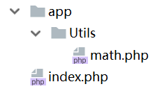
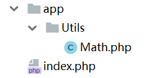

# 命名空间

PHP能够给变量、函数、类设定命名空间，和大多数语言一样，PHP中命名空间是独立于物理路径的另一套约束路径（Java比较特别，用文件夹路径作为包路径），主要用来解决代码规模较大时的模块划分问题。

## 命名空间的使用

我们这里创建如下工程结构作为例子，其中`math.php`中包含一些工具方法，我们要在`index.php`中调用。



math.php
```php
<?php

namespace App\Utils;

function add($a, $b)
{
    return $a + $b;
}
```

上面代码中，我们使用`namespace`关键字定义`add`方法属于的命名空间。

index.php
```php
<?php

require 'app/Utils/math.php';

$result = \App\Utils\add(1, 2);
echo $result;
```

引用时，我们除了需要使用`require`应用相应文件，还需要在被引用的方法前加上`\App\Utils\`这个命名空间路径。

## 命名空间和面向对象

在面向对象模式的开发中，引用一个类可以使用`use`关键字。



Math.php
```php
<?php

namespace App\Utils;


class Math
{
    public static function add($a, $b)
    {
        return $a + $b;
    }
}
```

和之前代码的区别是，这里我们创建了一个工具类`Math`，并将我们的功能封装成类的方法，之前是直接定义了一个函数。

index.php
```php
<?php

require 'app/Utils/Math.php';
use \App\Utils\Math;

$result = Math::add(1, 2);
echo $result;
```

引用一个类时，我们可以直接在文件的开头写`use 类路径`即可，下面我们就可以直接写引用类了，免去多次调用一个类，类路径要写好多遍的麻烦。
