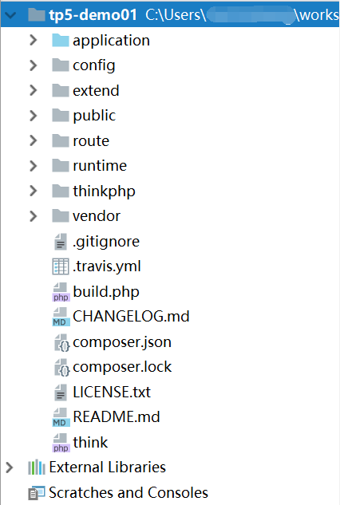
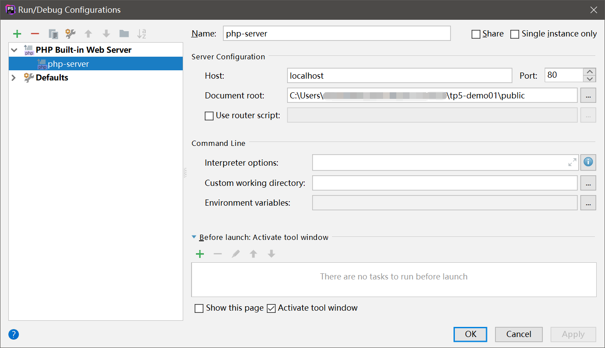
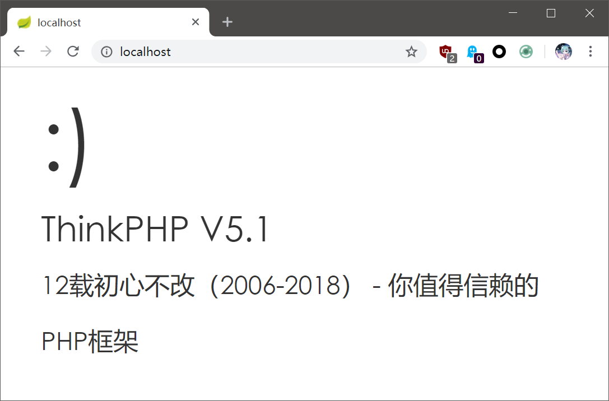

# ThinkPHP环境搭建

ThinkPHP是一个国产的免费开源PHP开发框架，而且已经有些年头了，我最初了解并试图学习它还是5年前，当年就觉得这框架真的是国产良心之作，上到ERP下到小黄网，都有广泛的应用实践。

最近ThinkPHP更新到了5.x，做出了很多重大的不兼容更新，可以说是一个打着ThinkPHP旗号的全新框架了。ThinkPHP5据说是「专为API开发而设计的高性能框架」，而且支持composer包管理工具，许多内容都进行了更加现代化的改造，这里我们就简单学习一下ThinkPHP5。

特别提醒：由于是PHP框架，而且是国产的，而且ThinkPHP历史比较久了，无论官网页面还是项目结构画风可能都比较山寨，大家不要被吓跑了，这门技术其实是相当靠谱的。

* ThinkPHP官网：[http://www.thinkphp.cn/](http://www.thinkphp.cn/)
* 学习手册：[https://www.kancloud.cn/manual/thinkphp5_1](https://www.kancloud.cn/manual/thinkphp5_1)

## ThinkPHP5.1项目搭建

所谓「项目搭建」其实就是把一些基础框架性的文件拷贝到我们的工程目录中，我们可以直接用Git下载相关文件，或者使用composer自动生成项目，后者比较简单，但是需要你先了解composer，并正确的配置国内镜像。

ThinkPHP5.1环境要求：
```
PHP>=5.6.0
pdo
mbstring
curl
openssl
```

这些都是比较常见的PHP扩展，有关PHP语言环境搭建的内容这里不多做介绍，具体请参考PHP语言基础相关章节。

使用composer安装ThinkPHP5.1：
```
composer create-project topthink/think <你的项目目录>
```
生成好项目后，我们直接将生成的文件夹其用任何一个IDE或文本编辑器打开，就可以直接开工了。我这里使用的是PHPStorm，除此之外，Eclipse、VSCode都是不错的选择。



运行时，最简单的方法就是使用php的内置服务器。这里我们直接在PHPStorm中对其进行配置，其它开发环境也是类似的。当然，更熟悉命令行的同学也可以直接用命令启动。

这里要注意一点的是，服务器的根目录要设置在项目的`public`文件夹下，在服务器上部署时也是这样指定的，不要将Web根目录设置在项目根目录，我们的配置文件、框架运行时、依赖库等都不应该被用户所访问。



运行PHP服务器，在浏览器中看到这个经典的笑脸画面就是成功了。



## ThinkPHP5.1项目目录结构

这里直接复制手册中的说明，已经非常详细了：
```
www  WEB部署目录（或者子目录）
├─application           应用目录
│  ├─common             公共模块目录（可以更改）
│  ├─module_name        模块目录
│  │  ├─common.php      模块函数文件
│  │  ├─controller      控制器目录
│  │  ├─model           模型目录
│  │  ├─view            视图目录
│  │  ├─config          配置目录
│  │  └─ ...            更多类库目录
│  │
│  ├─command.php        命令行定义文件
│  ├─common.php         公共函数文件
│  └─tags.php           应用行为扩展定义文件
│
├─config                应用配置目录
│  ├─module_name        模块配置目录
│  │  ├─database.php    数据库配置
│  │  ├─cache           缓存配置
│  │  └─ ...            
│  │
│  ├─app.php            应用配置
│  ├─cache.php          缓存配置
│  ├─cookie.php         Cookie配置
│  ├─database.php       数据库配置
│  ├─log.php            日志配置
│  ├─session.php        Session配置
│  ├─template.php       模板引擎配置
│  └─trace.php          Trace配置
│
├─route                 路由定义目录
│  ├─route.php          路由定义
│  └─...                更多
│
├─public                WEB目录（对外访问目录）
│  ├─index.php          入口文件
│  ├─router.php         快速测试文件
│  └─.htaccess          用于apache的重写
│
├─thinkphp              框架系统目录
│  ├─lang               语言文件目录
│  ├─library            框架类库目录
│  │  ├─think           Think类库包目录
│  │  └─traits          系统Trait目录
│  │
│  ├─tpl                系统模板目录
│  ├─base.php           基础定义文件
│  ├─convention.php     框架惯例配置文件
│  ├─helper.php         助手函数文件
│  └─logo.png           框架LOGO文件
│
├─extend                扩展类库目录
├─runtime               应用的运行时目录（可写，可定制）
├─vendor                第三方类库目录（Composer依赖库）
├─build.php             自动生成定义文件（参考）
├─composer.json         composer 定义文件
├─LICENSE.txt           授权说明文件
├─README.md             README 文件
├─think                 命令行入口文件
```
