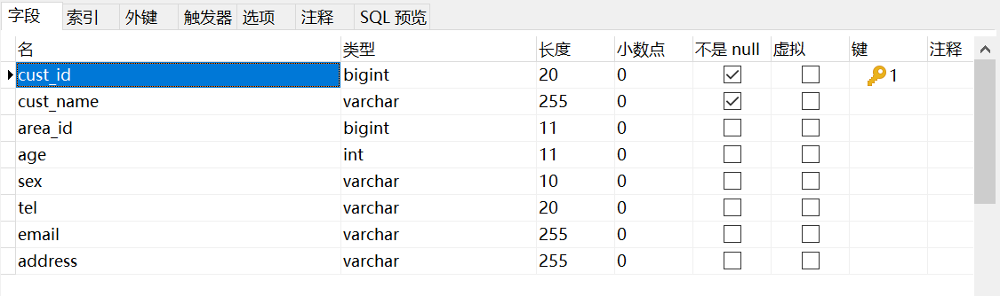
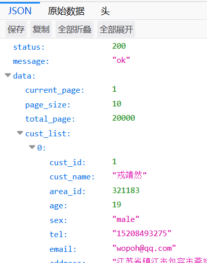

# API接口开发流程

既然ThinkPHP5一开始就打出自己是个后台API接口框架的口号，这里我们就简单实现一个REST接口作为一个入门例子，简单体验一下使用ThinkPHP的开发流程。

创建项目就不再赘述了，我们这里实现一个单表的查询接口。

## 数据准备

这里我有一个准备好的基于语料库生成的百万级电商OLTP模拟数据库，简单起见，我们这里就查询一下这个客户表。数据模型如下，其中字段的意义都非常好理解：



由于数据量较多，这里我们将接口设计为分页形式，除此之外，我们还打算利用`cust_name`这个字段进行可选的模糊匹配查询。

## 工程配置调整

我们要连接数据库，因此需要修改相关的配置。在`config/database.php`中，配置如下：

```php
// 数据库类型
'type'            => 'mysql',
// 服务器地址
'hostname'        => '127.0.0.1',
// 数据库名
'database'        => 'netstore',
// 用户名
'username'        => 'root',
// 密码
'password'        => 'root',
// 端口
'hostport'        => '3306',
// 连接dsn
'dsn'             => '',
// 数据库连接参数
'params'          => [],
// 数据库编码默认采用utf8
'charset'         => 'utf8mb4',
// 数据库表前缀
'prefix'          => 't_',
```

注意：我们数据库的表都统一有`t_`前缀，比如客户表`t_cust`、订单表`t_order`，因此这里配置了一个`prefix`参数。如果不对其进行配置，写出数据库完整的表名也是可以的（其实这个特性有些鸡肋）。

## 创建REST控制器

ThinkPHP中，控制器是一个PHP类，但我们不需要手动创建它和相关的模块目录。项目根目录下有个`think`文件，它包含了ThinkPHP框架的一些基本管理命令。

创建REST控制器：
```
php think make:controller api/Cust
```

执行该命令，就会生成`application/api/controller/Cust.php`这个类。类中生成了一些方法，这些方法其实就是对应REST接口的增删改查的，我们不用自己挨个定义路由，定义GET还是POST，资源控制器帮我们把这一切都做好了。

注：ThinkPHP5中，REST控制器也被称为资源控制器，针对REST接口的路由组件也被称为资源路由。

## 编写代码实现客户查询接口

下面我们为`index`方法编写了内容，该方法默认就是用于查询数据实体列表的。代码主要分为三部分：

1. 获取请求参数
2. 组装查询条件，查询数据库
3. 组装返回JSON

```php
public function index(Request $request)
{
  $current_page = $request->param('current_page', '1');
  $page_size = $request->param('page_size', '10');
  $cust_name = $request->param('cust_name');

  $query = Db::name('cust');
  if ($cust_name != '') {
    $query = $query->where('cust_name', 'like', '%' . $cust_name . '%');
  }
  $data_content = $query->page(intval($current_page), intval($page_size))->select();
  $total_page = ceil(Db::name('cust')->count() / intval($page_size));
  $data = array(
    'current_page' => intval($current_page),
    'page_size' => intval($page_size),
    'total_page' => $total_page,
    'cust_list' => $data_content);
  $json_rsp = array('status'=>200, 'message'=>'ok', 'data'=>$data);

  return json($json_rsp);
}
```

注意`Request`这个对象，这里它包含了HTTP请求信息，我们通过它得到请求参数。写在`index`的参数中，这种写法很像SpringMVC控制器的依赖注入。

`$request->param()`方法用于读取请求参数，它能自动识别GET或POST。Request对象也有`get()`或`post()`等一系列方法，可以专门读取某个请求类型的参数。如果该参数不存在，读取会得到一个空字符串。

ThinkPHP中，数据库操作使用`Db::name(表名)->链式操作函数`的形式，因此很容易实现复杂的动态查询，而不用自己去拼接SQL语句字符串，这和Java的Criteria查询很像，但是使用起来简洁得多。ThinkPHP当然也支持直接写SQL语句，详细内容将在专门的章节中介绍。

注意分页的实现，ThinkPHP内置了`page()`函数用于分页，其实就是将分页参数转化为`LIMIT`语句（MySQL中），其参数是当前页和分页大小。除此之外，ThinkPHP也提供了`limit()`函数，我们可以自己控制分页逻辑。分页当然还需要总页数，这里我使用了另外的一次查询，并用除法计算出了总页数。

最后进行了返回JSON的组装，控制器方法最终返回的写法也比较好理解：`return json(要返回的对象)`。

## 注册资源路由

资源控制器需要配置资源路由使用，我们的资源控制器本身不包含对HTTP请求方式判断、路由参数注入等功能，这些都是资源路由实现的。

在`route/route.php`中，增加一条路由记录：

```php
Route::resource('cust', 'api/cust');
```

## 使用浏览器进行访问

访问如下地址：
```
http://localhost/cust
```


