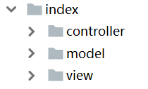

# 使用模板

ThinkPHP有自己内置的一套模板语法，适用于传统的前后端不分离的项目开发。它的模板语法比较简单，基本还是用的PHP语法，只不过是换了一种写法。这篇笔记我们学习一下如何使用ThinkPHP的模板。

注：其实我非常厌恶新发明一种模板的做法，尤其是Java。本来写JSP挺好的，非说JSP中允许写Java代码不符合MVC，改成Velocity以为天下统一了，又有人非说和HTML差异太大不适合页面设计人员，结果发明了个Thymeleaf。PHP本身就是个强大的模板，再在其上发明个模板纯属画蛇添足，而且增加用户学习成本。

## 模板目录

ThinkPHP5中，默认使用`view`文件夹存放模板。比如`index`模块有一个控制器`Hello`，调用的方法为`test`，那么其对应的模板路径就是`index/view/hello/test.html`。如果控制器名类似`StudentManage`这种有多个大写字母的驼峰式命名，模板对应要写成`student_manage`。

在控制器最后返回时，如下语句就能返回到约定目录的模板：
```php
return $this->fetch();
```

注：如图，一个模块下，模型、视图、控制器是按这样目录组织的：



## 向模板传递数据

控制器中，使用`$this->assign()`向模板中设置变量：

```php
public function test () {
  $msg = 'hello';
  $this->assign('msg', $msg);
  return $this->fetch();
}
```

模板中使用大括号输出一个变量：

```html
<body>
	{$msg}
</body>
```

## 模板语法

这里只简单介绍几种最简单的模板语法作为示例，模板使用非常简单，现用现查就足够了，一口气看完也是记不住的。

### 判断标签

```html
{if $is_login == true}
  <span>hello,{$username}</span>
{else /}
  <span>请登录</span>
{/if}
```

### 循环标签

```php
$user_list = array(
  array('username' => 'tom', 'password' => '123456'),
  array('username' => 'jerry', 'password' => 'root123'),
  array('username' => 'lucy', 'password' => 'admin123')
);
$this->assign('user_list', $user_list);
```

```html
<table>
	<thead>
	<tr>
		<td>用户名</td>
		<td>密码</td>
	</tr>
	</thead>
	<tbody>
	{foreach $user_list as $key => $value}
		<tr>
			<td>{$value.username}</td>
			<td>{$value.password}</td>
		</tr>
	{/foreach}
	</tbody>
</table>
```

### 包含标签

```html
{include file='../application/index/view/commons/nav.html' /}
```

注意模板互相包含时的路径问题，和大多数编程语言相同，默认情况下，PHP程序当前的执行路径是程序入口文件所在的路径。ThinkPHP5中，这个入口文件是`public/index.php`，故采用上面代码的写法。

另外，要分清楚浏览器的访问路径和后台模板的程序执行路径，不要把两者弄混了。这也是传统后端渲染项目的常见问题。
