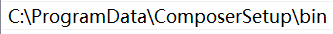
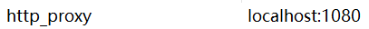

# composer包管理工具

composer是PHP的包管理工具，其依赖的是[Packagist](https://packagist.org/)这个包仓库。我们可以下载并引用第三方包或是发布自己的包到仓库中。

composer和npm等包管理工具都比较像，下面以Windows系统为例介绍composer的安装和使用。

## composer安装

按照官网的操作文档进行安装即可：[https://getcomposer.org/download/](https://getcomposer.org/download/)

这里如果是Windows系统，就直接下载安装程序并运行，PHP的配置文件和环境变量都会为我们自动配置好。

注意：上述操作在大陆地区的网络环境是无法完成的。

安装完成后，自动配置的Path环境变量如下，这个是composer可执行文件的安装位置：



我们可以看到，composer的代码包含在一个`phar`文件中（一个PHP的归档格式，类似Java的Jar，但是在PHP中除了打包制作一些命令行程序外没什么实际作用），然后通过Windows下的`.bat`文件通过`php`命令进行调用。

注意，由于安装的时候我这里使用了代理服务器，composer自动添加了这么一个环境变量，使得以后使用composer都会走代理，但是我们会配置国内镜像，因此把它干掉。



## 配置镜像

安装好composer后，我们可以配置上国内镜像加快下载速度。

```
composer config -g repo.packagist composer https://mirrors.aliyun.com/composer/
```

这个操作会在`C:\Users\<用户名>\AppData\Roaming\Composer\config.json`自动添加相应的配置。

## 初始化工程

类似npm项目的`package.json`，composer也有`composer.json`，其中包括本项目的名字，作者，依赖的包等信息。我们可以用`composer init`初始化这个项目配置文件。

自动生成的`package.json`：

```json
{
    "name": "ciyaz/demo-composer",
    "authors": [
        {
            "name": "CiyaZ",
            "email": "ciyaz@qq.com"
        }
    ],
    "require": {}
}
```

## 安装依赖

假如我们要安装`monolog`这个包（一个和日志处理相关的包，composer官网教程就用的这个例子），使用如下命令：

```
composer require monolog/monolog
```

包名结构是`<仓库名>/<包名>`，和npm中的包名结构是一样的。

安装完成后，我们的项目结构发生了如下改变：

1. 多了个`vendor`文件夹，里面内容就是安装的依赖包相关文件
2. `composer.json`中多了依赖信息
3. 多了一个`composer.lock`，用于记录版本等信息，这和npm相同

## 引用安装的依赖库

composer安装的包通常包含一个`autoload.php`，我们直接`require`这个文件，就可以访问所有已经安装的包了（注意包定义的命名空间的问题）。

例子代码：
```php
<?php
require 'vendor/autoload.php';
use Monolog\Logger;
use Monolog\Handler\StreamHandler;

$log = new Logger('name');
try {
    $log->pushHandler(new StreamHandler('myapp.log', Logger::WARNING));
} catch (Exception $e) {
    error_log($e);
}

$log->warning('Foo');
$log->error('Bar');
```

## 根据已有的composer.json安装依赖库

如果我们的项目时从VCS中检出的，可能已经由别人写好的`composer.json`了，为了安装其中定义的依赖，和npm一样，使用如下命令：

```
composer install
```

## 其它命令

这里再介绍几个composer的常用命令。

composer自我升级：
```
composer self-update
```

清除缓存：
```
composer clear
```

更新`composer.lock`文件：
```
composer update --lock
```

更多有关composer命令行的内容这里就不多介绍了，请参考官方文档：

[https://getcomposer.org/doc/](https://getcomposer.org/doc/)
