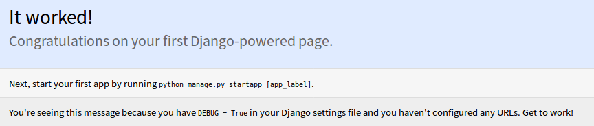
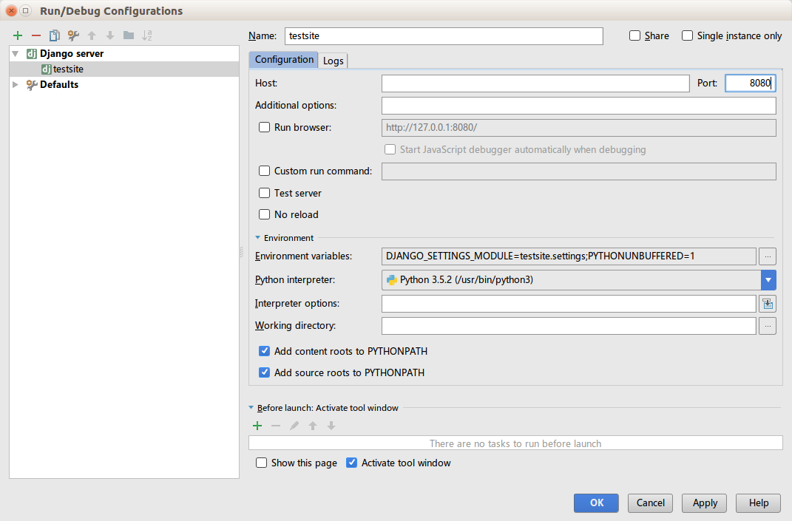

# Django简介和环境搭建

**Django：按时交付完美主义者的 Web 框架**

Django是一个Python的web开发开源框架，最初诞生于2005年。Django是一个基于MVC模式的框架，但是程序员在使用Django时，控制器接受用户输入的部分是由框架自行处理的，因此Django开发中程序员更关注模型（Model）、模板（Template）、视图（View），即MTV。控制器部分由Django框架实现，程序员只需要配置URLconf。

教程和文档都在Django官方网站可以找到：

[项目官方网站](https://www.djangoproject.com/)

## Django和SpringMVC对比

两个框架的区别很明显，JavaEE的整体理念和Django的定位区别也很明显：

SpringMVC：作为Web应用的表现层框架，经常需要和Java的一大套框架集成使用，SpringMVC提供了高度可配置，功能非常丰富表现层解决方案，编写JavaWeb应用时，需要程序员关注：框架选择和整体配置，模型（持久化类，MVC的Model），模板（MVC的View），控制器（MVC的Controller），业务逻辑层实现（Service），持久层实现（Persistence）等从前到后种种问题。

Django：装好Django后，写好MTV三个组件，稍加配置，项目就完成了。当然，不是说Django很神奇，而是Django定位就是Web应用敏捷开发，关注所开发的功能，不需要想太多架构的事。项目没分层耦合度稍高，在Django适用场景的项目下并不是个问题，本身项目也不复杂，维护和扩展统统以后再说。Django还提供了很多已经做好的模块，如`admin`模块、`auth`模块等，我们直接可以拿来用，放到Java的思想下，做一个类似admin的组件非要弄出十个八个配置文件，把模块配置做的比写一个模块还要复杂不可，那样才算一个好的设计。Django则是，反正各种功能就做了一个给你，不管什么可定制程度、可配置程度高不高，你爱用不用，毕竟程序就是用来实现功能的，一般我们都是选择用，最后结果就是没什么可写的，Django已经是一个半成品了，就差我们把MTV组件填上了！

## 安装Django

django可以使用pip进行安装

```
pip3 install django
```

安装完成后import测试一下

```
# ciyaz @ ciyaz-Linux in ~ [10:37:38]
$ python3
Python 3.5.2 (default, Nov 17 2016, 17:05:23)
[GCC 5.4.0 20160609] on linux
Type "help", "copyright", "credits" or "license" for more information.
>>> import django
>>> django.get_version()
'1.11.7'
```

## 使用命令行创建Django项目

装好Django模块后，我们可以使用`django-admin`命令创建一个新的Django项目。

```
django-admin startproject mysite
```

自动创建的目录结构
```
mysite
├── manage.py
└── mysite
    ├── __init__.py
    ├── settings.py
    ├── urls.py
    └── wsgi.py

1 directory, 5 files
```

* manage.py：当前Django项目的命令行工具，具备启动测试服务器等功能
* 内层的mysite文件夹：我们的项目作为一个python模块，这个文件夹就是模块的文件夹
* settings.py：当前Django项目的一些配置信息
* urls.py：URL路由配置文件
* wsgi.py：用于在支持WSGI的服务器上发布

## 启动测试服务器

django开发时可以直接使用测试服务器进行调试，不需要部署到生产环境的服务器上，比较方便。但是要注意，测试服务器仅用于测试环境。其安全性和性能均无法保证正式上线使用的需求。

```
python3 manage.py runserver 8080
```



注：测试服务器每次接受请求都会重新加载Python代码，修改代码不需要重启测试服务器。

## 使用Pycharm搭建Django开发环境

使用pycharm不需要什么特别的配置，创建项目时直接选择Django即可，没装django也会自动下载，一切都会为我们自动创建好，包括运行配置。

我们可以在这里修改下端口：



## helloworld项目

首先我们要知道，Django中，项目对应的概念是project，一个project可能有多个app。我们这里编写一个简单的app，首先使用`manage.py`创建一个新app：

```
python3 manage.py startapp app1
```

新创建的app必须在`settings.py`里配置到`INSTALLED_APPS`中，否则是不会生效的。

```python
INSTALLED_APPS = [
    ...
    'app1'
]
```

app1目录结构
```
app1
├── admin.py
├── apps.py
├── __init__.py
├── migrations
│   └── __init__.py
├── models.py
├── tests.py
└── views.py

1 directory, 7 files
```

编写app1/views.py
```python
from django.http import HttpResponse


def index(request):
	return HttpResponse("hello, world!")
```

编写app1/urls.py
```python
from django.conf.urls import url
from . import views

urlpatterns = [
    url(r'^$', views.index),
]
```

编写项目urls.py
```python
from django.conf.urls import url, include
from django.contrib import admin

urlpatterns = [
    url(r'^admin/', admin.site.urls),
    url(r'^app1/', include('app1.urls'))
]
```

代码很容易理解，`views.py`就是Django中的视图（MTV的V），`app1/urls.py`是模块app1的路由，URL使用正则表达式进行匹配。最后，项目根目录的`urls.py`引入了`app1/urls.py`。

用浏览器访问
```
http://localhost:8080/app1/
```

运行结果：


