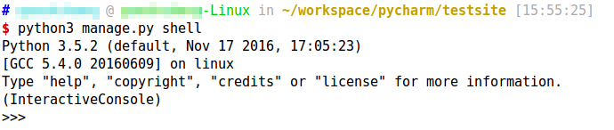

# 数据模型ORM

前一节我们了解到，Django是一个MTV框架，这篇笔记记录，如何将数据模型（Model）持久化到数据库中。

## SQLite3数据库配置

Django默认支持SQLite3，MySQL，PostgreSQL，Oracle等常见数据库。默认创建的工程已经针对SQLite3做出了配置，在没有性能要求的小型应用中，SQLite3是很好的选择。

settings.py
```python
DATABASES = {
    'default': {
        'ENGINE': 'django.db.backends.sqlite3',
        'NAME': os.path.join(BASE_DIR, 'db.sqlite3'),
    }
}
```

* ENGINE：选择要使用的持久层后端，这里使用SQLite3
* NAME：持久化到哪个数据库，SQLite3对应的就是一个文件，MySQL等就是对应一个数据库（由CREATE DATABASE语句创建）

## MySQL数据库配置

Django如果使用MySQL，需要额外安装`PyMySQL`这个库作为其后端（backend）。注意，这里Python连接MySQL数据库的接口有好几种，Django支持作为后端的也不止一种，但是最新的Python3只支持PyMySQL这一种。

配置文件如下，注意这里我们要预先手动创建好数据库：

settings.py
```python
DATABASES = {
	'default': {
		'ENGINE': 'django.db.backends.mysql',
		'NAME': '数据库名',
		'USER': '用户名',
		'PASSWORD': '密码',
		'HOST': 'localhost',
		'PORT': '3306',
		'OPTIONS': {
			'autocommit': True
		}
	}
}
```

注意：Django的ORM自动建表后，默认的编码就是MySQL数据库的默认编码，为了方便，创建新数据库后我们可以把数据库的编码统一修改成UTF8，否则默认为latin1，插入中文字段会报错。

## 编写持久化类

这里编写了两个持久化类，实现了一个投票应用，Question类是投票的主题，Choice是投票的选项和票数。Choice和Question具有多对一关系。

注：例子来自官网教程

app1/models.py
```python
from django.db import models


class Question(models.Model):
    question_text = models.CharField(max_length=200)
    pub_date = models.DateTimeField('date published')


class Choice(models.Model):
    question = models.ForeignKey(Question, on_delete=models.CASCADE)
    choice_text = models.CharField(max_length=200)
    votes = models.IntegerField(default=0)
```

持久化类要继承`models.Model`，类属性可以是`model.CharField`，`models.DateTimeField`等，对应文本数据、日期等，类属性名约定为HTTP参数名和数据库字段名，也可以额外指定一个可读的名字（例子中的pub_date字段）。对于每个属性，我们还可以指定一些约束，如`max_length`等，用于数据库生成和HTTP参数校验。

注意外键的定义方式，第一个参数是关联的类名，第二个关键字参数指定了删除级联，即Question删除时级联删除所有Choice。

## 将持久化类映射到数据库

执行下面的命令
```
python3 manage.py makemigrations app1
```

由于我们在`INSTALLED_APPS`里配置了很多模块，包括内置模块和我们自己编写的模块，这些模块需要很多数据库表的支持，这条指令会创建所有模块需要的数据库操作语句（注意：此时还没写入数据库，`migrations`文件夹下会出现一个名为`0001_initial`的python文件，创建的执行操作缓存在这里尚未执行，`migrations`可以提供类似版本控制的功能）。`migration`在Django中的概念可以理解为数据迁移。

下面的命令可以查看app1模块中，0001次数据迁移的SQL操作
```
python3 manage.py sqlmigrate app1 0001
```

下面命令真正的将所有操作写入数据库
```
python3 manage.py migrate
```

## 执行增删改查

Web应用的核心功能之一就是数据增删改查，这里我们使用Django提供的一个很方便的shell功能对持久化类的增删改查进行测试。

```
python3 manage.py shell
```



我们直接在这个shell中执行持久化对象的增删改查就可以，不用一定放到Web应用中去测试。但是使用时，不要忘了先引入持久化类。

```python
from app1.models import Question, Choice
```

下面介绍一些常见的增删改查操作。下面是官网文档的例子。

```python
>>> from polls.models import Question, Choice   # 引入持久化类

# 现在数据库中还没有Question
>>> Question.objects.all()
<QuerySet []>

# 创建一个新的Question
# 注意这里使用了关键字参数
# settings.py中配置了时区相关的信息，Django自带的时间模块能够正确处理相关数据，
# 所以请使用timezone.now()代替python的datetime.datetime.now()
>>> from django.utils import timezone
>>> q = Question(question_text="What's new?", pub_date=timezone.now())

# 持久化到数据库
>>> q.save()

# 持久化的对象会自动生成主键（不需要我们自己定义），根据数据库的不同，这里可能输出1或1L
>>> q.id
1

# 获取模型（Model）的字段
>>> q.question_text
"What's new?"
>>> q.pub_date
datetime.datetime(2012, 2, 26, 13, 0, 0, 775217, tzinfo=<UTC>)

# 修改字段值，再次调用save（）持久化到数据库
>>> q.question_text = "What's up?"
>>> q.save()

# 输出所有Question
>>> Question.objects.all()
<QuerySet [<Question: Question object>]>
```

注：如果觉得`<Question: Question object>`输出不太友好，我们可以给Model定义一个`__str__()`方法，就像Java的toString()一样。

```python
from django.db import models
from django.utils.encoding import python_2_unicode_compatible

@python_2_unicode_compatible  # python2兼容，python3不需要
class Question(models.Model):
    # ...
    def __str__(self):
        return self.question_text

@python_2_unicode_compatible  # python2兼容，python3不需要
class Choice(models.Model):
    # ...
    def __str__(self):
        return self.choice_text
```

Model上还可以自定义方法
```python
import datetime

from django.db import models
from django.utils import timezone


class Question(models.Model):
    # ...
    def was_published_recently(self):
        return self.pub_date >= timezone.now() - datetime.timedelta(days=1)
```

下面是一些高级用法例子
```python
>>> from polls.models import Question, Choice

# __str__()的效果
>>> Question.objects.all()
<QuerySet [<Question: What's up?>]>

# 条件查询
>>> Question.objects.filter(id=1)
<QuerySet [<Question: What's up?>]>
>>> Question.objects.filter(question_text__startswith='What')
<QuerySet [<Question: What's up?>]>

# 获取今年发布的Question
>>> from django.utils import timezone
>>> current_year = timezone.now().year
>>> Question.objects.get(pub_date__year=current_year)
<Question: What's up?>

# 查找一个不存在的主键会抛出异常
>>> Question.objects.get(id=2)
Traceback (most recent call last):
    ...
DoesNotExist: Question matching query does not exist.

# 按照主键查询十分常用，Django提供了一个快捷方法
# 下面代码等同于 Question.objects.get(id=1)
>>> Question.objects.get(pk=1)
<Question: What's up?>

# 新添加的方法测试
>>> q = Question.objects.get(pk=1)
>>> q.was_published_recently()
True

# 下面代码给Question对象创建几个Choice，Django使用set处理一对多关系
# 首先得到一个Question对象
>>> q = Question.objects.get(pk=1)

# 显示当前拥有的Choice
>>> q.choice_set.all()
<QuerySet []>

# 创建三个Choice对象加入set
>>> q.choice_set.create(choice_text='Not much', votes=0)
<Choice: Not much>
>>> q.choice_set.create(choice_text='The sky', votes=0)
<Choice: The sky>
>>> c = q.choice_set.create(choice_text='Just hacking again', votes=0)

# Choice对象具有访问Question的API（也就是说这里持久化类的关系是双向的）
>>> c.question
<Question: What's up?>

# 显示当前拥有的Choice
>>> q.choice_set.all()
<QuerySet [<Choice: Not much>, <Choice: The sky>, <Choice: Just hacking again>]>
>>> q.choice_set.count()
3

# 查询今年创建的Choice，注意filter函数关键字参数的用法，Django可以自动进行联合查询
>>> Choice.objects.filter(question__pub_date__year=current_year)
<QuerySet [<Choice: Not much>, <Choice: The sky>, <Choice: Just hacking again>]>

# 删除一些Choice
>>> c = q.choice_set.filter(choice_text__startswith='Just hacking')
>>> c.delete()
```

Django的ORM在查询时，直到求值时才会真正的执行SQL语句，所以不用太考虑延迟加载的问题（其实算总是延迟加载的），用到了就加载，用不到就不加载。和Hibernate比起来，Django的ORM功能很简单，没有瞬时态、持久化态、托管态这些抽象概念，持久化类就两个操作：读取到内存，存入数据库。

当然，查询时，使用某种ORM框架的API总是十分不爽的，功能会受到限制，要考虑把一堆封装的API组合起来实现功能，而且性能还有问题。对于熟悉SQL语言的开发人员来说，一般我们都是手写SQL比较简单轻松。Django支持直接使用SQL进行查询，这里介绍一种最通用的方法。

```python
from django.db import connection

def my_custom_sql(self):
    with connection.cursor() as cursor:
        cursor.execute("UPDATE bar SET foo = 1 WHERE baz = %s", [self.baz])
        cursor.execute("SELECT foo FROM bar WHERE baz = %s", [self.baz])
        row = cursor.fetchone()

    return row
```

首先获取游标`cursor`，然后使用`cursor.execute()`进行查询。使用`cursor.fetchone()`或`cursor.fetchall()`获取查询的数据，返回结果是list（处于节省内存的目的没有返回dict）。如果我们需要返回dict，可以定义按下面方法编写：

```python
def dictfetchall(cursor):
    "Return all rows from a cursor as a dict"
    columns = [col[0] for col in cursor.description]
    return [
        dict(zip(columns, row))
        for row in cursor.fetchall()
    ]
```
