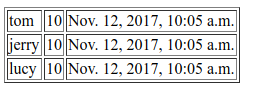

# 使用模板显示数据

Django中，模板对应的就是MTV模式的T，HTML在服务器端模板生成，返回给用户。这篇笔记记录如何在Django中使用模板。

## 一个简单的例子

下面例子代码中，访问一个URL，返回一个list，模板中使用for语法，在一个table中展示。

```
app1
├── __init__.py
├── models.py
├── templates
│   └── app1
│       └── user_list.html
├── urls.py
└── views.py
```

models.py
```python
class User(models.Model):
    username = models.CharField(max_length=20)
    age = models.IntegerField()
    birthday = models.DateTimeField()
```

views.py
```python
def query_list(request):

	user_list = []
	u1 = models.User(username="tom", age=10, birthday=timezone.now())
	u2 = models.User(username="jerry", age=10, birthday=timezone.now())
	u3 = models.User(username="lucy", age=10, birthday=timezone.now())

	user_list.append(u1)
	user_list.append(u2)
	user_list.append(u3)

	context = {
		"user_list": user_list
	}

	return render(request, "app1/user_list.html", context)
```

注意render()函数的参数，context有点像springMVC中的ModelAndView，用于向模板传递用于显示的数据结构。render()其实是封装了`HttpResponse(template.render(context, request))`。

user_list.html
```html
<!DOCTYPE html>
<html lang="en">
<head>
	<meta charset="UTF-8">
	<title>用户列表</title>
</head>
<body>
<table border="1px">
	
		<tr>
			<td>{{ user.username }}</td>
			<td>{{ user.age }}</td>
			<td>{{ user.birthday }}</td>
		</tr>
	
</table>
</body>
</html>
```

模板里使用了for循环遍历list，在一个table中进行显示。




## 分支和循环

```

    ...

    ...

```

```

    ...

```

## 转发和重定向

对比Java中的概念，前面的代码中，view将模型交给模板进行显示，算是类似于Servlet控制器把请求转发给JSP视图或另一个Servlet（Django里不知道叫不叫转发dispatch，反正就是那个意思）。除此之外，重定向也是比较常用的，比如提交表单成功后，没什么信息可显示，需要重定向到另一个页面。

此时就不用`render()`了，应该用`redirect()`。

urls.py
```python
url(r'^users2/$', views.query_list)
```

views.py
```python
def query_list2(request):
	return HttpResponseRedirect("/app1/users")
```
