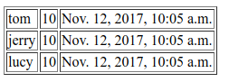

# 使用模板显示数据

Django中，模板对应的就是MTV模式的T，HTML在服务器端模板生成，返回给用户。这篇笔记记录如何在Django中使用模板。

## 一个简单的例子

下面例子代码中，访问一个URL，返回一个list，模板中使用for语法，在一个table中展示。

```
app1
├── __init__.py
├── models.py
├── templates
│   └── user_list.html
├── urls.py
└── views.py
```

models.py
```python
class User(models.Model):
    username = models.CharField(max_length=20)
    age = models.IntegerField()
    birthday = models.DateTimeField()
```

views.py
```python
def query_list(request):

	user_list = []
	u1 = models.User(username="tom", age=10, birthday=timezone.now())
	u2 = models.User(username="jerry", age=10, birthday=timezone.now())
	u3 = models.User(username="lucy", age=10, birthday=timezone.now())

	user_list.append(u1)
	user_list.append(u2)
	user_list.append(u3)

	context = {
		"user_list": user_list
	}

	return render(request, "user_list.html", context)
```

注意render()函数的参数，context有点像springMVC中的ModelAndView，用于向模板传递用于显示的数据结构。render()其实是封装了`HttpResponse(template.render(context, request))`。

user_list.html
```html
<!DOCTYPE html>
<html lang="en">
<head>
	<meta charset="UTF-8">
	<title>用户列表</title>
</head>
<body>
<table border="1px">
	
		<tr>
			<td>{{ user.username }}</td>
			<td>{{ user.age }}</td>
			<td>{{ user.birthday }}</td>
		</tr>
	
</table>
</body>
</html>
```

模板里使用了for循环遍历list，在一个table中进行显示。




## 分支和循环

模板中，分支和循环渲染逻辑非常常用，它们的写法如下。

```

    ...

    ...

```

```

    ...

```

关于其它模板指令，这里就不多介绍了，具体参考文档即可。

## 引用静态资源

模板中肯定会用到JavaScript、CSS等前端文件，这些内容是存于服务器上的静态文件，而非动态生成的数据。Django中有静态资源的默认存放路径，位于`项目根目录/模块名/static/模块名/`下。在模板中，引入方式如下：

```html
<!DOCTYPE html>
<html lang="en">
<head>
	<meta charset="UTF-8">
	<title>测试页面</title>
	
	<link href="" rel="stylesheet" type="text/css"/>
	...
</head>
...
</html>
```

模板中使用`static`能够自动帮我们生成静态文件的引入路径，开发调试时，测试服务器也会正确的处理静态文件。但要注意，部署时，还是需要在Nginx中手动配置静态文件的URL路径和文件位置的。

实际上，这个默认路径非常难用，不仅难于管理，部署时也会遇到问题。我的习惯是一个工程会把所有静态文件集中存放在一个文件夹中，比如`工程根目录/static/`。这需要在`settings.py`中进行额外的配置：

```python
STATIC_URL = '/static/'

STATICFILES_DIRS = [
    os.path.join(BASE_DIR, "static"),
]
```

第一行配置了静态文件的URL路径，后面配置了包含静态资源的文件夹在工程中的位置。
