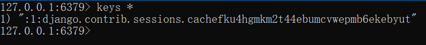

# Cookie和Session

Django中使用Cookie和Session很简单，和PHP差不多，这篇笔记简单介绍一下。

## Session中间件

Django中和Session有关的功能都是通过一个中间件：`django.contrib.sessions.middleware.SessionMiddleware`实现的，默认创建工程时，已经自动帮我们添加这个组件了。

## 设置访问Cookie和Session

设置session：
```python
request.session["is_login"] = True
```

访问session：
```python
is_login = request.session["is_login"]
```

对于Session的设置，Django中有一个暗坑，默认情况下，Session不会每一次请求都更新，仅仅会在Session的内容被修改后，Session中会有一个标识`request.session.modified`被自动置为`True`，Session才会更新。但如果我们对Session中的对象进行“深层”的修改（比如对`session['user']`对象中的属性进行修改，而不是`user`这个Session中相对外层的引用），这个标识就不会自动更新。解决办法有两种：

1. 手动设置`request.session.modified = True`，但这会使代码变得冗余
2. 在`settings.py`中加入配置`SESSION_SAVE_EVERY_REQUEST = True`，使得每次请求都会更新Session，但如果使用基于数据库的Session会使得数据库压力显著增大，最好配合Redis等中间件使用

设置cookie：
```python
def set_cookie(request):
	res = HttpResponse()
	res.set_cookie("key", "cookie")
	return res
```

访问cookie：
```python
def get_cookie(request):
	print(request.COOKIES["key"])
	return HttpResponse()
```

## 在模板中访问Session

最常见的一种需求是顶部导航的登陆判断，如果已经登陆，显示用户名和用户菜单，如果未登录，显示“请登录”，那么显然我们需要在模板中访问Session，判断用户是否已经登录。

对于下面例子，假设用户登录后，我们会将`user`对象存入Session中，模板中可以这样进行判断：

```html

	...

```

实际上，Django模板中也有类似JSP的内置对象，通过`request.session`就可以访问Session内容了。

## Session的超时和清除

### 关闭浏览器清除Session

对于Session，大多数框架的处理方式都是关闭浏览器时过期，但Django默认不是这样的。我们可以在`settings.py`中设置如下选项：

```python
# 关闭浏览器时让Session过期
SESSION_EXPIRE_AT_BROWSER_CLOSE = True
```

### 手动删除Session字段

代码中，我们也可以手动删除一个Session中的字段，下面例子中，删除Session中的`user`字段：

```python
request.session.pop('user')
```

### 设置Session的超时时间

下面例子中，Session会在5秒后超时：

```python
request.session.set_expiry(5)
```

注：实际上，经过实际测试，这个超时时间似乎不是太准确，指定5秒超时，但可能10秒后才真的起作用，不知道是不是bug。

## Session的存储

默认Django会在数据库中持久化Session，表名为`django_session`，如果需要手动清空服务端的Session，直接清空该表就可以了。

### 使用Redis存储Session

无论如何，使用数据库存储Session肯定不是个太好的注意，大量的请求会给数据库造成不小的压力。像Redis这种缓存系统存储Session是十分合适的。

安装Django的Redis插件：
```
pip install django-redis
```

`settings.py`中配置Redis缓存，并指定Session使用Redis缓存：

```python
CACHES = {
    "default": {
        "BACKEND": "django_redis.cache.RedisCache",
        "LOCATION": "redis://127.0.0.1:6379/0",
        "OPTIONS": {
            "CLIENT_CLASS": "django_redis.client.DefaultClient",
        }
    }
}

SESSION_ENGINE = "django.contrib.sessions.backends.cache"
```

`LOCATION`中配置的是Redis服务器的地址，其中最后的`/0`指定使用0号数据库。

我们可以在`redis-cli`工具中，查看Django生成的键值对：



