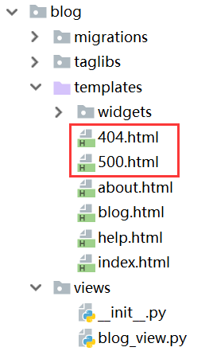
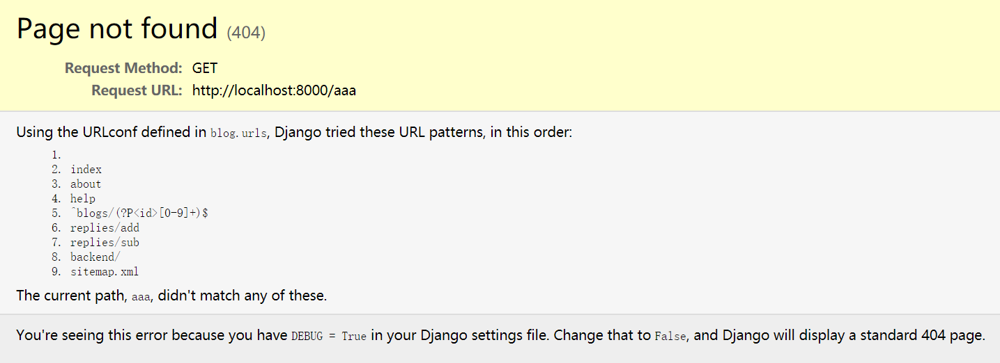

# 错误页面

我们的应用在出错时，应该返回给用户一个错误页面，Django中定义这个错误页面非常简单，直接在根模块中建立`404.html`、`500.html`等模板就可以了。

在开发过程中，因为`settings.py`中配置了`DEBUG = True`，因此开发调试时可能不会看到这个页面，而是Django的错误调试页面。

当我们将其修改为`DEBUG = False`时，就可以看到我们定制的错误页面了。
