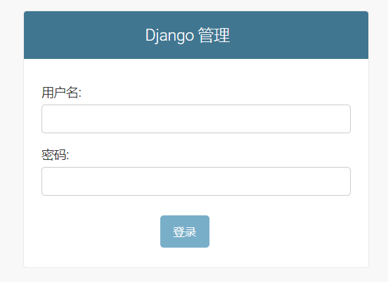
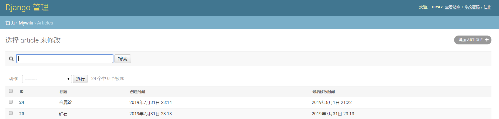
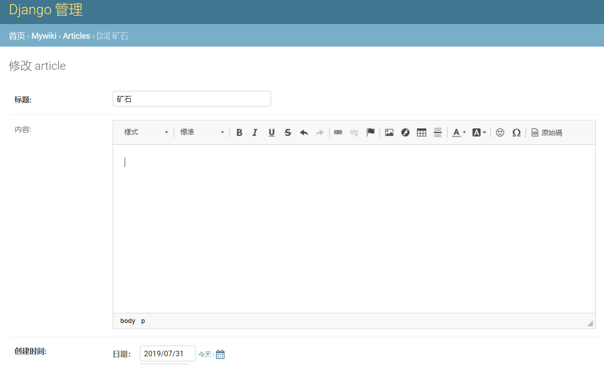

# admin-后台数据模型管理

新建项目默认自带的`django-admin`能够和Django数据模型无缝整合，为我们的Web应用程序提供后台数据管理功能，这个功能可以说是Django的杀手锏。对于一个随手写的小型网站，`django-admin`组件直接把一个开箱即用的后台给我们生成好了，直接给我们节省了一大半的开发时间。

当然，`django-admin`缺点也很明显，页面比较丑，增删改查功能比较僵硬，定制性很差，但对于大多数情况都足够了，这篇笔记简单介绍一下`admin`模块的使用方法。

## Admin后台配置

创建工程默认的`INSTALLED_APPS`中已经包含Admin组件及其依赖相关的APP配置了。除此之外，我们需要配置Admin后台的路由地址：

urls.py
```python
from django.contrib import admin
from django.urls import path


urlpatterns = [
    path('admin/', admin.site.urls),
]
```

以上配置完成后，我们可以创建一个管理员用户：
```
python manage.py createsuperuser
```

按照提示输入用户名、邮箱、密码、确认密码即可，创建完成我们即可通过该账号登录管理后台。



注：admin的登录功能默认是需要集成auth模块的，当然，这两个模块一般新创建项目时都是自带的。

## 注册模型

假设我们有这样一个定义好的数据模型：
```python
from django.db import models
from ckeditor_uploader.fields import RichTextUploadingField


class Article(models.Model):
    """文章实体类"""
    title = models.CharField(verbose_name='标题', max_length=255)
    content = RichTextUploadingField(verbose_name='内容', max_length=65535, null=True, blank=True)
    create_time = models.DateTimeField(verbose_name='创建时间')
    last_modified_time = models.DateTimeField(verbose_name='最后修改时间')

    def __str__(self):
        return '[' + str(self.pk) + '] ' + self.title
```

默认情况下，Admin后台除了用户管理，没有模型数据的管理，我们需要将模型数据注册到Admin组件。

admin.py
```python
from django.contrib import admin
from mywiki.models import Article


@admin.register(Article)
class ArticleAdmin(admin.ModelAdmin):
    list_display = ('id', 'title', 'create_time', 'last_modified_time')
    search_fields = ('content', 'title')
```

其中，`@admin.register()`装饰器将`Article`这个模型注册到了Admin管理后台，`list_display`指定列表展示的字段，`search_fields`定义了一个模糊匹配搜索功能。



注意：图中表格字段表头为中文名，而不是字段英文名，这是因为我们在数据模型字段上定义了`verbose_name`属性。

## 集成ckeditor

Admin后台中，默认`TextField`使用原始的`<textarea>`组件进行输入处理，对于CMS系统等使用场景，我们显然需要一个富文本编辑器，`django-admin`可以很容易和`ckeditor`集成。

安装依赖：
```
pip3 install django-ckeditor pillow
```

注：图片上传功能依赖`pillow`

在`settings.py`中，`INSTALLED_APPS`内加入以下两个应用：`ckeditor`和`ckeditor_uploader`，并加入以下配置：
```python
CKEDITOR_CONFIGS = {
    'default': {
        'toolbar': 'Full',
    },
}
MEDIA_ROOT = os.path.join(BASE_DIR, 'media')
MEDIA_URL = '/media/'
CKEDITOR_UPLOAD_PATH = 'upload/'
```

`CKEDITOR_CONFIGS`用于配置`ckeditor`编辑器组件，之后的三个配置用于指定媒体上传路径。

在`urls.py`中，加入路由`path('ckeditor/', include('ckeditor_uploader.urls'))`，指定上传功能的上传路径。此外还需要配置MEDIA路径的静态访问权限（实际部署时还要配下Nginx）：

```python
from django.conf.urls.static import static
from django.conf import settings
from django.contrib import admin
from django.urls import path, re_path, include


urlpatterns = [
    # ...其它路由配置
] + static(settings.MEDIA_URL, document_root=settings.MEDIA_ROOT)
```

最后在模型中，我们使用`RichTextUploadingField`替换`TextField`即可（代码参考前面Article模型），它们的参数参数基本一致。


