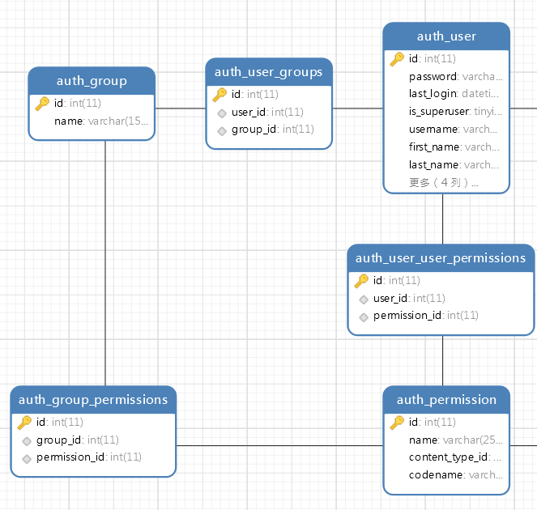

# auth-登陆和鉴权

`django-auth`提供了一个最基础的登陆和鉴权组件，实现了一个标准的RBAC访问控制模型。我们通过该组件可以很方便的实现用户、用户组（可以理解为RBAC中的角色）、权限的管理，以及登陆判断和权限判断功能，能满足大多数小型应用的权限管理需求，默认创建的Django项目已经自带`auth`模块了。

## auth的权限模型

`django-auth`的权限模型其实非常简单易懂，一共有三个实体类：

* 用户
* 用户组
* 权限

它们三个互为多对多关系，体现在数据库中，也就是三张实体表外加三张中间表。



我们围绕`auth`模块能够编写的一系列功能，都是基于对这三个对象操作实现的。

## 用户 User

`auth`中用户用来登录认证和分配权限。

### 用户管理

我们可以直接用ORM操作用户对象实现增删改查，但是`auth`模块中的`User`对象实际上已经封装了很多实用方法，很多功能我们甚至不需要自己写查表的ORM操作，直接调用这些方法就行了，这些方法定义可以直接查看`User`模型类的源码进行了解。

添加用户：
```python
User.objects.create_user('tom', email='tom@google.com', password='abc123')
```

注意，`User`的密码字段存储到数据库中不是明文，而是一个散列值，但这个逻辑不需要我们手动编写，`create_user`函数会自动帮我们进行处理，更改密码时也要调用相应的方法。

至于删除用户、修改用户、查询用户等操作，其实都是差不多的，有封装好的方法就直接调用，没有就使用ORM操作直接修改，这里就不多介绍了。

### 登入登出和判断

用户和登录相关，`auth`模块已经帮我们封装好登入、登出、登陆判断的逻辑了。

登陆判断例子：

```python
from django.contrib.auth.decorators import login_required
from django.http import HttpResponse
from django.contrib.auth.models import User, Group, Permission


@login_required(login_url='/login')
def index(request):
    User.objects.filter(username='tom').delete()
    return HttpResponse('OK')
```

登陆判断需要一个装饰器`login_required`，用它修饰的`view`方法能够通过`auth`模块判断是否已登陆，否则进行登录页面`/login`的重定向。

登入和登出例子：

```python
from django.http import HttpResponseRedirect, HttpResponseForbidden
from django.shortcuts import render
from django.contrib.auth import authenticate, login, logout


def login_page(request):
    return render(request, 'login.html')


def do_login(request):
    username = request.POST.get('username')
    password = request.POST.get('password')
    user = authenticate(username=username, password=password)
    if user is not None:
        login(request, user)
        return HttpResponseRedirect('/')
    else:
        return HttpResponseForbidden('认证失败')


def do_logout(request):
    logout(request)
```

`login_page`用来返回登录页面，就是一个HTML表单，这里不再占用篇幅了。

`do_login`是登录逻辑，`auth`模块中封装了`login()`函数，它会操作Session处理用户的登陆状态等问题，但是不包含认证功能。认证功能是通过`authenticate()`函数实现的，如果认证成功，其返回值是用户对象，认证失败返回`None`。

`do_logout`用于登出，`auth`封装的`logout`函数会清除用户的登录状态。

### 获取当前用户

我们可以用`request.user`获取当前的用户，如果已经登陆，返回登录用户。如果你的请求没有登录拦截，并且访问的客户端未登录，将返回`AnonymousUser`对象，这可以通过用户的`is_authenticated`进行判断。

## 用户组 Group

用户组操作和用户差不多，若干用户可以归集为用户组，然后针对用户组进行授权，省去挨个设定用户权限的麻烦。下面是一段例子代码：

```python
@login_required(login_url='/login')
def add_to_grp(request):
    # 获取当前用户
    current_user = request.user
    # 创建一个用户组
    new_group = Group.objects.create(name='研发组')
    # 将当前用户添加到用户组
    new_group.user_set.add(current_user)
    return HttpResponse('OK')
```

## 权限 Permission

`auth`模块默认的权限级别是模型级的，也就是说控制的粒度是某模型对应表的增删改查权限。如果想到针对表中某条数据实现权限控制，单独使用`auth`模块是难以实现的。

### 检查权限

我们可以用`has_perm()`函数判断用户或用户组是否有某权限，下面是例子代码：

```python
current_user = request.user
result = current_user.has_perm('auth.add_user')
```

上面代码检查了当前用户是否有`auth`模块的添加`User`对象的权限，如果有权限返回`True`，没有权限返回`False`。

除此之外，更常见的用法是直接在`view`方法上使用装饰器进行权限限定：

```python
@permission_required('auth.add_user')
```

如果没有权限，默认会返回`403`错误，我们也可以在`@permission_required`装饰器上添加`raise_exception`或`login_url`这两个命名参数，实现抛出自定义异常或是重定向。

### 添加权限

下面例子代码为当前用户添加`auth.add_user`权限。

```python
content_type = ContentType.objects.get(app_label='auth', model='user')
permission = Permission.objects.get(content_type=content_type, codename='add_user')
current_user.user_permissions.add(permission)
```

添加权限这里先手动操作用`ContentType`和`Permission`的ORM操作把一个权限对象给查出来，然后调用`user.user_permissions.add()`添加权限。删除等操作也是类似写法，这里就不多介绍了。
