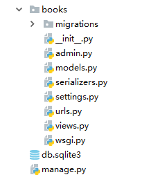
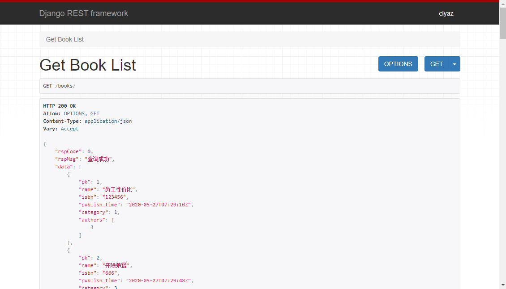

# drf-接口开发框架

Django REST Framework（以下简称drf）是Django框架中，用来开发Web接口的一个插件框架。

[https://www.django-rest-framework.org/](https://www.django-rest-framework.org/)

## drf简介

通过前面学习我们知道，Django的一个缺点就是前后端高度耦合，甚至出现了`form`组件这种邪路，做些个人博客、个人小型CMS之类的站点确实方便，但这已经无法满足现代较大型应用系统的建设需求了。

现在前端的发展非常迅速，早已经不是撸几个静态页，每个页面写千十来行难以维护的JQuery代码的时代了，前端项目的工程化和用户体验也得到了极大提升，现在后端更应把精力放在接口和业务逻辑上。

Django本体在这方面并没有多考虑，因此直接使用Django编写Web接口，需要写很多非业务功能性的重复代码，浪费时间，drf就是为了解决这个问题而设计的。

## drf的主要功能

drf主要功能分两部分：

1. 序列化器：使用drf的序列化器能够很方便的将查询模型的结果集映射到JSON。
2. 视图模板：drf提供了GenericAPIView和一系列Mixins，很多增删改查其实我们不需要手写，直接声明式的配置相关组件就可以自动生成相关功能了。

注：drf中mixins是指一种能够由视图继承的类，它们以REST规范实现了各种常用功能，比如查询列表、更新模型等，我们的视图采用多继承的方式继承这些mixins组件，就能自动实现相应功能。

当然，实际开发中肯定会碰到内置mixins无法满足的时候，我们基于drf的序列化器，手动写自己的视图也是很常见的状况。

## 配置drf框架

Django默认没有内置drf框架，我们需要手动安装：

```
pip3 install djangorestframework
```

然后在`settings.py`中，加入相关配置：

```python
INSTALLED_APPS = [
    'django.contrib.admin',
    'django.contrib.auth',
    'django.contrib.contenttypes',
    'django.contrib.sessions',
    'django.contrib.messages',
    'django.contrib.staticfiles',
    'rest_framework',
    ...
]
```

## drf基础用法

### 使用drf响应JSON数据

这里我们编写一个简单的例子工程`books`，使用drf的序列化器和响应组件，返回一组JSON数据。

下面例子中，我们有三个Model，书籍（Book）、分类（Category）、作者（Author）。



模型代码就不再多说了，这里我们关注`serializers.py`，它是我们定义drf序列化器的文件。

serializers.py
```python
from rest_framework import serializers
from books.models import *


class CategorySerializer(serializers.ModelSerializer):
    class Meta:
        model = Category
        fields = ['pk', 'name']


class AuthorSerializer(serializers.ModelSerializer):
    class Meta:
        model = Author
        fields = ['pk', 'name', 'gender']


class BookSerializer(serializers.ModelSerializer):
    class Meta:
        model = Book
        fields = ['pk', 'name', 'isbn', 'publish_time', 'category', 'authors']
```

里面内容其实很简单，就是模型配置到序列化器上。这里我们使用的是`ModelSerializer`，它是一个相对比较通用的序列化器，能够直接将指定的模型字段映射为JSON。

views.py
```python
from rest_framework.decorators import api_view
from rest_framework.response import Response
from books.models import *
from books.serializers import *


@api_view(['GET'])
def get_book_list(request):
    book_list = Book.objects.all()
    rsp_data = BookSerializer(book_list, many=True)
    return Response({
        'rspCode': 0,
        'rspMsg': '查询成功',
        'data': rsp_data.data
    }, status=200)

```

urls.py
```python
urlpatterns = [
    ...
    path('books/', views.get_book_list),
    ...
]
```

在`views.py`中，我们编写了一个`Function based view`，注意`@api_view`这个装饰器，它是drf提供的，用于处理drf专用请求响应组件，使用drf时我们需要带上这个装饰器（注：后面会用到Class based view，那边会使用另一种写法）。

代码逻辑很简单，我们查询出结果列表后，将其传入序列化器。`many=True`这个关键字参数意味着返回的结果是多个而不是一个。

最后返回一个drf提供的`Response`对象，其中第一个参数是一个字典类型，代表返回的JSON数据，其中`rsp_data.data`是序列化结果的字典类型数据。`Response`中比较常用的关键字参数`status`，是我们可以自定义的HTTP响应码。

用浏览器直接访问接口`http://localhost:8000/books`，会返回一个调试页面如下：



下面我们再编写一个根据ID查询数据的接口。

views.py
```python
@api_view(['GET'])
def get_book_by_pk(request, pk):
    book_list = Book.objects.filter(pk=pk)
    if len(book_list) != 0:
        rsp_data = BookSerializer(book_list[0])
        return Response({
            'rspCode': 0,
            'rspMsg': '查询成功',
            'data': rsp_data.data
        })
    else:
        return Response({
            'rspCode': 1,
            'rspMsg': '查询无结果',
            'data': None
        }, status=404)
```

urls.py
```python
urlpatterns = [
    ...
    re_path(r'^books/(?P<pk>[0-9]+)$', views.get_book_by_pk),
    ...
]
```

上面代码中，我们通过一个`re_path`指定了一个带路径参数的路由，在`views.py`中，我们通过路径参数传入的主键进行查询，查询结果通过drf的序列化器和Response组件返回。如果查询无结果，则返回空时对应的内容，这里我们还设置了HTTP响应码为`404`。

### 使用drf读取请求内容

之前我们看到drf对响应做了一个叫Response的封装，其实drf对请求也做了封装，使用非常简单。

#### 读取请求参数

下面例子中，我们改造了前面查询所有书籍列表的功能，加入了一个可选参数`category_id`，传入该参数，则查询该分类下的书籍，不传则查询全部。

```python
@api_view(['GET'])
def get_book_list(request):
    params = request.query_params
    category_id = params.get('category_id')
    if category_id is not None:
        # 存在分类参数，查询该分类的书籍
        category_list = Category.objects.filter(pk=category_id)
        if len(category_list) != 0:
            category = category_list[0]
            book_list = category.book_set.all()
        else:
            return Response({
                'rspCode': 1,
                'rspMsg': '查询无结果',
                'data': None
            })
    else:
        # 不存在分类参数，查询全部书籍
        book_list = Book.objects.all()

    rsp_data = BookSerializer(book_list, many=True)
    return Response({
        'rspCode': 0,
        'rspMsg': '查询成功',
        'data': rsp_data.data
    }, status=200)
```

drf对请求对象做了封装，使用`request.query_params`能够得到请求参数的字典表示。

#### 读取请求JSON

下面例子我们实现添加一个书籍，这里我们采用POST请求，请求体的书籍信息存储在POST请求体中。

```python
@api_view(['POST'])
def add_book(request):
    req_data = request.data
    category_id = req_data['category_id']
    category = Category.objects.get(pk=category_id)
    authors_id = req_data['authors_id']

    book = Book(name=req_data['name'], isbn=req_data['isbn'], publish_time=now(), category=category)
    book.save()

    for author_id in authors_id:
        author = Author.objects.get(pk=author_id)
        book.authors.add(author)
    book.save()

    return Response({
        'rspCode': 0,
        'rspMsg': '添加成功',
        'data': None
    })
```

通过drf提供的`request.data`，我们可以很容易获得请求体。取出的内容是JSON映射的字典类型，我们的请求信息中其实还包含了一个数组，也是能够正确解析的。

注：出于篇幅考虑，上面代码省去了一些必要的校验，实际开发中应该对请求字段做校验，一些关联模型是否存在也需要校验并实现相关操作。

由于是POST请求，我们可以通过Postman工具进行测试：

请求体：
```json
{
	"name":"testbook",
	"isbn":"66666666",
	"category_id":1,
	"authors_id": [1,2]
}
```

## 序列化组件

### ModelSerializer

之前我们代码中，使用的都是这个`ModelSerializer`，一般情况下，这个内置序列化器能够满足我们绝大部分需求，这里我们再详细介绍一下。

#### 简单使用

```python
class AuthorSerializer(serializers.ModelSerializer):
    class Meta:
        model = Author
        fields = ['pk', 'name', 'gender']
```

最简单的配置`ModelSerializer`写法如上述代码，我们配置好关联模型，以及显示的字段即可。

#### 嵌套序列化

有时候我们需要嵌套序列化，前面我们的Book模型会返回关联的Category和Author，但仅仅返回了主键，如果要嵌套返回完整的内容，则需要将序列化器嵌套定义。

```python
class BookSerializer(serializers.ModelSerializer):

    authors_set = AuthorSerializer(source='authors', many=True)

    class Meta:
        model = Book
        fields = ['pk', 'name', 'isbn', 'publish_time', 'category', 'authors', 'authors_set']
```

上面代码中，我们在`BookSerializer`中嵌套了一个`author_set`字段，它是通过序列化器`AuthorSerializer`实现的。注意其中的几个关键字参数，`source`表示模型`Book`中对应的字段，`many`指定其中内容是多个（这里我们Book和Author是多对多定义的）。

#### 增加自定义字段

有时候我们需要在返回信息中增加原本模型没有的字段，这可以通过`SerializerMethodField`实现。

```python
class BookSerializer(serializers.ModelSerializer):

    authors_cnt = serializers.SerializerMethodField()

    class Meta:
        model = Book
        fields = ['pk', 'name', 'isbn', 'publish_time', 'category', 'authors', 'authors_cnt']

    def get_authors_cnt(self, obj):
        return obj.authors.count()
```

上面代码中，我们新增了一个`authors_cnt`字段，表示该Book的作者数，但显然数据模型中没有这个字段，我们是通过`get_authors_cnt`函数中的逻辑返回的。

### 自定义序列化器

实际上，我们可以自定义序列化器。drf中，序列化器的基础类是`Serializer`，它也是`ModelSerializer`的父类。

我们可以看一下`Serializer`的构造函数（来自`BaseSerializer`）：

```python
def __init__(self, instance=None, data=empty, **kwargs)
```

* instance：序列化时传入Django模型实例
* data：用于反序列化
* context：可用于传递额外数据

下面例子中，我们通过自定义序列化器对模型Author进行序列化：

serializers.py
```python
class AuthorSerializer2(serializers.Serializer):
    name = serializers.CharField()
    gender = serializers.SerializerMethodField()

    def get_gender(self, obj):
        return obj.get_gender_display()
```

views.py
```python
@api_view(['GET'])
def get_author_list(request):
    authors = Author.objects.all()
    resp_data = AuthorSerializer2(instance=authors, many=True)
    return Response({
        'rspCode': 0,
        'rspMsg': '查询成功',
        'data': resp_data.data
    })
```

和直接使用`ModelSerializer`相比，我们手动定义了几个模型原有的字段，同时使用`SerializerMethodField`定义了一个定制化的字段。

实际上，`ModelSerializer`就是通过指定的`fields`属性，自动包装了一些字段，因此我们通常都是使用`ModelSerializer`，这样更加方便一些。

## 类视图和Mixins

### class based view

我们之前一直定义View的方式都是function based view，也就是一个函数处理一个请求，这种方式确实简单易用，也是最推荐的开发方式。

但函数难以像类一样实现继承、多继承，也不方便针对一个请求定义多个处理方式（比如`GET /books`和`POST /books`在后端是两种处理逻辑，使用函数就得在一个函数内判断请求方法，写起来不太优雅），因此drf提供的视图模板都需要结合class based view来使用。

### GenericViewSet和Mixins

drf中，我们的View可以继承`GenericViewSet`，它封装了一些基础逻辑供我们使用，结合Mixins能够无需编写代码实现各种常用功能，这里直接给出一个例子。

views.py
```python
class AuthorView(GenericAPIView, ListModelMixin):
    queryset = Author.objects.all()
    serializer_class = AuthorSerializer

    def get(self, request, *args, **kwargs):
        return self.list(request, *args, **kwargs)
```

urls.py
```python
urlpatterns = [
    ...
    path('authors/', views.AuthorView.as_view()),
    ...
]
```

上面代码中，我们使用了`ListModelMixin`，它能直接通过`list()`返回多个查询结果，不需要我们手动调用序列化器了。

未完，待续

## 相关配置

### CSRF检查
