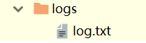

# logging-应用日志

我们知道Nginx有一个访问日志，但是我们的应用程序通常也需要记录日志，Django中默认使用Python内置的`logging`模块进行日志记录。

实际上，这个`logging`模块的功能不是太强，如果有非常复杂的日志记录要求，还是自己开发一个日志模块比较靠谱。

## 日志的配置

Python中的`logging`日志系统，主要分为四个组件：

1. formatter：格式化器，配置日志信息如何格式化
2. handler：处理器，配置日志文件名、编码等
3. logger：日志组件，可以看作是我们代码中引用的`logger`对象实例的总配置
4. filter：过滤器，决定过滤哪些日志内容

我们首先需要在`settings.py`中配置日志功能，下面是一个配置例子，这里将生成的日志放在工程目录`logs`文件夹下。

```python
# 日志

LOG_PATH = os.path.join(BASE_DIR, 'logs')

LOGGING = {
    'version': 1,
    'disable_existing_loggers': False,

    'formatters': {
        'default': {
            'format': '%(levelname)s %(funcName)s %(module)s %(asctime)s %(message)s'
        }
    },

    'handlers': {
        'app_handlers': {
            'level': 'DEBUG',
            'class': 'logging.handlers.RotatingFileHandler',
            'maxBytes': 5 * 1024 * 1024,
            'filename': '%s/log.txt' % LOG_PATH,
            'formatter': 'default',
            'encoding': 'utf-8'
        }
    },

    'loggers': {
        'app': {
            'handlers': ['app_handlers'],
            'level': 'INFO'
        }
    },

    'filters': {
    }
}
```

配置虽然比较长，但是都很容易看懂，这里就不过多解释了。

代码中调用日志组件例子：

```python
from django.shortcuts import render
import logging

logger = logging.getLogger('app')


def login_page(request):
    logger.info('访问登录页面')
    return render(request, 'login.html')
```

访问该方法后，可以看到`logs`文件夹下生成了对应的日志文件：



内容：

```
INFO login_page login_view 2019-11-28 10:11:04,864 访问登录页面
```
