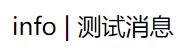

# message-消息

Web开发中有一个概念叫`flash message`，它用来设置一条信息，这条信息存储在Session或Cookie中，在当前会话下次HTTP请求的响应中返回这条信息给页面。这个功能一般用来输出表单错误信息等。Django中默认集成的`message`组件能够实现这个功能。

## message组件配置

默认创建的工程中，已经为我们配置好`message`组件了，`INSTALLED_APPS`中，包含了`django.contrib.messages`。`MIDDLEWARE`中，包含了中间件`django.contrib.messages.middleware.MessageMiddleware`，此外，模板`context_processors`配置中`django.contrib.messages.context_processors.messages`，它能让我们在模板中直接访问消息。

除此之外，还有一个`MESSAGE_STORAGE`的可选配置，默认值是`django.contrib.messages.storage.fallback.FallbackStorage`，它配置了消息的存储位置，默认情况是存储消息时优先使用`Cookie`，其次尝试`Session`，我们一般不需要改动这个配置。

## 例子

下面代码中，我们编写这样一个测试功能：首先访问`/add_msg`添加一条消息，然后访问`/show_msg`回显这条消息，再次访问`/show_msg`因为消息已经被消费掉，应该没有任何显示。

```python
from django.http import HttpResponse
from django.shortcuts import render
from django.contrib import messages


def add_msg(request):
    messages.info(request, '测试消息')
    return HttpResponse('OK')


def show_msg(request):
    return render(request, 'msg.html')
```

上面代码中，我们调用`messages.info`设置了消息，其中，`info()`生成了`INFO`级别的消息，Django中消息和日志错误级别类似，也有一个消息级别，分别是：

* DEBUG
* INFO
* SUCCESS
* WARNING
* ERROR

页面模板代码如下：

```html

    
        {{ message.tags }} | {{ message }}
    

```

在页面模板中，我们可以直接通过`messages`变量访问消息，我们遍历消息变量，其中`message.tags`可以获得消息级别，`message`可以获得消息内容。

第一次访问`/show_msg`浏览器输出：


