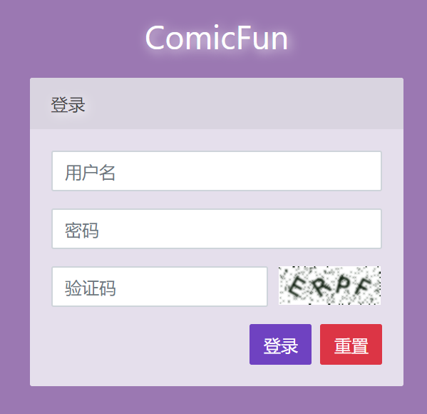

# simple-captcha 验证码

`django-simple-captcha`是一个简单易用的验证码组件，但使用文档语焉不详，网上的例子大多不能用，比较坑。

注：网上大多数教程都是结合`django-form`这个鸡肋组件使用的，本系列笔记是没有介绍这个`form`组件的，我们这里不使用该组件，主要原因是它不仅难用，局限性也实在是太大，我们这里还是使用纯HTML方式来搭建一个登录表单。

## 安装和配置

执行以下命令安装`django-simple-captcha`：

```
pip3 install django-simple-captcha
```

在Linux下，该组件依赖的一些图形处理库需要手动安装：

```
apt-get install libz-dev libjpeg-dev libfreetype6-dev
```

`settings.py`中需要在`INSTALLED_APPS`中配置`captcha`，然后配置相关功能，具体作用见以下代码注释，我们根据自己需要定制化即可：

settings.py
```python
# captcha配置
# https://django-simple-captcha.readthedocs.io/en/latest/usage.html

CAPTCHA_NOISE_FUNCTIONS = (
    'captcha.helpers.noise_null',
    # 'captcha.helpers.noise_arcs', # 干扰线
    'captcha.helpers.noise_dots',  # 干扰点
)
# 随机英文字母
CAPTCHA_CHALLENGE_FUNCT = 'captcha.helpers.random_char_challenge'
# 随机数学表达式
# CAPTCHA_CHALLENGE_FUNCT = 'captcha.helpers.math_challenge'
# 字符个数
CAPTCHA_LENGTH = 4
# 超时(minutes)
CAPTCHA_TIMEOUT = 5
# 验证码宽度和高度
CAPTCHA_IMAGE_SIZE = (95, 36)
```

配置验证码组件的路由：

urls.py
```python
urlpatterns = [
    # 验证码路由
    path('captcha/', include('captcha.urls')),
]
```

注：验证码图片的链接地址，就是通过这个路由获取的。

## 一个登录的例子

这里我们以一个登录页面为例进行介绍，下面例子我们主要关注验证码获取、验证码校验、验证码点击刷新这三个功能的实现。



login_view.py
```python
from django.shortcuts import render
from django.http import HttpResponseRedirect, JsonResponse, HttpResponseBadRequest
from captcha.models import CaptchaStore
from django.contrib.auth import authenticate, login, logout
from captcha.helpers import captcha_image_url


def login_page(request):
    """登录页"""
    captcha_key = CaptchaStore.generate_key()
    img_url = captcha_image_url(captcha_key)
    return render(request, 'login.html', {
        'captcha_key': captcha_key,
        'image_url': img_url
    })


def refresh_captcha(request):
    """更新验证码"""
    captcha_key = CaptchaStore.generate_key()
    img_url = captcha_image_url(captcha_key)
    return JsonResponse({
        'captcha_key': captcha_key,
        'image_url': img_url
    })


def do_login(request):
    """登录"""
    username = request.POST.get('username')
    password = request.POST.get('password')
    captcha_value = request.POST.get('captcha-value')
    captcha_key = request.POST.get('captcha-key')

    if username is None or password is None or captcha_value is None or captcha_key is None:
        return HttpResponseBadRequest()

    # 验证码校验
    captcha = CaptchaStore.objects.get(hashkey=captcha_key)
    if captcha.response != captcha_value.lower():
        captcha_key = CaptchaStore.generate_key()
        img_url = captcha_image_url(captcha_key)
        return render(request, 'login.html', {
            'username': username,
            'err_msg': '验证码错误',
            'captcha_key': captcha_key,
            'image_url': img_url
        })

    # 登录校验
    user = authenticate(request, username=username, password=password)
    if user is None:
        captcha_key = CaptchaStore.generate_key()
        img_url = captcha_image_url(captcha_key)
        return render(request, 'login.html', {
            'username': username,
            'err_msg': '用户名或密码错误',
            'captcha_key': captcha_key,
            'image_url': img_url
        })

    login(request, user)
    return HttpResponseRedirect('/index')


def do_logout(request):
    """提交退出登录"""
    logout(request)
    return HttpResponseRedirect('/login')
```

实际上，`django-simple-captcha`会将生成的验证码和一个键以`key-value`的形式保存在数据库中，生成验证码会返回一个`key`和一个验证码值，我们将`key`和验证码图片返回给前端，用户填写验证码后，和验证码值进行比对即可。

login.html
```html
<form action="/login/submit" method="post" onsubmit="return check();">
    
    <div class="form-group">
        <label for="username" class="d-none">用户名</label>
        <input type="text" class="form-control" id="username" name="username" autocomplete="off" placeholder="用户名" value="{{ username }}" />
        <div class="invalid-feedback" id="username-err"></div>
    </div>
    <div class="form-group">
        <label for="password" class="d-none">密码</label>
        <input type="password" class="form-control" name="password" id="password" placeholder="密码" />
        <div class="invalid-feedback" id="password-err"></div>
    </div>
    <div class="form-row">
        <div class="col-8">
            <label for="captcha-value" class="d-none">验证码</label>
            <input type="text" class="form-control" name="captcha-value" id="captcha-value" placeholder="验证码" />
            <input type="hidden" name="captcha-key" id="captcha-key" value="{{ captcha_key }}" />
            <div class="invalid-feedback" id="captcha-err"></div>
        </div>
        <div class="col-4" style="cursor: pointer;">
            
        </div>
    </div>
    <div style="margin-top: 1rem;">
        <span style="float: left;" class="err-msg">{{ err_msg }}</span>
        <button type="reset" class="btn btn-danger" style="float: right;">重置</button>
        <button type="submit" class="btn btn-primary" style="float: right; margin-right: .5rem;">登录</button>
    </div>
</form>
```

login.js
```javascript
// 验证码点击刷新实现
var imgNode = $('#captcha-img');
imgNode.click(function () {
    var csrf = $('[name="csrfmiddlewaretoken"]').val();
    $.ajax({
        type: "POST",
        async: true,
        url: '/login/captcha',
        headers: {
            'X-CSRFToken': csrf
        },
        dataType: "json",
        success: function (msg) {
            imgNode.attr('src', msg.image_url);
            $('#captcha-key').val(msg.captcha_key);
        }
    });
});
```

模板代码这里省略了一些不重要的细节，实际上点击刷新很简单，就是通过`ajax`重新请求一个验证码链接，让``标签去加载就行了。
