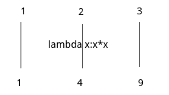

# map函数

文字不好解释，我们直接看例子。

```python
l = map(lambda x:x * x, [1, 2, 3])
print(list(l))
```

输出结果：

```
[1, 4, 9]
```

## map是什么意思？

注意：map第一个参数是函数，有一个参数和一个返回值

上面代码的完成的功能，看图：



# reduce函数

同样直接看例子。

```python
from functools import reduce

s = reduce(lambda x, y: x + y, [1, 2, 3, 4, 5])
print(s)
```

输出结果：

```
15
```

## reduce是什么意思？

注意：reduce第一个参数是一个函数，有两个参数和一个返回值

```
1 2 3 4 5
3 4 4 5
7 4 5
11 5
16
```

reduce就是这个意思。
