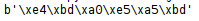
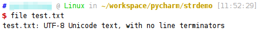

# 字符串编解码

python2中字符串编解码十分混乱，难以掌握，python3中改进了这一问题，这里介绍python3的编解码问题。

## str和bytes

str就是python中的字符串类型，我们知道可以直接使用引号定义字符串字面量。

```python
a = "你好"
```

但是此时我们使用的是什么编码呢？这涉及到好几个需要注意的地方：

1. 由于我是用的是Linux操作系统，因此我们保存的python源代码文件默认是`utf-8`编码。
2. 在文件开头加上一句`# -*- coding: utf-8 -*-`，python解释器会使用`utf-8`编码读取这个源代码文件。
3. python解释器运行我们的代码，创建变量a，但是我们知道，计算机内存中的字符保存的都是`Unicode`，这之间就需要编解码转换了，但是其实我们并不需要关心内存中的编码格式，我们认为它是一个变量就可以了。

我们可以使用bytes类型表示一个编码字符串的二进制。通过`decode()`和`encode()`函数可以完成这种转换。类似`b'\xe4\xbd\xa0\xe5\xa5\xbd'`的形式，我们也可以直接定义bytes类型的字面值。

### 将字符串编码为二进制

```python
a = "你好"
print(a.encode("utf-8"))
```

上面代码将字符串变量`a`以`utf-8`形式编码，得到其bytes类型表示。



### 将二进制解码为字符串

```python
a = b'\xe4\xbd\xa0\xe5\xa5\xbd'
print(a.decode("utf-8"))
```

上面代码将`utf-8`编码的bytes类型的`a`以`utf-8`形式解码，得到一个字符串变量。


### 完成一个编解码转换

为了说明编解码的应用场景，下面写一个例子，完成读取`utf-8`编码的文件，并以`gbk`编码保存其中的内容。

```python
# -*- coding: utf-8 -*-

fp = open("test.txt", "rb")
ch_byte_utf8 = fp.read()
fp.close()

ch_str = ch_byte_utf8.decode("UTF-8")
print(ch_str)
ch_byte_gbk = ch_str.encode("GBK")

fp = open("test.txt", "wb")
fp.write(ch_byte_gbk)
fp.close()
```

脚本运行之前，我们可以使用`file`命令查看其编码是`utf-8`。



运行脚本后，编码变成了`gbk`

注意：这里出现了一个很坑的问题，`file`命令并不能识别`gbk`编码，而是把它识别成了`ISO-8859-1`，但是我们使用的`PyCharm`开发环境支持`gbk`编码，使用`gbk`编码就能成功读取txt文件，说明这个文本文件的编码现在是`gbk`。


### 其他应用场景

python在编写爬虫方面，应用很多，网络上的数据传输经常需要编码转换。因此实际上，python编码问题还是十分常见的，遇到这种问题不要慌，回想起编码解码过程，问题就迎刃而解了。
