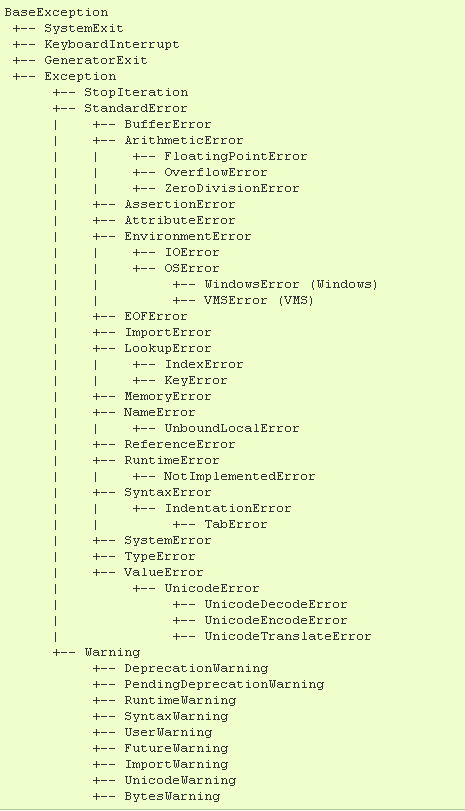

# Python异常处理

高级语言通常内置了`try...catch...finally...`机制。Python中也是一样，只不过关键字名稍微不一样，是`try...except...finally...`。Java中，异常处理机制包含Exception和Error，Exception又分为受检查异常和运行时异常，总的来说是比较复杂。

Python只有运行时异常，要么catch这个异常，要么沿着函数调用向上抛出。当异常抛到主函数时，解释器就会停止工作。

## 捕捉异常例子

```python
try:
	i = 1 / 0
except ZeroDivisionError as e:
	print(e)
finally:
	print("end")
```

和其他语言一样，运行时出错，就会进入`except`语句，无论执行成功与否，都会执行`finally`语句。

## 抛出异常

Python使用`raise`关键字抛出异常，下面是一个例子：

```python
class MyError(ZeroDivisionError):
	pass

def div(a, b):
	if b== 0:
		raise MyError("divide by zero")
```

我们继承`ZeroDivisionError`定义了自己的异常类，然后使用`raise`关键字抛出异常。

## Python异常继承体系



这张图是我在网上找到的，`BaseException`是所有异常的基类，它继承了`object`。但是我们定义自己的异常时，应该继承`Exception`。
