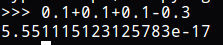

# Python的数据类型

掌握一门编程语言最重要的是先了解它的数据类型，这样我们才能定义变量，用这门语言进行一些运算。下面介绍Python的数据类型。

## 整数

Python整数就相当于C中的`int`，可以直接用`1`，`100`等字面量表示，对于十六进制字面量可以用`0x`前缀表示，二进制可以使用`0b`。

Python默认支持大数运算，也就是说，整数没有范围，当整数值超过C能表示的最大`int`时，会自动使用大数运算的算法，浮点数也是如此。

## 浮点数

Python3的浮点数提供17位精度，需要计算更高精度浮点数时，就需要使用其他模块了。使用浮点数要注意的问题是，Python3存储浮点数可能是不精确的。举个例子：

这是因为，内存中是以二进制形式存储数据的，对于某些浮点数，存储时就不会是我们定义的精确值。因此，如果用这种结果进行`if`相等判断，结果可能就错了。

注：那么使用C语言时是不是也是这样呢？实际上也是一样，不过这个问题我竟然从未意识到。因为我从未用浮点数运算结果做相等判断，`printf`输出时，并没有保留17位精度，经常把不精确的结果给直接忽略了。

## 字符串

Python3的字符串字面量可以用`''`和`""`定义，虽然用哪个都一样，但是我熟悉C语言风格的语法，所以我喜欢使用双引号。

同其他语言一样，Python也是用`\`作为转义字符。

## 布尔类型

布尔值有两个`True`，`False`，布尔值只能用布尔运算`and`，`or`，`not`。

## 空值 None

None就像其他语言的null，表示空值。判断一个变量是否是空值，可以用`if foo is None`。
