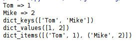

# Python中的集合数据结构

Python提供了列表，元组，字典，集合，这几种常用的数据结构，下面介绍他们的常见用法。实际上，python提供了丰富的函数库，包括了大量的实用方法，这里无法一一列举。建议查阅文档，或者使用PyCharm的查看文档功能随时查阅。

## 列表 list

其实也可以不严谨的叫它数组。

### 定义一个list

```python
l = ["dog", "cat"]
```

list使用中括号表示字面量，里面是任意数据类型的。虽然list可以同时存例如str和int，但是并没有什么用，不要这样写。

定义一个空list直接使用`l = []`即可。

### 得到list的长度

```python
l = ["dog", "cat"]
l_len = len(l)
```

### 使用索引访问list的元素

```python
l = ["dog", "cat"]
a = l[0]
```

注意：list的索引从0开始，到`len - 1`结束。同时还有一个反向索引，从`-1`开始，`-1`表示最后一个元素。使用超出list范围的的索引会引发`Index Error:list index out of range`。

### 添加删除元素

```python
l = ["dog", "cat"]
l.append("bird")
l.pop()
l.insert(0, "fish")
l.pop(1)
```

* `append(obj)`在list最后添加元素
* `pop()`删除list最后的元素
* `pop(i)` 删除指定位置的元素
* `insert(index, obj)`在指定位置元素前添加元素

### 遍历list

```python
l = ["dog", "cat", "fish"]
for i in l:
	print(i)
```

python中可以直接使用`for`迭代遍历一个list。

## 元组 tuple

元组是一个不可变的集合。

### 定义一个tuple

```python
t = ("dog", "cat")
```

就像Java有个不可变的`String`一样，Python有个不可变的`tuple`，理解起来原理是一样的。`tuple`和`list`一样，可以使用索引，可以使用`len()`，但是没有添加删除的方法了。

那么`tuple`用在什么地方呢？比如一个函数返回值是一个二维坐标如：`(12.5, 24.3)`，这时可以用元组表示，因为这个坐标只是代表一个值，我们不需要它可变。而`list`可以看做是一个容器数据结构，我们可以用它存放一组坐标，随时添加删除。

## 字典 dict

字典就是一组键值对，通常通过哈希表或平衡树实现。Java中对应的数据结构是`Map`。这个非常好理解。Python的dict应该是使用优化的哈希表实现的，所以dict是无法保证顺序的。

### 定义一个dict

```python
d = {"Tom":1, "Mike":2}
```

字典使用大括号定义字面值。定义一个空的字典：`d = {}`。

### 使用索引访问字典

```python
d = {"Tom":1, "Mike":2}
a = d["Tom"]
```

如果索引不存在，会抛出`KeyError`。我们可以判断索引是否存在：

```python
d = {"Tom":1, "Mike":2}
if "Tom" in d:
	a = d["Tom"]
```

### 添加和删除元素

```python
d = {"Tom":1, "Mike":2}
d.pop("Tom")
d["Lucy"] = 3
```

* `pop(key)` 删除指定key的键值对

### 判断某个key是否存在

```python
d = {"Tom":1, "Mike":2}
if "Tom" in d:
	print(d["Tom"])
```

### 遍历dict

首先要说的是，通常没有需求要求遍历一个字典。一定要遍历的话，我们可以遍历key。

```python
d = {"Tom":1, "Mike":2}
for k in d:
	print(k, "=>", d[k])
```

除此之外，我们还可以使用`dict.keys()`，`dict.values()`，`dict.items()`获取字典的键列表，值列表，键值对元组列表。这些数据可以间接用来遍历。

```python
d = {"Tom":1, "Mike":2}

keys = d.keys()
print(keys)

values = d.values()
print(values)

items = d.items()
print(items)
```

运行结果：



## set

`set`和Java的`Set`用法基本一样。其元素是无重复的，经常用于表示对应数据库表的实体之间的关系。

### 创建set

```python
s = {1, 2, 3}
```

`set`也是使用大括号创建。但是要是创建一个空`set`就不能`s = {}`了，这样和`dict`冲突，所以python认为这样创建的是一个dict。创建空set可以使用`s = set()`。

### 添加删除

```python
s = set()
s.add(3)
s.remove(2)
```

* `set.add()` 添加元素
* `set.remove()` 删除元素

### 迭代set

```python
s = {1, 2, 3}
for i in s:
	print(i)
```
