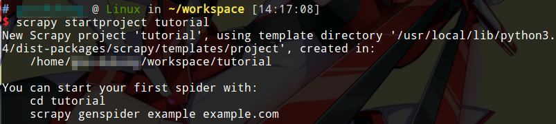
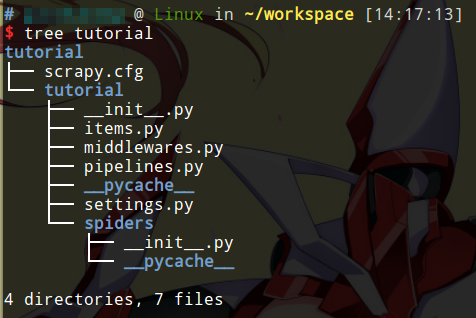
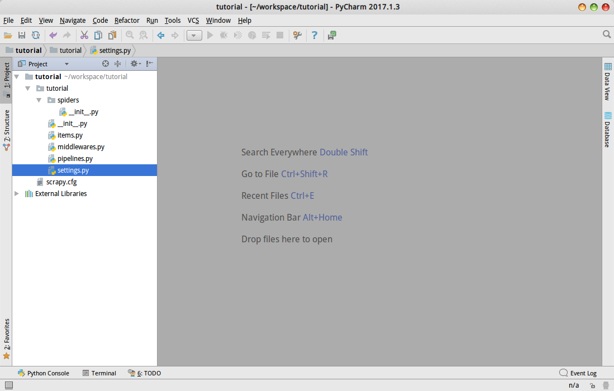
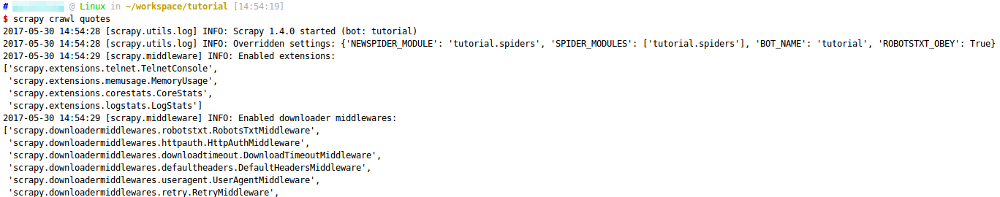
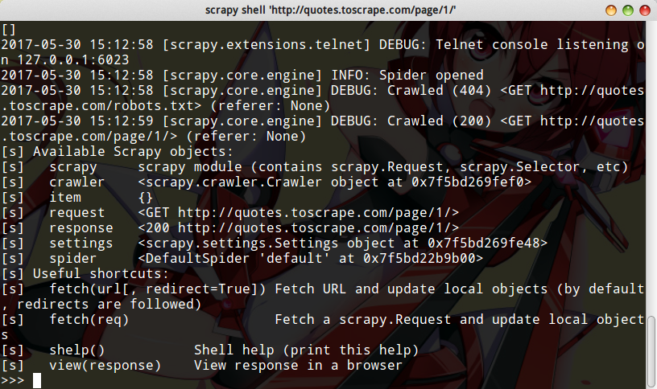
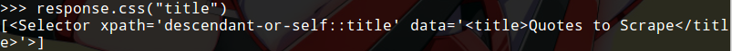
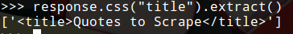
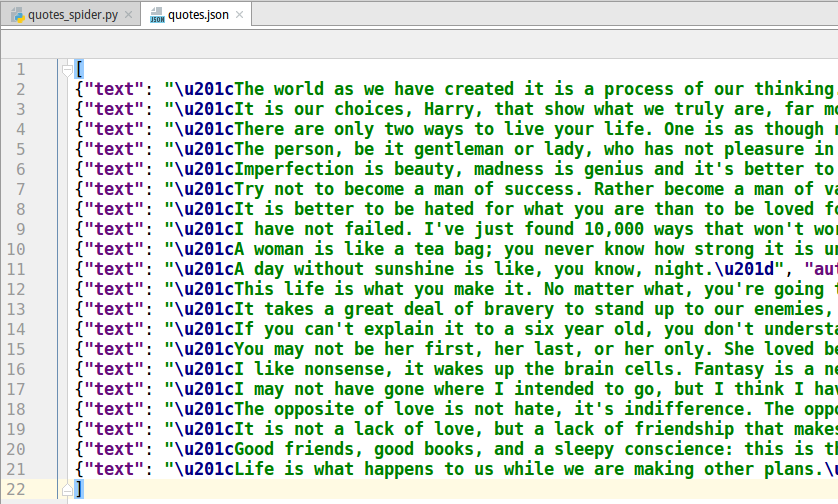
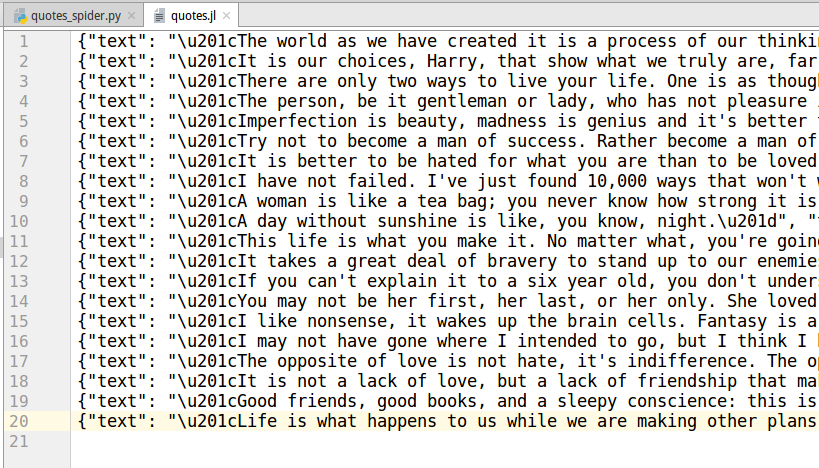

# Scrapy简介

Scrapy是一个用来抓取网站数据的爬虫框架。我们可以基于这个框架，很方便的实现我们自己的爬虫程序。本篇笔记包含Scrapy环境搭建，以及一个爬虫的示例程序（来自官网）。

官网文档[https://doc.scrapy.org/en/latest/index.html](https://doc.scrapy.org/en/latest/index.html)

## 安装scrapy

本文以Ubuntu14.04为例，我们使用Python3。

官网文档建议使用venv虚拟环境，我觉得无所谓吧，全局安装的Scrapy有命令行工具会自动安装到`/usr/local/bin/scrapy`，如果装虚拟环境还要切环境，太麻烦了，只是要小心别在Python2和3上同时装，否则就冲突了。

安装：
```
pip3 install Scrapy
```

这里我们安装的是当前的最新版本Scrapy 1.4.0。

## Scrapy简单例子

接下来我们写一个简单的例子，这个例子来自官网文档Tutorial部分。我们爬取的数据是Scrapy提供的一个测试网站[http://quotes.toscrape.com/](http://quotes.toscrape.com/)。

### 创建项目

```
scrapy startproject tutorial
```

我们使用scrapy命令行工具创建项目。



自动生成的项目结构：



这里为了方便起见，我们把项目导入了pycharm。当然用文本编辑器也是一样的。



## 编写一个Spider

* Spider：蜘蛛经常在网（这里指Internet）上行走，所以老外把爬虫叫蜘蛛

我们需要编写一个Spider类，Spider就是从网页上抓取数据的实现类，这个类必须继承`scrapy.Spider`，然后定义起始HTTP请求。我们还可以定义Spider的一些其他行为，如：如何点进页面的链接，如何抽取获得的数据等。

tutorial/spiders/quotes_spider.py
```python
import scrapy


class QuotesSpider(scrapy.Spider):
	name = "quotes"

	def start_requests(self):
		urls = [
			'http://quotes.toscrape.com/page/1/',
			'http://quotes.toscrape.com/page/2/',
		]
		for url in urls:
			yield scrapy.Request(url=url, callback=self.parse)

	def parse(self, response):
		page = response.url.split("/")[-2]
		filename = 'quotes-%s.html' % page
		with open(filename, 'wb') as f:
			f.write(response.body)
		self.log('Saved file %s' % filename)
```

简单看一下这个类：

* name：爬虫的名字，这个名字是必须指定的，而且是不能重复的，scrapy框架会根据这个名字实例化爬虫类。
* start_requests()：这是覆盖父类的一个方法，这个函数返回了一个生成器，返回值是一个scrapy.Request对象，参数传入了我们定义的url和下面的定义的parse()作为回调。这个很好理解，Request对象看来就是一个自动发起HTTP请求的类，请求URL由我们传入，返回数据用我们提供的回调函数解析。
* parse()：这也是覆盖父类的一个方法，这个函数用来处理Request的返回数据，参数response是TextResponse对象，里面包含了HTTP请求返回的数据。函数体很好理解，我就不多解释了。

## 执行这个Spider

```
scrapy crawl quotes
```



根据前面代码，我们知道Spider会下载两个URL对应的网页，然后写入文件，仅此而已。

## 查看下载的文件

我们可以用pycharm的html编辑器查看下载的html，或者直接用浏览器打开。打开网页后，会发现没有样式表，这是因为我们就没下载css等，html里写的又是相对路径，自然就加载不出样式了，不过没关系，我们只关心数据，不关心css。


## 如何抽取数据

scrapy提供css选择器用来解析html（实际上应该是依赖lxml来解析），同时还提供了一个`scrapy shell`命令行程序，这个程序相当于Python交互式解释器，但是scrapy预先执行了一些代码，我们有一些scrapy对象可以直接使用。

```
scrapy shell 'http://quotes.toscrape.com/page/1/'
```



如上图所示，可用的scrapy对象都给我们列出来了。

### CSS选择器

现在，在`scrapy shell`里，我们试着测试一个css选择器。



data中有我们选择的数据。

#### extract()

* resonse.css("title")：这个函数返回一个`list-like`的SelectorList，包含css选择器选取的全部数据。我们可以使用`extract()`提取数据，见下图。



注意返回结果还是一个列表，因为SelectorList是`list-like`，有多个数据，如果我们只想选取第一个数据，可以使用`resonse.css("title")[0].extract()`或者`resonse.css("title").extract_first()`都可以，后者能够避免数组越界异常（无数据返回None）。

注意返回的数据还有`<title>`包围，我们可能只想提取文本节点，这时可以使用`css("title::text")`。

#### re()

除了`extract()`，我们还可以使用正则表达式提取数据，这时使用`re()`代替`extract()`。

### XPath选择器

其实css选择器我反倒不喜欢用，我更喜欢XPath表达式：简洁，准确。

```python
response.xpath("//title/text()").extract_first()
```

如果你会XPath表达式（参考软件和开发工具/特种用途语言），这个就非常简单了，我们直接选取`title`节点的文本节点。

实际上，CSS选择器也是转化成XPath表达式，然后使用lxml解析的，XPath更为灵活强大，建议使用。

## 在Spider中编写抽取数据的代码

现在我们把parse()改成这样了：
```python
import scrapy


class QuotesSpider(scrapy.Spider):
	name = "quotes"
	start_urls = [
		'http://quotes.toscrape.com/page/1/',
		'http://quotes.toscrape.com/page/2/',
	]

	def parse(self, response):
		for quote in response.css('div.quote'):
			yield {
				'text': quote.css('span.text::text').extract_first(),
				'author': quote.css('small.author::text').extract_first(),
				'tags': quote.css('div.tags a.tag::text').extract(),
			}
```

首先`start_requests()`函数被干掉了，这里我们使用了`start_urls`属性。实际上结果是一样的，原来`start_requests()`的作用就是定义几个URL，然后创建Request的实例，此处这种写法，scrapy也能正确读到`start_urls`，为每个URL自动创建Request，回调parse()，具体请看scrapy.Spider的代码。

虽然官网给出的例子是这么写的，我还是建议覆盖一下`start_requests()`，实际使用一下就会发现原因了。当然`url`定义成类属性完全没什么问题。

parse()现在返回了一个生成器，之前的代码是没返回值的。我们使用css选择器选取了几个数据。我们再运行Spider看看效果：

```
...
2017-05-30 15:35:47 [scrapy.core.scraper] DEBUG: Scraped from <200 http://quotes.toscrape.com/page/1/>
{'text': '“The world as we have created it is a process of our thinking. It cannot be changed without changing our thinking.”', 'tags': ['change', 'deep-thoughts', 'thinking', 'world'], 'author': 'Albert Einstein'}
2017-05-30 15:35:47 [scrapy.core.scraper] DEBUG: Scraped from <200 http://quotes.toscrape.com/page/1/>
{'text': '“It is our choices, Harry, that show what we truly are, far more than our abilities.”', 'tags': ['abilities', 'choices'], 'author': 'J.K. Rowling'}
...
```

返回数据较长，我们截取一部分，可以看到，控制台上打印了我们返回的字典生成器的若干值。

## 数据持久化

持久化Scrapy抓取到的数据最简单的方式，是使用`Feed exports`，直接使用命令：

```
scrapy crawl quotes -o quotes.json
```

这条命令会自动把返回的数据存储到一个指定的json文件中。运行结果：



注意：由于历史原因，重复运行上面的命令不会清空原来的文件，而是追加写入文件，要注意这个问题。

scrapy也支持写成JSON Lines格式：
```
scrapy crawl quotes -o quotes.jl
```

这个格式我还是第一次听说，原来就是这样的。



等等，写进文件什么鬼，scrapy就不能内嵌支持个mongodb吗？想多了，还得自己写(╯°Д°)╯︵ ┻━┻

在小规模数据采集程序中，使用Json文件保存数据已经足够了，但是如果我们想实现更复杂的数据持久化功能，就需要写一个`Item Pipeline`。这个文件初始化工程时，已经帮我们创建好了，就是`tutorial/pipelines.py`文件。

有关`Item Pipeline`将在后续章节介绍。

## let Spider follow links（爬虫自动进入超链接）

我们刚刚编写的Spider只能下载指定的两个url上的html文档，这远远不够。比如我们抓取一个论坛的数据，初始页面一般是一个帖子列表，页面上还有翻页按钮，我们要抓取的是所有用户，发帖信息等。我们需要Spider能“从首页点进帖子里”。

官网例子就是实现翻页，翻页按钮是这样的：

```html
<ul class="pager">
    <li class="next">
        <a href="/page/2/">Next <span aria-hidden="true">&rarr;</span></a>
    </li>
</ul>
```

所以我们可以这样提取翻页链接：
```python
response.css('li.next a::attr(href)').extract_first()
```

修改一下我们的Spider：
```python
import scrapy


class QuotesSpider(scrapy.Spider):
	name = "quotes"
	start_urls = [
		'http://quotes.toscrape.com/page/1/',
	]

	def parse(self, response):
		for quote in response.css('div.quote'):
			yield {
				'text': quote.css('span.text::text').extract_first(),
				'author': quote.css('small.author::text').extract_first(),
				'tags': quote.css('div.tags a.tag::text').extract(),
			}

		next_page = response.css('li.next a::attr(href)').extract_first()
		if next_page is not None:
			next_page = response.urljoin(next_page)
			yield scrapy.Request(next_page, callback=self.parse)
```

我们修改了`parse()`，实际上也是很好理解，我们先返回了第一页的所有数据，然后实例化一个Request实现翻页，发出第二个HTTP请求后，`parse()`再次被回调，返回下一页数据，如此循环，直到`next_page is not None`为假。

* urljoin()：因为链接可能是相对链接，这个函数会自动判断，相对链接会自动加上主机名，最后返回一个绝对链接

为什么返回一个Request对象，scrapy就能自动发起第二个请求呢？因为scrapy框架内部自动判断了一下，我们使用框架，知道能这么用就行了。

```python
yield response.follow(next_page, callback=self.parse)
```

scrapy还提供了一种简化的返回Request对象的方法，使用`response.follow()`函数，他会自动调用`urljoin()`。

如果一个页面有两个一模一样的链接，我们提取的关键字又不会加以区分，Spider会不会进入“下一页”两次？默认不会，scrapy考虑了这种情况，不会重复进入一个页面，当然有时情况比较复杂，我们需要关闭这个“聪明”的功能：在setting.py加上`DUPEFILTER_CLASS='scrapy.dupefilters.BaseDupeFilter'`即可。注意：如果两个或多个页面是环（图论的环），这可能造成死循环。

我们也可以继承`RFPDupeFilter`并覆盖`request_fingerprint()`，实现我们自己的重复连接检查函数。

## Spider读取命令行参数

我们执行爬虫时，可以传入命令行参数，例如：

```
scrapy crawl quotes -o quotes-humor.json -a tag=humor
```

这些参数会传入`__init__`变成Spider的属性，上面命令的例子，我们直接使用`self.tag`就能引用这个参数了。
