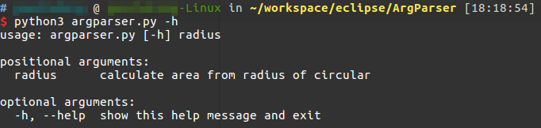
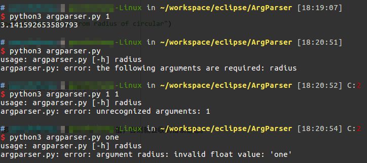
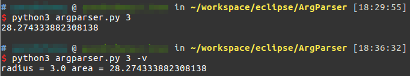
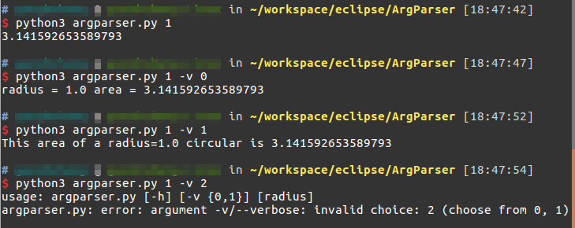

# argparse命令行参数解析

Linux下有大量命令行程序，我们自己编写命令行程序时，不但需要解析命令行参数的选项和值，还要编写的尽量符合Linux的规范。不仅如此，我们还必须做好错误处理，在用户输入错误时给出适当提示，还需要做好帮助信息等功能。显然，每个程序都需要这种功能，自己写起来又比较麻，因此Python内置了argparse模块专门来解析命令行参数。

* 有关Linux下命令行规范可以参考`/Linux系统维护/命令和工具/Linux命令格式`。
* argparse在官方文档上有一篇详细的教程：[https://docs.python.org/3.5/howto/argparse.html](https://docs.python.org/3.5/howto/argparse.html)

官网教程比较详细，就不全文翻译了，这篇文章记录argparse常见需求下的最佳实践。同时，也要记住，不要过度使用命令行参数，太复杂的命令行选项会让软件非常难以使用，适当的CLI交互界面，甚至GUI交互界面也是十分必要的。

## 使用命令行传值

下面例子是一个计算圆的面积的程序。这个程序接受一个命令行参数值作为半径。

```python
import argparse
import math

parser = argparse.ArgumentParser()
parser.add_argument("radius", type=float, help="calculate area from radius of circular")

args = parser.parse_args()
print(math.pi * args.radius ** 2)
```

argparse会自动为我们的命令行程序添加`-h`（或是`--help`）选项，运行结果如下。



同时，我们在代码中指定了一个命令行参数`radius`，那么用户就必须正确的输入这个参数值，否则就会收到错误信息。



`parser.add_argument()`可携带的关键字参数：

* `type`：指定了命令行参数的类型
* `help`：制定了命令行参数的提示信息

`argparse.ArgumentParser()`可携带的关键字参数：

* `description`：这个字符串可以作为程序的简介

## 可省略的参数值

下面代码将上面程序改为：用户传递`radius`，就使用用户传递的，否则默认为0。

```python
import argparse
import math

parser = argparse.ArgumentParser()
parser.add_argument("radius", type=float, help="calculate area from radius of circular", nargs="?", default="0")

args = parser.parse_args()
print(math.pi * args.radius ** 2)
```

`parser.add_argument()`可携带的关键字参数：

* `nargs`：其值是一个正则表达式的数量限定词，一般可选`?`（0或1个），`*`（任意个），`+`（>=1个）
* `default`：命令行参数的默认值

## 使用命令行选项

上面程序再增加一个功能：使用选项`--verbose`（或`-v`）能够输出详细信息。

```python
import argparse
import math

parser = argparse.ArgumentParser()
parser.add_argument("radius", type=float, help="calculate area from radius of circular", nargs="?", default="0")
parser.add_argument("-v", "--verbose", help="show verbose information", action="store_true")

args = parser.parse_args()
result = math.pi * args.radius ** 2
if args.verbose == True:
	print("radius = {} area = {}".format(args.radius, result))
else:
	print(result)
```

运行结果如下：



上面代码中，我们设置了一个命令行选项，可以看出写法非常简单，同样是`parser.add_argument()`函数，向其传递我们需要的选项字符串就好了，不过要注意按照规范，命令行选项是以`-`或`--`开头的。建议两种形式都提供给用户。

`parser.add_argument()`可携带的关键字参数：

* `action="store_true"`：该选项意味着用户传递`--verbose`参数，`args.verbose`就为`True`，否则为`False`

## 使用命令行选项值

继续修改上面程序，`--verbose`选项带有参数值，可选0或1，表示两种不同的显示方式，不能取其他值。

```python
import argparse
import math

parser = argparse.ArgumentParser()
parser.add_argument("radius", type=float, help="calculate area from radius of circular", nargs="?", default="0")
parser.add_argument("-v", "--verbose", help="show verbose information", type=int, choices=[0, 1])

args = parser.parse_args()
result = math.pi * args.radius ** 2
if args.verbose == 0:
	print("radius = {} area = {}".format(args.radius, result))
elif args.verbose == 1:
	print("This area of a radius={} circular is {}".format(args.radius, result))
else:
	print(result)
```



`parser.add_argument()`可携带的关键字参数：

* `type`：命令行选项携带的参数值
* `choices`：命令行选项携带的参数的可选值
