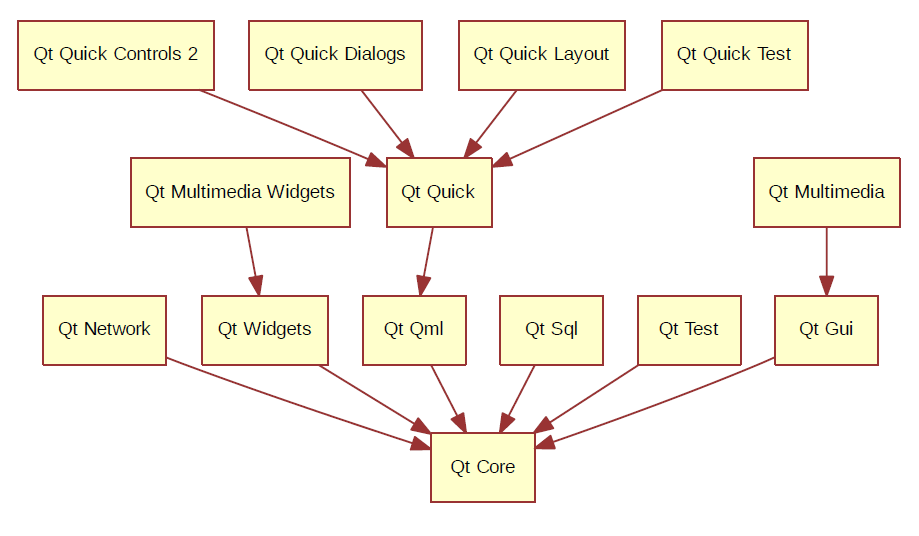

# Qt Quick 简介和环境搭建

本系列笔记基于最新版的Qt5.12，有关Qt相关工具的安装，请参考`Qt应用程序开发基础`章节。

## 使用Qt Quick需要了解的知识

Qt是一个非常庞大的框架，它不仅仅包含基础的GUI功能，在最新的Qt框架中，包含了多媒体、网络、数据库等大量实用功能的类库。本系列笔记介绍如何使用QML开发GUI程序，我们会涉及到下面这些模块：

* Qt Core：核心库，所有其他模块的依赖
* Qt GUI：基于OpenGL，所有GUI组件的核心依赖
* Qt Multimedia：包括音视频，摄像头功能的库
* Qt Multimedia Widgets：多媒体功能的控件库
* Qt Network：网络库
* Qt QML：QML语言相关的核心依赖
* Qt Quick：基于QML实现GUI的现代化框架
* Qt Quick Controls 2：Qt Quick框架的控件库
* Qt Quick Dialogs：Qt Quick中使用系统对话框的依赖库
* Qt Quick Layouts：布局相关库
* Qt Quick Test：QML程序的单元测试框架
* Qt Widgets：传统的C++控件库

