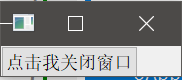

# Qt简介和环境搭建

Qt是一个流行的使用C++语言开发的，跨平台的图形界面应用程序开发框架。在我们经常使用的许多桌面软件程序中，有很多都是基于Qt框架开发的。其中最著名的是Linux桌面环境KDE（虽然我是用Gnome的），至今已经发布了KDE 5 Plasma。

Qt有基于LGPL协议的免费版本，也有商业版本。这里我们使用的主要目的是开发开源软件，因此使用的是社区版。Qt的安装包包含开发Qt程序使用的IDE（Qt Creator，包含界面设计器、C++文本编辑器、帮助文档），Qt使用的工具（qmake），Qt的各种库等。由于在线安装包下载比较缓慢，因此建议使用镜像源下载离线安装包。

现在最新的版本是Qt 5.9.0，本系列笔记基于Qt5.9.0，以及Windows10操作系统，使用MinGW编译器，虽然Visual Studio也有插件可以支持Qt程序，但是这里还是选择比较简单方便的Qt Creator作为开发的IDE工具。

Qt离线安装包下载地址：[http://download.qt.io/archive/qt/](http://download.qt.io/archive/qt/)

上面地址服务器在国外，下载速度是比较慢的，我们也可以在镜像库中找一找，镜像列表地址：[http://download.qt.io/static/mirrorlist/](http://download.qt.io/static/mirrorlist/)

## Qt功能模块

Qt并不仅仅是一个GUI框架，Qt包含大量包括数据库、网络的操作库，极大的补充了贫弱不堪的C++标准库，而且有良好的文档。因此使用Qt时，我们可以省去大量寻找并学习各种库的麻烦。

一些常用的库：

* Qt Core：核心功能库，所有其他模块的依赖
* Qt GUI：所有GUI组件的核心依赖
* Qt Multimedia：包括音视频，摄像头功能的库
* Qt Multimedia Widgets：多媒体功能的控件库
* Qt Network：网络库
* Qt Sql：数据库支持
* Qt QML：QML语言相关的核心依赖
* Qt Quick：基于QML实现GUI的现代化框架
* Qt Widgets：传统的基于C++的控件库

其中，关于Qt Quick，将单独分出一组笔记进行学习。

## Hello,world!

下面是一个最简单的Qt程序，界面上有一个按钮，点击按钮后窗口关闭，程序退出。这个例子中，我们创建一个空项目`hello`，然后添加一个源文件`main.cpp`。

为了使用Qt Widgets，我们需要手动在`.pro`文件中引入我们需要的模块`widgets`。`.pro`文件是用来指示qmake工具的，这样做后，qmake在生成Makefile时会自动添加Qt Widgets相关的动态链接库编译命令。如果使用Qt Creator IDE，其实我们不必太过关心程序具体的编译和构建过程，有关这部分内容，将在后续章节介绍。

hello.pro
```
SOURCES += \
    main.cpp
QT += widgets
```

补充：如果直接创建Qt Widgets工程，该模块会自动添加

编写界面的C++代码：

main.cpp
```cpp
#include <QApplication>
#include <QWidget>
#include <QPushButton>

int main(int argc, char *argv[])
{
  QApplication app(argc, argv);
  //主窗口
  QWidget w;
  //创建一个按钮
  QPushButton button("点击我关闭窗口", &w);
  //使用connect函数，连接按钮的点击事件和窗口的关闭动作
  QObject::connect(&button, SIGNAL(clicked()), &w, SLOT(close()));
  //显示主窗口
  w.show();

  return app.exec();
}
```

上面代码中，我们在main函数的栈上创建了`QApplication`和`QPushButton`这两个对象，然后使用Qt的信号槽功能，将按钮的点击事件和应用程序的退出功能对接，这样点击按钮，程序就会退出。最后，调用`app.exec()`，开启事件循环，这样我们的程序不会立即退出，而是一直运行着，等待用户的输入并作出响应。

运行结果：


