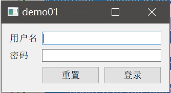
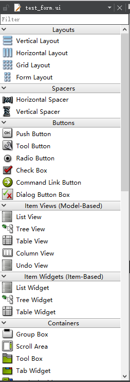
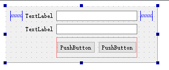
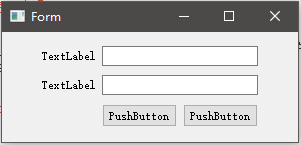

# 控件和布局的简单使用

Qt是一个十分庞大的框架，Qt Widgets中有着非常丰富的控件。这里我们简单介绍一下如何在Qt中使用各种控件，以及如何使用布局。

## 使用C++代码组织布局和控件

下面的例子代码中，使用纯C++代码编写了一个登陆框。

main.cpp
```cpp
#include <QApplication>
#include <QWidget>
#include <QGridLayout>
#include <QHBoxLayout>
#include <QLabel>
#include <QLineEdit>
#include <QPushButton>

int main(int argc, char *argv[])
{
    QApplication app(argc, argv);
    //主窗口
    QWidget w;

    //创建一个GridLayout布局
    QGridLayout *gridLayout = new QGridLayout(&w);
    //在第0和3列设置弹簧，参数是列坐标和权重
    gridLayout->setColumnStretch(0, 1);
    gridLayout->setColumnStretch(3, 1);

    //初始化四个控件：用户名标签，用户名输入框，密码标签，密码输入框，
    //并添加到布局中，参数是行列坐标
    QLabel *usernameLabel = new QLabel("用户名");
    gridLayout->addWidget(usernameLabel, 0, 1);

    QLineEdit *usernameLineEdit = new QLineEdit();
    gridLayout->addWidget(usernameLineEdit, 0, 2);

    QLabel *passwordLabel = new QLabel("密码");
    gridLayout->addWidget(passwordLabel, 1, 1);

    QLineEdit *passwordLineEdit = new QLineEdit();
    passwordLineEdit->setEchoMode(QLineEdit::Password);
    gridLayout->addWidget(passwordLineEdit, 1, 2);

    //创建一个HBoxLayout作为子布局
    QHBoxLayout *hBoxLayout = new QHBoxLayout();

    //向HBoxLayout添加两个按钮
    QPushButton *resetButton = new QPushButton("重置");
    hBoxLayout->addWidget(resetButton);

    QPushButton *submitButton = new QPushButton("登录");
    hBoxLayout->addWidget(submitButton);

    //将HBoxLayout添加到GridLayout中
    gridLayout->addLayout(hBoxLayout, 2, 2);

    //为主窗口widget设置布局
    w.setLayout(gridLayout);

    //显示主窗口
    w.show();

    return app.exec();
}
```

运行结果：



### Widget控件的使用步骤

上面代码已经简单介绍了几种常用的控件：QLabel、QLineEdit、QPushButton。从代码中我们可以发现，每个Widget控件都包含在一个头文件中，比如我们现在想要试用按钮控件（QPushButton），那么我们首先要做的就是引入头文件`#include <QPushButton>`，实例化一个按钮对象后，把它安排到合适的位置，调用合适的API实现正确的功能，我们的程序就是这样一步步构建起来的。

### Widget布局的使用步骤

布局（Layout）的使用和控件差不多，同样需要先引入头文件，每个布局都有不同的用法， 但是实际上常用的布局就那么几个，用到时查文档即可。

## 使用Qt设计器组织布局和控件

这里我们创建一个`Qt Widgets`工程，实际上工程为我们自动创建了一个`QMainWindow`的主窗口，为了和上面例子保持一致，这里我们再创建一个基于`QWidget`的窗口布局文件，Qt Creator中选择`文件->新建文件或项目->Qt设计师界面类`，然后添加基于`QWidget`的窗口。有关`QMainWindow`将在后续章节详细介绍。

设计器使用很简单，和Visual Studio基本差不多，从右边往编辑区拖控件就行了。



这里我们拖一个和之前一样的登录框，这比用C++代码堆界面更简单，更容易维护。注意，根组件的布局不是拖进去的，而是拖入几个控件后，在根组件上右击，选择布局子菜单进行设置的。



## 运行

由于有两个窗口，这里我直接修改了下`main.cpp`初始化的窗口类，实际开发中我们通常不会这么干。


