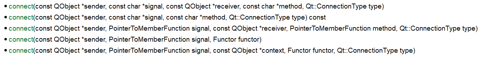

# 信号槽机制

在Qt简介和环境搭建章节，我们写了一个最简单的HelloWorld程序，现在我们再回顾一下它的代码：

```cpp
#include <QApplication>
#include <QWidget>
#include <QPushButton>

int main(int argc, char *argv[])
{
  QApplication app(argc, argv);
  //主窗口
  QWidget w;
  //创建一个按钮
  QPushButton button("点击我关闭窗口", &w);
  //使用connect函数，连接按钮的点击事件和窗口的关闭动作
  QObject::connect(&button, SIGNAL(clicked()), &w, SLOT(close()));
  //显示主窗口
  w.show();

  return app.exec();
}
```

注意其中我们使用了`QObject::connect`这个函数，实现了响应按钮点击事件（click），事件的处理函数是关闭应用程序（close）。这里我们查阅文档，具体看一下这个`connect`函数如何使用。

## connect函数



实际上，HelloWorld程序中，我们使用的是第一个重载。文档中大致是这样描述的：


创建一个从事件发出对象到事件接受对象的连接，返回一个用来解除这种连接的句柄。你必须用`SIGNAL()`和`SLOT()`这两个宏对信号和接受函数进行预处理（因为函数定义的参数类型是`const char *`）。

Qt中，将发出事件的函数叫信号函数，将接收事件的函数叫槽函数，我们可以将多个信号绑定在一个槽上，也可以绑定一个信号到多个槽上，这就是Qt中所谓的信号槽机制。

## 带有参数的信号和槽函数

文档中的另一个例子：
```cpp
QLabel *label = new QLabel;
QScrollBar *scrollBar = new QScrollBar;
QObject::connect(scrollBar, SIGNAL(valueChanged(int)),
                   label,  SLOT(setNum(int)));
```

很显然，上面例子代码实现的功能，就是让一个标签显示滚动条的位置。注意，和HelloWorld程序不同的是，上面例子代码中，信号和槽函数都包含了一个int类型的参数。使用`SIGNAL()`和`SLOT()`时，我们要声明参数的类型，但是不能带有任何形参名。

除此之外，为了保证槽函数能够正确接受信号，显然信号函数和槽函数的参数类型必须是一致的。

## connect函数的其它写法

根据文档，connect有5个重载函数，实际上使用`SIGNAL()`和`SLOT()`是Qt4时代比较古老的一种信号槽机制实现方式了，Qt5中，我们可以直接向connect函数传函数指针。在新版的Qt中，推荐使用下面这种新写法。

例子：
```cpp
QObject::connect(&button, &QPushButton::clicked, &w, &QWidget::close);
```

当然，使用lambda表达式也是可以的，和之前的写法一样，要保证信号函数和槽函数的参数一致。

## 自定义信号和槽函数

如果我们想在一个自定义的控件类上手动发射信号，可以使用`signals`关键字定义信号并使用`emit`关键字发射，然后通过`connect`函数绑定接收。

定义信号很简单，只要在头文件中像函数一样声明即可，例子：
```cpp
signals:
    void mySignal(const QString s);
```

发射信号：
```cpp
emit mySignal(s);
```

使用`emit`发射信号后，被`connect`的槽函数就会被回调，收到和信号函数一致的实参。

自定义槽函数就更简单了，和`signals`差不多，只要在头文件中使用`slots`声明一个函数，然后实现它即可。
