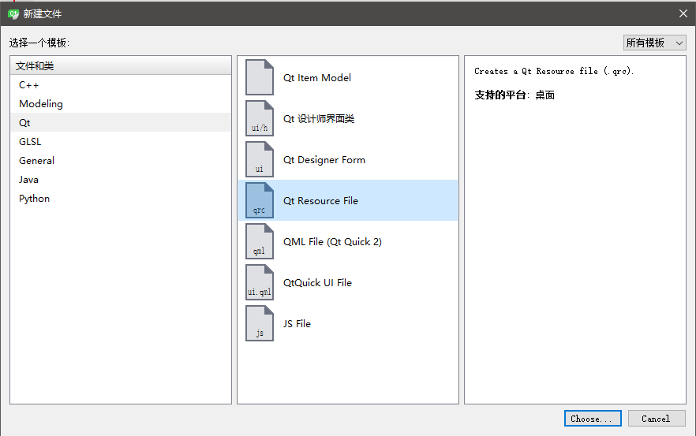

# 导入资源文件

我们的桌面程序通常需要大量的资源文件，做网页时一般都是美工切图给我们，其实桌面程序也差不多。Qt中，我们需要的一些图标资源等，都可以通过Qt的资源管理机制统一管理。

和添加C++源代码文件差不多，这里我们添加一个资源文件。



添加完成后，会生成一个`.qrc`文件，它实际上是XML格式的。


## Qt中资源文件的组织形式

我们的文件都有一个在文件系统中的路径，比如`/home/ciyaz/workspace/demo01/a.png`，这些绝对路径不利于资源文件的统一管理，Qt为我们生成的`.qrc`文件实际就是一个索引，我们通过为图片资源文件定义一个虚拟的逻辑路径，然后在程序中就可以引用这个逻辑位置，而不用把文件路径硬编码到代码中。

编辑这个文件，我们首先添加一个前缀，所谓的前缀相当于一个文件路径，例如`/icons`这类：


然后我们就可以在这个虚拟路径下添加文件了，在实际的文件系统上，我们最好在Qt工程文件夹中新建一个文件夹，统一存放我们的图片以便于管理。另外，Qt中图片资源最好使用png格式，图标一般要支持透明，因此png是最常用的格式。

添加文件后，我们还可以给它添加一个别名，以避免使用原文件名，程序中全部引用别名。


注：添加的文件不能带有任何中文路径。

## 引用资源文件

加入我们设置的一个图片的前缀和路径分别是`/icons`和`file`，那么引用该图片的时候，使用`:/icons/file`即可。
即可。

例如：
```cpp
QIcon(":/icons/file")
```
