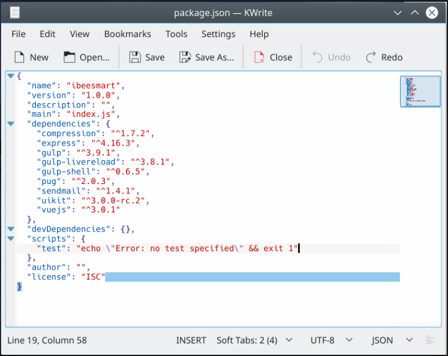
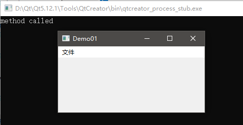
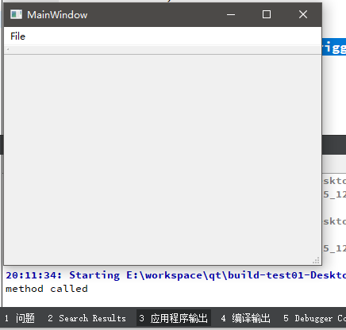

# 主窗口QMainWindow的使用

前面章节中，我们曾使用`QWidget`作为一个GUI程序的根控件（也就是所谓的主窗口），但是实际上，在大多数软件中，主窗口都是大致这样的一个布局：



在窗口顶部标题栏中，显示的是程序的名字和最大化、关闭等按钮，下方则是菜单栏，之后是一排快捷操作按钮。工作区在窗口的中央，窗口最下面是状态栏。

我们当然可以用`QWidget`和其他按钮等控件一点点把这个布局堆砌出来，但是显然这不合理，大多数GUI框架都封装好了一个「主窗口控件」。Qt中，我们的程序一般使用`QMainWindow`作为所有控件的根组件。

## QMainWindow基本使用

下面例子中，我们创建一个QMainWindow，并添加一个菜单。为了说明问题，下面例子创建的是一个控制台工程，并手动在`.pro`文件中加入了相关的依赖模块，我们将从头写所有的C++代码。源代码包括`mainwindow.h`、`mainwindow.cpp`和`main.cpp`三个文件。

mainwindow.h
```cpp
#ifndef MAINWINDOW_H
#define MAINWINDOW_H

#include <QMainWindow>

namespace Ui {
class MainWindow;
}

class MainWindow : public QMainWindow
{
    Q_OBJECT

public:
    explicit MainWindow(QWidget *parent = nullptr);
    ~MainWindow();
private slots:
     void openFile();
};

#endif // MAINWINDOW_H
```

上面代码中，我们定义了一个`MainWindow`类，继承`QMainWindow`。

把所有代码写在`main`函数中，这在面向对象的程序中显然是不可取的，因此我们这里选择继承并扩展`QMainWindow`。

`Q_OBJECT`是一个Qt定义的宏，它表示这个类是图形界面相关的，会用到Qt独有的一些预处理机制。关于这个宏我们不需要关心太多，只需要适时的在头文件中加上它就可以了。

mainwindow.cpp
```cpp
#include <QMenuBar>
#include <QAction>
#include <QDebug>
#include "mainwindow.h"

MainWindow::MainWindow(QWidget *parent) : QMainWindow(parent)
{
    setWindowTitle("Demo01");

    // 创建一个QAction
    QAction *action = new QAction("打开...", this);
    connect(action, &QAction::triggered, this, &MainWindow::openFile);

    // 添加一个菜单
    QMenu *fileMenu = menuBar()->addMenu("文件");
    fileMenu->addAction(action);
}

void MainWindow::openFile()
{
    qDebug() << "method called";
}

MainWindow::~MainWindow(){}
```

这里有额外的两个Qt控件需要介绍：

* `QAction`：一个抽象的事件触发器，可以将其附加到一个窗口菜单（QMenu），菜单点击就会执行该动作
* `QMenu`：配合QMainWindow使用的菜单控件

上面代码实现了`mainwindow.h`中的一些函数，构造函数中，我们创建了一个`QAction`对象，然后将其赋予`QMenu`。其中，`menuBar()`返回结果是一个`QMenuBar`指针，我们调用`addMenu()`就能添加一个`QMenu`对象。许多UI框架都是差不多的结构，这都不难理解。

而`QAction`通过`connect`函数，连接到了`openFile()`槽函数。当然，这里出于简单起见，我们并没有真的打开什么文件，而仅仅是打印一个调试日志。

main.cpp
```cpp
#include <QApplication>
#include "mainwindow.h"

int main(int argc, char *argv[])
{
    QApplication app(argc, argv);
    MainWindow window;
    window.show();
    return app.exec();
}
```

`main`函数中，我们初始化这个`MainWindow`并显示，然后开启事件循环。

运行结果：



## 使用Qt Creator设计器设计主窗口

大多数情况下，我们都会用图形化的设计器去完成页面上的逻辑，设计器能给我们节省不少时间。下面我们用Qt Creator的设计器完成上面同样的功能。

首先创建一个`Qt Widgets`项目，初始化工程时，会自动为我们新建一个`.ui`文件，设计器使用XML格式保存我们的设计，构建工程时，再将其编译成C++代码，双击这个文件就能打开设计器功能。


### 菜单栏 QMenuBar

我们在设计器中创建一个File菜单，这个操作编辑的实际上就是QMenuBar，然后加入一个`Open...`子菜单，设计器为我们自动在QMenuBar中添加了一个QMenu。而在Action Editor中，我们可以看到设计器自动为我们创建了一个这个子菜单绑定的动作，这个其实就是之前我们手动实例化的`QAction`。


在这个动作上点击右键，选择「转到槽」，和之前手动`connect`一样，我们选择`triggered`信号，设计器自动为我们生成了一个槽函数，它的名字是根据事件的名字自动生成的，格式为`on_事件名_信号名`。

这里我们和上面一样，输出一个调试信息。

```cpp
void MainWindow::on_actionOpen_triggered()
{
    qDebug() << "method called";
}
```



### 动作 QAction

在Action Editor中，双击这个动作，能够打开这个动作的编辑窗口。


我们可以为动作设置图标和快捷键。

之前我们说过QAction是一个抽象的动作，它拥有图标、快捷键，在Qt设计器中，将Action拖到菜单栏中它就会生成一个QMenu，拖到工具栏中，就会生成一个QToolButton，这是一个非常灵活的设计。

图标是一个资源，关于如何导入资源，具体请参考相关章节。

### 工具栏 QToolBar

这里我们直接将Action拽进设计器的QToolBar的位置（就是菜单栏下面的那一窄条），一个QToolButton就会自动生成，它绑定的是和之前菜单相同的Action。


我们甚至可以把QToolBar竖着拽下来。


### 状态栏 QStatusBar

QMainWindow窗口最下面实际上有一个状态栏，它能显示Action的提示文字。

设置QAction的`statusTip`属性。


运行结果如下图所示：


