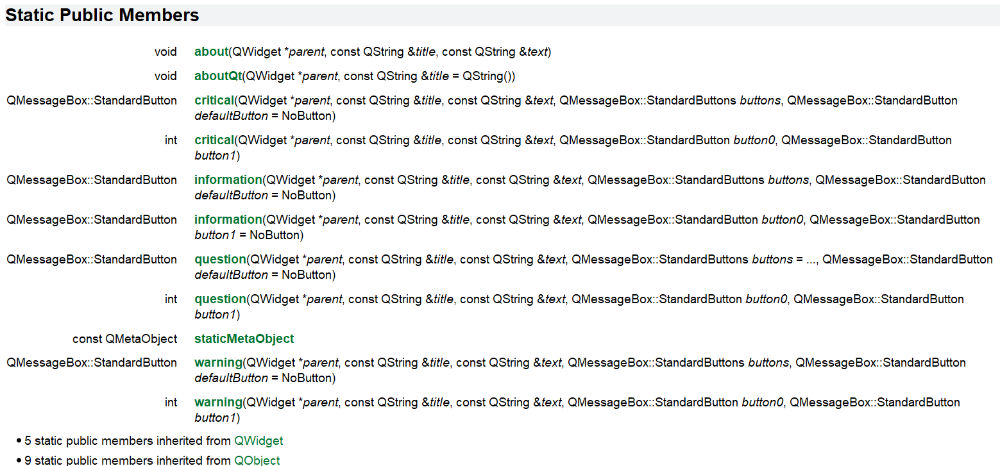
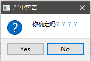
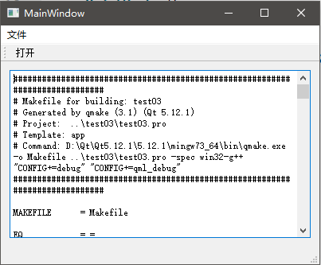
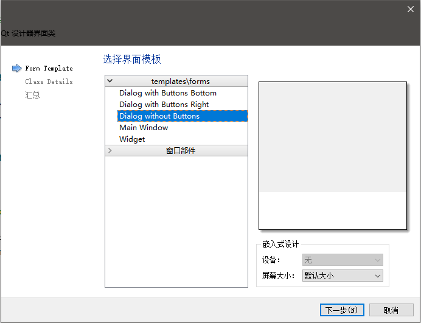
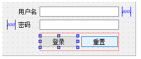
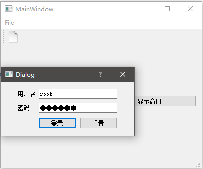

# 使用对话框

和大多数GUI框架一样，Qt为我们预制了一系列的通用对话框，我们也可以自定义对话框。

## QMessageBox

QMessageBox是一个简易的模态对话框，用于向用户输出警告或者提示信息，它只能按预定义的功能工作，而不能定制一个复杂的对话框窗口。QMessageBox定义了几个静态成员函数，直接调用就能显示对应的对话框。Qt文档有关QMessageBox静态成员函数的内容：



显示一个询问对话框例子：

```cpp
void MainWindow::on_pushButton_clicked()
{
    int result = QMessageBox::question(this, "严重警告", "你确定吗？？？？", QMessageBox::Yes | QMessageBox::No, QMessageBox::No);
    switch (result) {
    case QMessageBox::Yes:
        qDebug() << "用户同意了你";
        break;
    case QMessageBox::No:
        qDebug() << "用户拒绝了你";
        break;
    }
}
```

上面我们使用了`QMessageBox::question`函数，其中参数分别是：

1. 父控件
2. 标题
3. 内容
4. 按钮
5. 默认按钮

我们通过接收函数返回值，得到用户选择的结果。



注意：QMessageBox是一个模态对话框，也就是说，`QMessageBox::question`会在对话框显示时阻塞，主窗口也不能响应任何点击事件。

## QFileDialog

QFileDialog用于实现文件选择，这个对话框十分常用，因此这里我们基于文件对话框，实现文件读取。

```cpp
void MainWindow::on_openAction_triggered()
{
    QString path = QFileDialog::getOpenFileName(this, "打开文件");
    if(!path.isEmpty())
    {
        QFile file(path);
        if(!file.open(QIODevice::ReadOnly | QIODevice::Text))
        {
            QMessageBox::warning(this, "警告", "读取文件失败");
        }
        else
        {
            QTextStream in(&file);
            ui->textEdit->setText(in.readAll());
            file.close();
        }
    }
}
```

上面是一个菜单的槽函数回调，我们调用了`QFileDialog::getOpenFileName`，并读取其返回的文件路径。然后通过这个路径，使用`QTextStream`读取文件中的文本信息，然后显示在一个`QTextEdit`上。



QFileDialog除了打开文件，常用的功能还有选择文件夹，以及保存文件，都非常简单，这里就不多做介绍了。

## 其它预制对话框

除了上面介绍的，还有很多预制的对话框，选颜色的，选文件的等，基本满足了我们各方面的要求，具体请查阅对话框相关文档。

## 自定义对话框

下面例子中，我们自己创建一个对话框，用来展示一个登录表单，然后在主窗口中通过信号槽机制读取模拟登录的返回值。

首先我们要知道登录的机制，客户端将用户名和密码传给服务端（通常是通过HTTPS，密码可能已经是散列值），服务端比对成功后会返回一个token来保持会话，同时服务端内存中建立一个token到该用户信息的映射，以后通信时只要带上这个token，服务端就认得客户端你是谁了。

首先创建一个新的对话框窗口，这里我们创建的是最基础的没有按钮的对话框：



在生成的`ui`文件中拖拽一个基本的登录框，这个过程比较简单，就不再详述了：



我们主要关注登录按钮的回调槽函数是如何编写的：

mydialog.cpp
```cpp
void MyDialog::on_pushButton_clicked()
{
    QString username = ui->usernameInput->text();
    QString password = ui->passwordInput->text();
    if(username == "root" && password == "123456")
    {
        QString token = "qwerasdf";
        emit tokenFetched(token);
        accept();
    }
}
```

上面代码中，我们读取了用户名和密码，然后进行判断。如果符合要求，就使用`emit`发射一个事件，其中包含的值是登录获得的token（假装我们进行了网络请求）。当然，我们也要先定义这个信号：

mydialog.h
```cpp
...
signals:
    void tokenFetched(const QString token);
...
```

在主窗口创建这个对话框，下面代码是一个按钮的回调槽函数：

```cpp
void MainWindow::on_pushButton_2_clicked()
{
    MyDialog *dialog = new MyDialog(this);
    // 设置对话框关闭立刻析构
    dialog->setAttribute(Qt::WA_DeleteOnClose);
    // 接收对话框发射的事件
    connect(dialog, &MyDialog::tokenFetched, this, [](const QString s){
        qDebug() << s;
    });
    // 接收模态框返回值
    int result = dialog->exec();
    qDebug() << result;
}
```

主窗口中，我们在堆内存上创建对话框对象，然后使用`connect`函数连接了`tokenFetched`信号，接收登录成功返回的token。注意`dialog->setAttribute(Qt::WA_DeleteOnClose);`，如果不这么设置，每次对话框弹出，即时关闭也不会在内存中销毁，而我们已经丢失了其指针，下次执行该函数又会新创建一个对话框，这就造成了内存泄漏。



输入正确的用户名和密码，点击登录，就能看到控制台上输出的token信息调试日志。

## 非模态对话框

如果我们要定义一个非模态对话框，上面的`dialog->exec()`改成`dialog->show()`就行了。但是要注意，非模态对话框不会阻塞主窗口，因此也就没有什么对话框的返回值了，创建对话框的函数也会立即返回，而不会阻塞等待。
