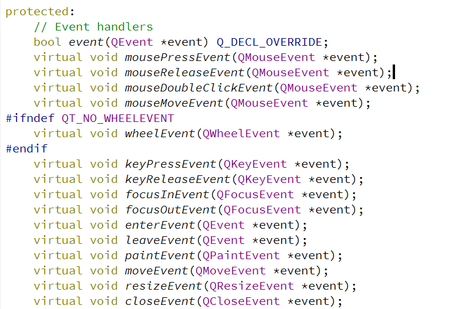

# 鼠标和键盘事件

这篇笔记中，我们来了解一下如何在Qt中捕捉鼠标和键盘事件。

## QWidget中的事件回调函数

我们查看QWidget的源码，会发现其中定义了一些鼠标、键盘事件的虚函数。我们要想捕捉这些事件，只需要继承QWidget，并实现这些虚函数即可。



## 捕捉鼠标和键盘事件

这里我们简单介绍一些鼠标和键盘事件的捕捉和使用，下面例子代码中定义了一个类继承QWidget。

mywidget.h
```cpp
#ifndef MYWIDGET_H
#define MYWIDGET_H

#include <QWidget>
#include <QEvent>
#include <QMouseEvent>
#include <QKeyEvent>

class MyWidget : public QWidget
{
    Q_OBJECT
public:
    explicit MyWidget(QWidget *parent = nullptr);

    //所有事件
    bool event(QEvent *ev);
    //鼠标事件
    void mousePressEvent(QMouseEvent *ev);
    void mouseReleaseEvent(QMouseEvent *ev);
    void mouseMoveEvent(QMouseEvent *ev);
    //键盘事件
    void keyPressEvent(QKeyEvent *ev);
    void keyReleaseEvent(QKeyEvent *ev);
};

#endif // MYWIDGET_H
```

mywidget.cpp
```cpp
#include <QDebug>
#include "mywidget.h"

MyWidget::MyWidget(QWidget *parent) : QWidget(parent)
{
    this->setMouseTracking(true);
}

bool MyWidget::event(QEvent *ev)
{
    ev->accept();
    return QWidget::event(ev);
}

void MyWidget::mousePressEvent(QMouseEvent *ev)
{
    if(ev->button() == Qt::LeftButton)
    {
        //按下鼠标左键的同时按下Shift
        if(ev->modifiers() == Qt::ShiftModifier)
        {
            qDebug() << "Shift+Left Click";
        }
        //只按下鼠标左键
        else
        {
            qDebug() << "Left Click";
        }
    }
}

void MyWidget::mouseReleaseEvent(QMouseEvent *ev)
{
    qDebug() << "Mouse Release";
}

void MyWidget::mouseMoveEvent(QMouseEvent *ev)
{
    QPoint pos = ev->pos();
    qDebug() << pos;
}

void MyWidget::keyPressEvent(QKeyEvent *ev)
{
    int key = ev->key();
    if(ev->modifiers() == Qt::ShiftModifier)
    {
        qDebug() << "Shift+按键按下" << key;
    }
    else
    {
        qDebug() << "按键按下" << key;
    }

}

void MyWidget::keyReleaseEvent(QKeyEvent *ev)
{
    int key = ev->key();
    qDebug() << "按键弹起" << key;
}
```
