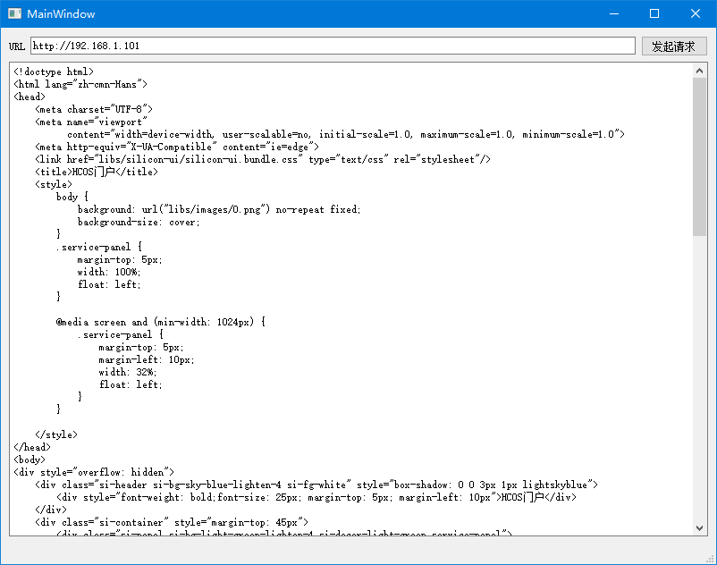

# 网络通信

到目前为止，C++的标准库仍然没有网络功能，代码中如果需要使用Socket套接字，需要借助Windows或Posix系统API，如果想使用HTTP、FTP等应用层协议，就不得不引入第三方库了。Qt中对应用开发中各种常用的网络功能做了一个跨平台的封装，使用十分简便。

使用网络功能，需要将`network`加入`qmake`配置中。

```
QT += network
```

## 获取网络相关信息

网络相关应用中，经常需要获取IP、主机名等信息，这些信息可以通过Qt封装的`QHostInfo`和`QNetworkInterface`等接口获取。下面例子中，我们输出了主机名和当前计算机的网络接口。

```cpp
// 主机名
QString hostName = QHostInfo::localHostName();
qDebug() << hostName;

// 网络接口
QList<QNetworkInterface> interfaceList = QNetworkInterface::allInterfaces();
qDebug() << interfaceList;
```

## 使用HTTP协议

现在绝大多数的互联网应用，除非有特殊要求，一般都是通过HTTP协议进行通信的。下面例子中，我们通过HTTP协议的GET方式请求服务端的数据：

mainwindow.h
```cpp
#ifndef MAINWINDOW_H
#define MAINWINDOW_H

#include <QMainWindow>
#include <QNetworkRequest>
#include <QNetworkAccessManager>
#include <QNetworkReply>
#include <QTextStream>
#include <QDebug>

QT_BEGIN_NAMESPACE
namespace Ui { class MainWindow; }
QT_END_NAMESPACE

class MainWindow : public QMainWindow
{
    Q_OBJECT

public:
    MainWindow(QWidget *parent = nullptr);
    ~MainWindow();

private slots:
    void on_pushButton_clicked();
    void handleHttpReply(QNetworkReply *reply);

private:
    Ui::MainWindow *ui;
    QNetworkAccessManager *manager;
};
#endif // MAINWINDOW_H
```

上面代码中，槽函数`handleHttpReply()`用于响应HTTP请求完成的信号。

mainwindow.cpp
```cpp
#include "mainwindow.h"
#include "ui_mainwindow.h"

MainWindow::MainWindow(QWidget *parent)
    : QMainWindow(parent)
    , ui(new Ui::MainWindow)
{
    ui->setupUi(this);
    manager = new QNetworkAccessManager(this);
    connect(manager, &QNetworkAccessManager::finished, this, &MainWindow::handleHttpReply);
}

MainWindow::~MainWindow()
{
    delete ui;
}

void MainWindow::on_pushButton_clicked()
{
    QString urlStr =  ui->lineEdit->text();
    if (!urlStr.isEmpty())
    {
        QUrl url = QUrl(urlStr);
        if (url.isValid())
        {
            QNetworkRequest req = QNetworkRequest(url);
            manager->get(req);
        }
    }
}

void MainWindow::handleHttpReply(QNetworkReply *reply)
{
    QTextStream in(reply);
    in.setCodec("UTF-8");
    QString replyStr = in.readAll();
    ui->plainTextEdit->setPlainText(replyStr);
}
```

我们在构造函数中，初始化了`QNetWorkAccessManager`对象，然后绑定其`finished`信号到我们的处理槽函数`handleHttpReply()`。按钮点击时，将用户输入的URL转化为`QNetworkRequest`请求对象，然后调用`manager->get()`方法发出HTTP请求。

请求完成后，我们将返回的响应体读入`plainTextEdit`，这里因为`QNetworkReply`本身继承于`QIODevice`，因此我们通过文本流`QTextStream`读取即可。



当然上述代码比较简陋，HTTP协议本身还是很复杂的，具体使用时参考文档即可。
