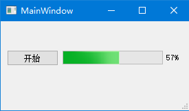

# 多线程

我们都知道，GUI软件中的耗时操作，如磁盘IO、网络IO等，尽量不要直接写在主线程中，否则会导致窗口卡死，这些操作应该拆分到子线程。

另一方面，出于线程安全考虑，子线程又不能直接更新UI控件，这个在Qt中不是问题，Qt的信号槽机制已经考虑到了，我们直接在子线程发送信号即可。

此外C++标准库没有线程相关的接口，因此需要针对操作系统调用Windows或PosixAPI，而Qt封装了这种差异。

## QThread线程对象

Qt中，QThread类封装了线程对象，我们重写其`run()`成员函数即可实现子线程的逻辑。

下面代码中，我们编写了一个简单的程序，子线每10ms程累加一个`int`型变量，并发送信号使主线程的进度条更新。

mythread.h
```cpp
#ifndef MYTHREAD_H
#define MYTHREAD_H

#include <QThread>

class MyThread : public QThread
{
    Q_OBJECT

public:
    MyThread();

protected:
    void run() override;

private:
    int progress;

signals:
    void onProgressUpdate(int progress);
};

#endif // MYTHREAD_H
```

mythread.cpp
```cpp
#include "mythread.h"

MyThread::MyThread()
{
    progress = 0;
}

void MyThread::run()
{
    while(progress <= 100)
    {
        QThread::msleep(10);
        progress++;
        emit onProgressUpdate(progress);
    }
}
```

上面代码中定义了线程类`MyThread`，在`run()`中，我们使用了`QThread::msleep()`函数进行线程休眠，并使用自定义的信号`onProgressUpdate`通知主线程更新UI。

mainwindow.h
```cpp
#ifndef MAINWINDOW_H
#define MAINWINDOW_H

#include <QMainWindow>
#include <mythread.h>

QT_BEGIN_NAMESPACE
namespace Ui { class MainWindow; }
QT_END_NAMESPACE

class MainWindow : public QMainWindow
{
    Q_OBJECT

public:
    MainWindow(QWidget *parent = nullptr);
    ~MainWindow();

private slots:
    void on_pushButton_clicked();
    void updateProgress(int progress);

private:
    Ui::MainWindow *ui;
};
#endif // MAINWINDOW_H
```

mainwindow.cpp
```cpp
#include "mainwindow.h"
#include "ui_mainwindow.h"

MainWindow::MainWindow(QWidget *parent)
    : QMainWindow(parent)
    , ui(new Ui::MainWindow)
{
    ui->setupUi(this);
    ui->progressBar->setRange(0, 100);
}

MainWindow::~MainWindow()
{
    delete ui;
}


void MainWindow::on_pushButton_clicked()
{
    MyThread *myThread = new MyThread();
    connect(myThread, &MyThread::onProgressUpdate, this, &MainWindow::updateProgress);
    connect(myThread, &MyThread::finished, myThread, &MyThread::deleteLater);
    myThread->start();
}

void MainWindow::updateProgress(int progress)
{
    ui->progressBar->setValue(progress);
}
```

上面代码中，我们主要关注子线程的信号连接部分，我们连接了两个信号：自定义的`progress`值更新信号，以及线程执行结束信号。对于线程结束信号，我们将其连接到了信号的`deleteLater()`槽函数，用于销毁线程对象。


