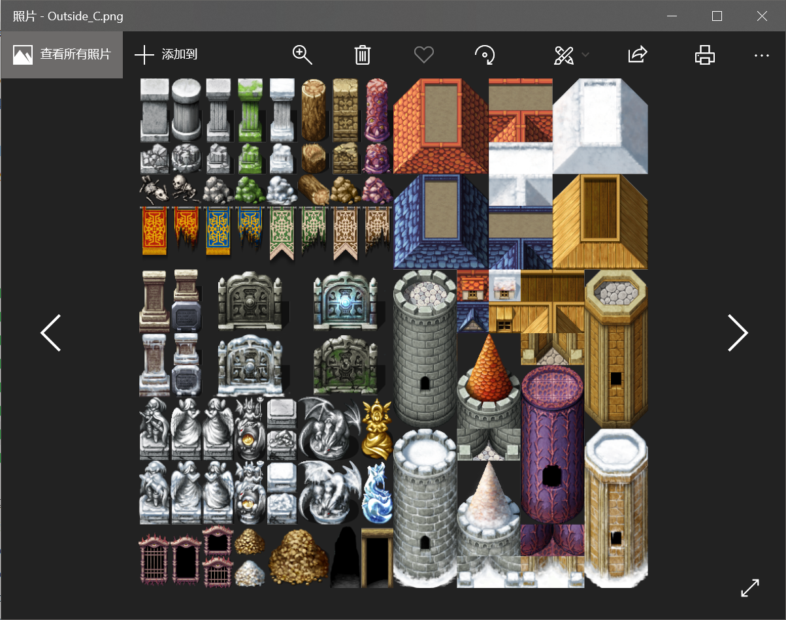
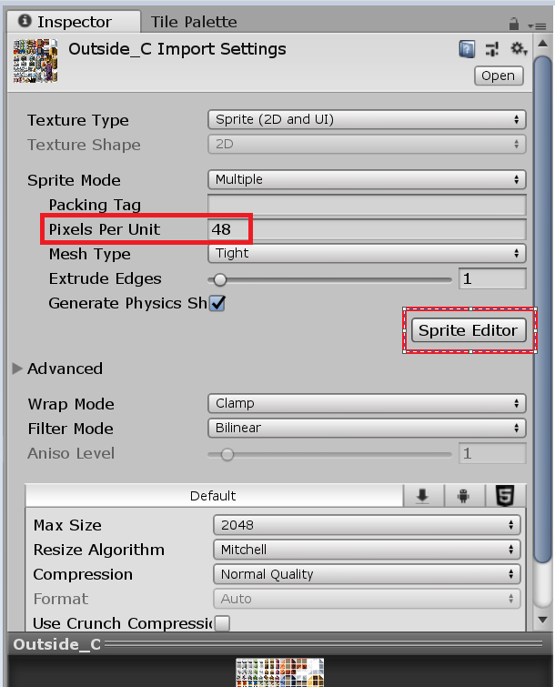
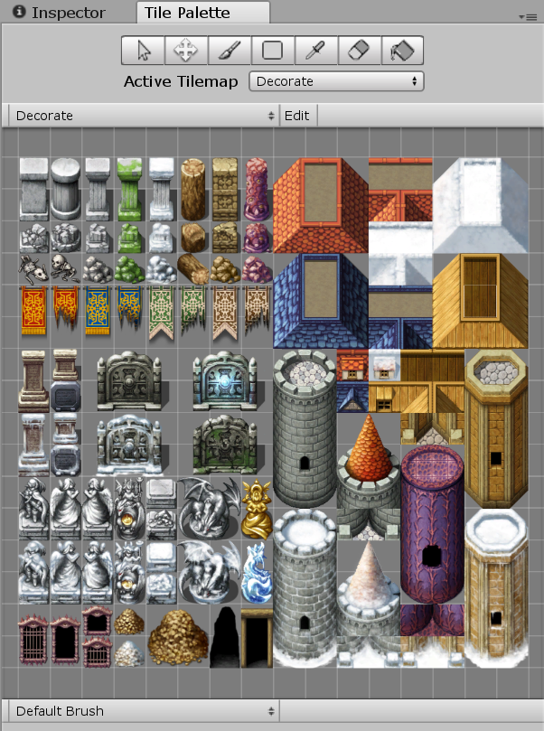
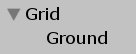
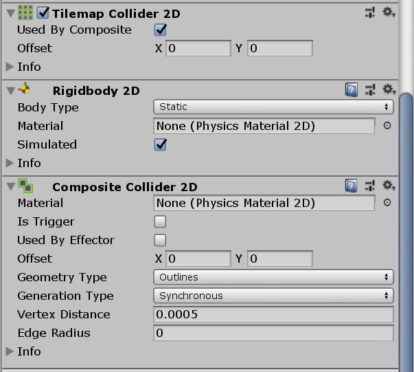
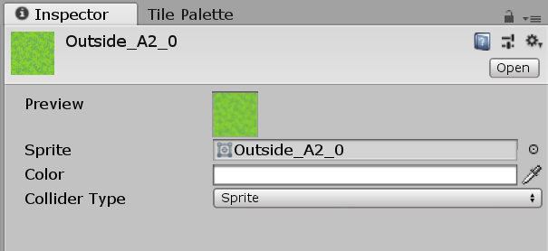

# TileMap瓦片地图编辑器

2D游戏中，瓦片地图（Tilemap）是一个比较常用的场景搭建方式。相比纯手绘地图，使用瓦片地图能够复用地图图块（Tile），减少美术工作量，也能够轻松实现随机生成场景等玩法，因此广泛用于有大量开放世界、RogueLike元素的2D游戏中。

Unity内置了对瓦片地图的支持，能够使用矩形地图、六边形地图、等角菱形地图这三种最为常见的地图展现形式。

## 基本概念

### 素材

我们编辑的瓦片地图其实是一张张小图片，这些小图片按照一定位置组合到一起，就是一个地图了，通常情况下出于性能考虑，所有的小图片是绘制在一张大图上的。

### Palette 调色板

Palette是一个工具，用于容纳我们的TileMap素材，游戏设计者从Palette中选取一些Tile绘制到游戏场景中。

### Brush 笔刷

和Palette配合使用，就想画画用的笔一样，把Tile画到游戏场景中。

### Grid 网格

游戏场景中，一个个Tile的位置肯定不是乱画的，每个Tile都位于一个格子中。

### TileMap 瓦片地图

许多Tile拼到一起就是一张TileMap了。

## 导入素材到Palette

下面我们介绍一下如何将素材导入Palette中。

首先导入一个TileMap素材作为Sprite并切图。其中Pixels Per Unit代表一个格子的像素大小，我们这里的素材每个格子像素大小是48px。

然后我们新建一个Tile文件。在Project视图中，右键`Create->Tile`，选择文件夹保存。双击可以打开Palette视图。然后直接将所有切好的素材拽进Tile Palette就行了，每个切好的Tile都会保存为单个资源文件。

我们可以在Hierarchy中右键`2D Object->Tilemap`，创建一个TileMap对象。父对象是一个Grid（网格），子对象是我们真正编辑的TileMap。这样以后，在Palette中选择图块，刷到对应的TileMap上就能实现TileMap地图编辑了。

如果需要绘制多层地图，创建多个`Tilemap`即可。下面的`Tilemap`会遮挡上面`Tilemap`的像素。

## TileMap碰撞器

地图上的一些Tile可能需要碰撞器，表示允许或禁止玩家通过，或是触发一些事件。我们可以为一个TileMap对象添加`Tilemap Collider 2D`组件。

只添加一个`Tilemap Collider 2D`是不行的，它会为每个格子产生一个碰撞器，许多格子会产生许多碰撞器，因此我们需要再添加一个`Composite Collider 2D`，用于将可以合并的`Tilemap Collider 2D`组合到一起。这一步会自动添加一个刚体组件`Rigidbody 2D`，我们肯定不想让我们的地图受y轴上的物理引擎影响“掉下去”，因此注意要勾选刚体的`Body Type`为`static`。

补充：其实我们可以创建一个专用的禁止通行层，来单独设置碰撞。

## Tile上的一些属性

Tile资源文件上也有一些属性可以设置，修改这些属性会影响已经绘制到TileMap上的所有Tile。

* Sprite 该Tile对应的图片
* Color 颜色
* Collider Type 选择Sprite碰撞器会自动根据图片是否透明进行形状的调整，选择Grid碰撞器会充满整个格子
