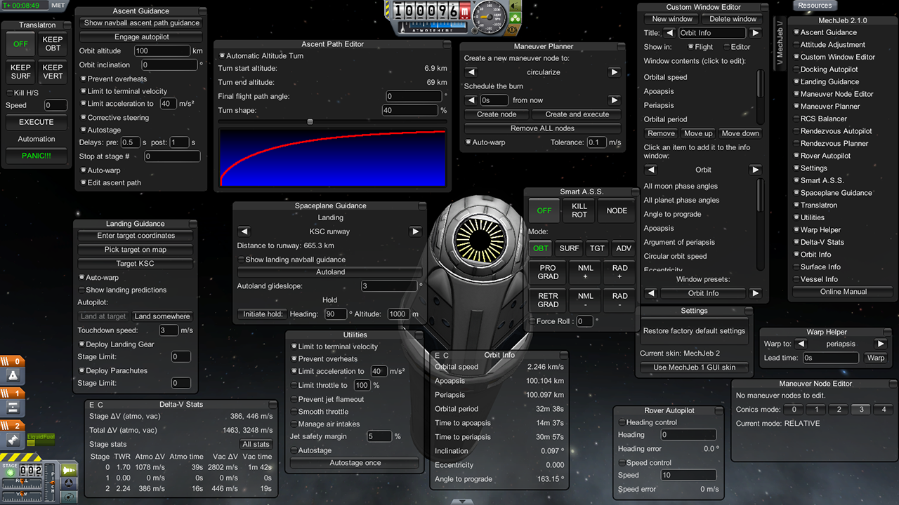

# GUI系统简介

Unity的GUI系统发展了很长时间，这篇笔记我们简单介绍一下Unity中的各种GUI系统。

## OnGUI

最初，Unity内置了一套OnGUI，但是这套最老的GUI系统局限性很大，使用不方便。它的默认画风是这样的，其实挺让人印象深刻：

注：图片来自独立游戏《Kerbal Space Program》的一个叫做Mechjeb的模组。

图中的游戏界面可以说是非常复杂了，但GUI并不杂乱，而是像专业软件一样井井有条，OnGUI制作图中这种界面其实非常简单。

然而OnGUI再想扩展就困难了，而且从开发角度看，它的写法也不是很美观。最大的一个缺点，是OnGUI不是事件驱动的，而是通过`MonoBehaviour`中的`OnGUI()`生命周期函数不断的重绘，绘制的效率是很低的。在几年前，手机的性能普遍差的情况下，更不会采用这种方式绘制UI了。

我们实际开发中，实际上OnGUI更多的被作为一种调试工具而使用，而不是正式和用户交互的GUI系统。有关OnGUI的内容，请参考`Unity引擎游戏开发/Unity脚本编程/11-OnGUI`章节。

## 第三方插件GUI系统

OnGUI不能满足开发需求，在UGUI出现之前，涌现出了很多优秀的GUI插件。其中NGUI（Next-Gen UI kit）是随着Unity引擎的流行，最广泛应用在各个项目中的一个第三方插件GUI系统。

其`$95`的价格对于个人开发者来说是比较昂贵了，但NGUI在公司的历史遗留项目中可能还在广泛使用。

## UGUI

在Unity4.6后，Unity正式内置了一套UGUI，并且随着Unity的发展也在不断完善，新项目一般都直接使用UGUI了。

UGUI我们将在后续章节详细介绍。
