# UGUI系统简介

Unity自带了一套GUI系统，一般称作UGUI以和其他第三方UI系统区分。实际上，Unity自带的这个UI系统十分简陋，有时候自带的控件没法满足我们的需要，我们就得自己组合控件、编写脚本，实现新的控件。这篇笔记主要对UGUI的简单使用进行介绍。

## 创建UI控件

我们创建一个2D工程，在Hierarchy中右键，选择`UI`菜单，我们就可以看到若干UGUI自带的控件。这里我们创建一个`Text`。

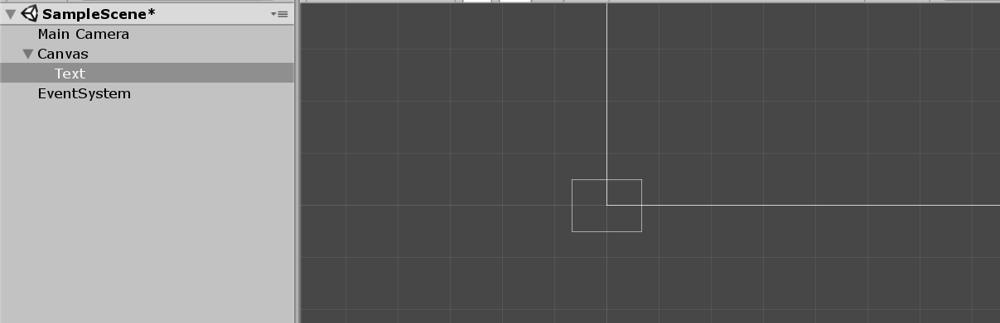

毕竟玩游戏时HUD和玩家看到的场景通常是两层（暂不考虑游戏场景中嵌入的UI），在`Scene`视图中，Unity编辑器会为我们把UI的编辑区和游戏场景分开，如上图中，小框是游戏场景的摄像机，大框是UI的编辑框，对应玩家看到的视口。

## 自带控件简介

### Text 文字

Text用于显示文字。

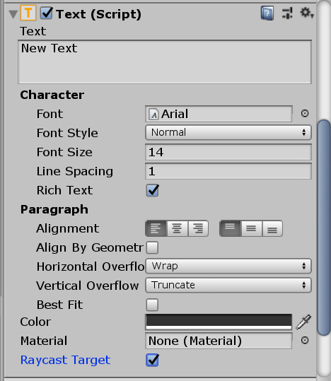

在Text组件中，我们可以改变文字的内容，字号，字体等内容。

除此之外，我们还可以使用脚本控制Text控件的属性，比如文字内容。我们从控件上获得`Text`这个组件（实际上是一个脚本），修改器属性即可。

```csharp
using System.Collections;
using System.Collections.Generic;
using UnityEngine;
using UnityEngine.UI;

public class DemoUI : MonoBehaviour
{
    public GameObject textObj;

	void Start ()
	{
	    Text text = textObj.GetComponent<Text>();
	    text.text = "hello, world!";
	}
}
```

注：使用和UI相关的组件需要引入命名空间`UnityEngine.UI`。

### Image 图片

Image用于显示图片。

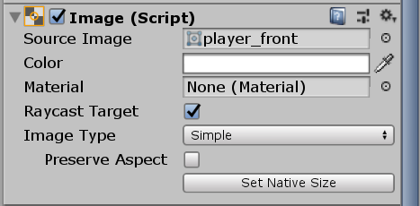

同样，我们可以用脚本改变Image组件的属性，比如图片的内容。

```csharp
using System.Collections;
using System.Collections.Generic;
using UnityEngine;
using UnityEngine.UI;

public class DemoUI : MonoBehaviour
{
    public GameObject imgObj;

	void Start ()
	{
	    Image img = imgObj.GetComponent<Image>();
	    img.sprite = Resources.Load<Sprite>("player_back");
	}
}
```

### Button 按钮

Unity中按钮实际上是2个GameObject组合而成的：

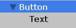

Button上有Image和Button两个组件。Image用于调整按钮的样式，Button组件用于响应用户点击事件。Text子对象则专门用来调整按钮上的文字。Button组件内容如下：

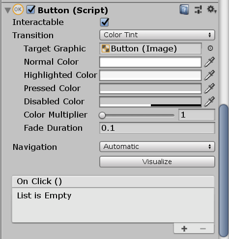

脚本实现按钮回调函数：

```csharp
using System.Collections;
using System.Collections.Generic;
using UnityEngine;
using UnityEngine.UI;

public class DemoUI : MonoBehaviour
{
    public void foo()
    {
        Debug.Log("hello, world!");
    }
}
```

在Unity编辑器中指定按钮点击的回调函数：

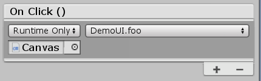

### Toggle 切换开关

Unity中Toggle的样式是一个复选框。

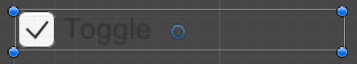

使用脚本接收复选框事件回调：

```csharp
using System.Collections;
using System.Collections.Generic;
using UnityEngine;
using UnityEngine.UI;

public class DemoUI : MonoBehaviour
{
    public void foo(bool val)
    {
        Debug.Log(val);
    }
}
```

### Slider 滑动条

Slider可以用来拖动改变某个值。

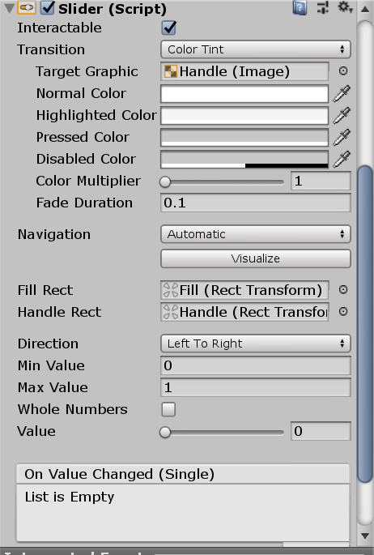

### DropDown 下拉框

DropDown控件包含的子对象：

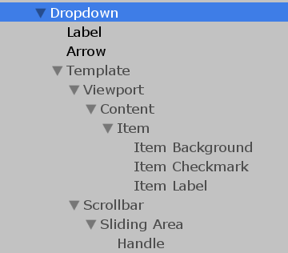

DropDown对象包含Image和DropDown两个组件。这里我们主要关注如何接收DropDown的事件。

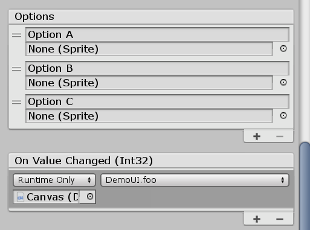

```csharp
using System.Collections;
using System.Collections.Generic;
using UnityEngine;
using UnityEngine.UI;

public class DemoUI : MonoBehaviour
{
    public void foo(int val)
    {
        Debug.Log(val);
    }
}
```

被回调的函数参数是一个整数，代表DropDown选中的选项，第一个选项传0， 第二个传1，以此类推。

### InputField 输入框

InputField用于接收用户的输入。InputField包含两个子组件，分别代表占位字符和输入的文字。

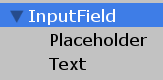

使用脚本获取InputField的值：

```csharp
using System.Collections;
using System.Collections.Generic;
using UnityEngine;
using UnityEngine.UI;

public class DemoUI : MonoBehaviour
{
    public GameObject inputFieldObj;
    private InputField inputField;

    void Start()
    {
        inputField = inputFieldObj.GetComponent<InputField>();
    }

    void Update()
    {
        Debug.Log(inputField.text);
    }
}
```

InputField还可以使用两个回调事件，使用方法和上面差不多，这里就不介绍了。

### Panel 面板容器

Panel就是起一个容器的作用，用于容纳其他的控件。Panel有一个Image组件。

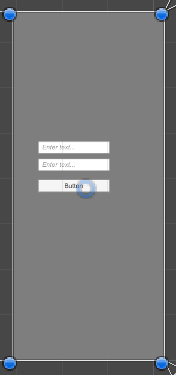

### ScrollView 带滚动条的容器

ScrollView带有垂直和水平两个滚动条，内部可以容纳其他控件。加入ScrollView的控件需要作为`content`对象的子对象。

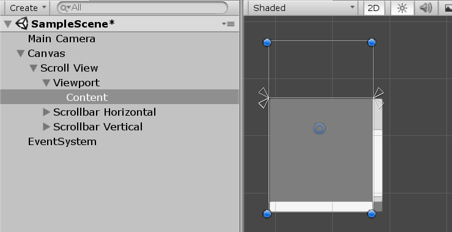
