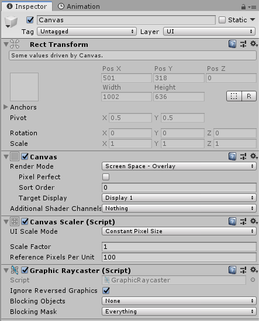
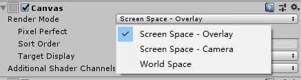

# Canvas

Canvas是包含所有的UI控件的父对象，它实际上是一个GameObject，包含了若干`Canvas`相关的组件。在Unity编辑器里创建一个新的UI控件后，就会自动创建一个Canvas，以后新创建的UI控件都会自动作为Canvas的子对象。

* Rect Transform：UI专用的Transform组件，将在本系列笔记后面章节专门介绍
* Canvas：UI画布组件，我们接下来重点介绍
* Canvas Scaler：和UI画布缩放相关的功能
* Graphic Raycaster：和画布、游戏世界的事件遮挡相关功能

## Canvas渲染模式

Canvas有三种渲染模式：

* Screen Space - Overlay：UI画布永远显示在屏幕最前面的一层，使用正交渲染，适合作为游戏的全局HUD使用
* Screen Space - Camera：UI画布需要绑定一个摄像机，并永远覆盖这个摄像机显示，摄像机可以移动或者设置透视渲染实现一些特别的效果
* World Space：UI画布在游戏世界中被渲染，适合用来实现游戏对象的UI，比如角色头顶上的名字和血条

## Canvas渲染顺序

如果我们的场景中有多个Canvas组件，可以用Sort Order指定Canvas的渲染顺序。

## UI控件的绘制顺序

在Hierarchy视图中的顺序就是UI控件的绘制顺序，如果两个UI控件重叠，后面绘制的UI控件就会覆盖前面的。为了动态控制UI控件的覆盖效果，我们可以使用代码来改变UI控件在Hierarchy视图中的顺序，Transform组件的`SetAsFirstSibling`，`SetAsLastSibling`，`SetSiblingIndex`。
