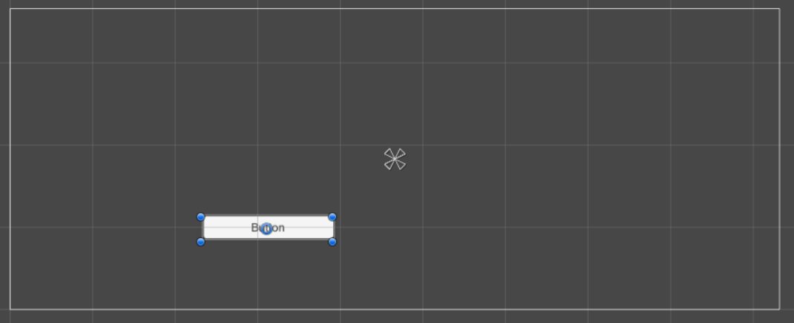

# Anchor 锚点

在其他的GUI框架中，貌似很少见“锚点”这种布局方式。现代的软件GUI框架都倾向于用标记语言手写布局，而不是在设计器里拖来拖去。手写布局界面效果很好，屏幕适应性也非常好，但就是比较麻烦，不适合放进游戏里，锚点这种概念显然是方便拖控件用的。

我们把一个UI控件拖进Canvas，但如果UI控件的坐标是固定的，屏幕适应性就很差了，不同的屏幕分辨率下会出现显示不全之类的问题。Unity里解决办法是在绝对位置的基础上加了个锚点（Anchor）的概念，一定程度上能控制UI控件的位置。

我们创建了一个按钮（Button），中间花瓣形状的就是锚点，这个锚点的设计很难用文字描述，只可意会不言传，我们可以改变Canvas的长宽试试，看看在中心锚点的作用下，按钮的位置会有什么变化。

右侧的Rect Transform里，可以选择预设的锚点模式。
