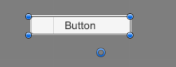

# RectTransform和Anchor

Unity的UI组件，使用RectTransform而不是我们通常使用的Transform，它和Anchor配合使用能够实现适合游戏的复杂、跨屏幕兼容的UI布局。

Anchor（UI锚点）是UGUI中一个比较特殊的概念，UGUI和我们以往使用的各种GUI框架（Android、Qt、Web等）都不一样，多出一个用于UI组件的布局Anchor的概念。它理解起来比较复杂，但其实使用非常简单。

## Anchor

为了方便理解，我们可以建立这样一个结构：

Canvas下创建一个Panel，一个Button作为Panel作为子组件。锚点的作用是受直接父组件影响的，因此这样我们可以任意调节Panel的大小，来观察Button的锚点对其影响。

对于上面的例子，锚点形成的矩形其实可以看做Button的一个子组件，当父组件发生缩放（或Canvas处于不同比例和大小的屏幕下）时，将基于Anchor矩形的长宽和位置来控制Button将被如何缩放和改变位置。

这里我就不具体用语言描述了，我们可以在Unity中进行测试来直观的理解。

在RectTransform左上角，它内置了一些Anchor的预设布局，我们可以直接选用。

## Pivot中心点

在RectTransform还有一个Pivot属性，它代表UI组件的中心点。Pivot默认在UI组件的中心，它用来指定UI组件的旋转中心。

在顶部工具栏中，将Center模式改为Pivot模式，我们就可以通过拖动修改UI组件的中心点了。

