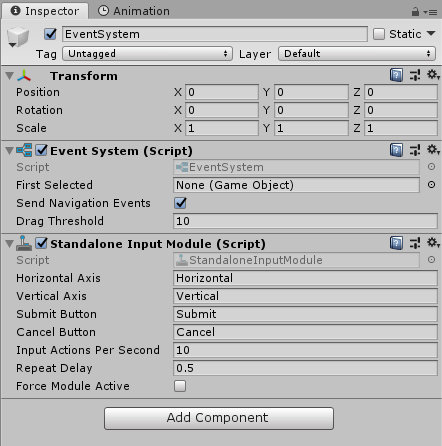
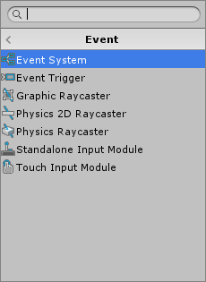
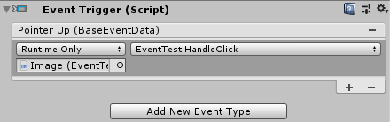
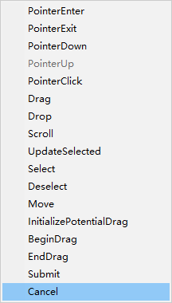
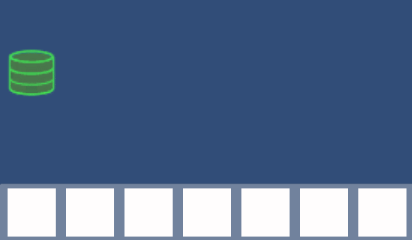
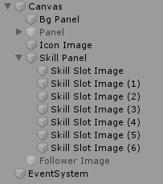
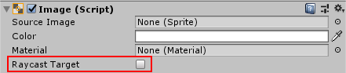
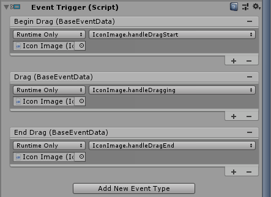
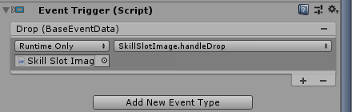
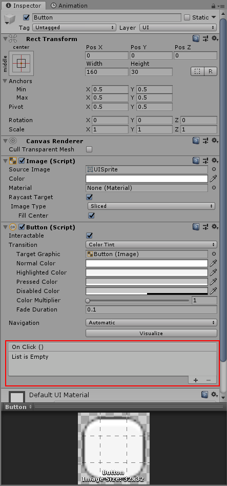

# 事件系统

UGUI是基于事件的GUI系统，无论是内置的UI组件，还是我们自定义的一些交互，都需要借助UGUI的事件系统来表达。

## 事件系统相关的组件

我们在场景中放入一个UI组件后，会发现Unity编辑器自动为我们创建了一个`EventSystem`对象，它相当于UI系统的一个事件管理器。该对象组件上有一些配置项，不过我们一般都不需要修改。



在组件中，有一个Event分类，其中包含了和UGUI事件系统相关的组件。



* Event System：事件管理器，配置在`EventSystem`对象上
* Event Trigger：事件触发器，放置在物体上可以用来监听一种或多种事件（经常使用）
* Graphic Raycaster：UI组件的射线检测相关设置，配置在`Canvas`上
* Physics2D Raycaster：2D游戏对象的射线检测相关设置，配置在`Canvas`上
* Physics Raycaster：游戏对象的射线检测相关设置，配置在`Canvas`上
* Standalone Input Module：键盘鼠标输入系统，配置在`EventSystem`对象上
* Touch Input Module：触屏输入系统，配置在`EventSystem`对象上

## Event Trigger的使用

我们编写UI时，涉及最多的内容就是绑定监听器触发事件，之前介绍的组件中，最常用的其实就是`Event Trigger`。下面例子中，我们使用`Event Trigger`组件，为一个`Image`控件绑定点击事件的回调（`Image`默认不响应任何事件）。



如图所示，我们在`Image`上面，增加了一个`Event Trigger`组件，然后为其配置了一个回调函数。

```csharp
public void HandleClick() 
{
    Debug.Log("target clicked");
}
```

注意：回调函数必须为`public`，至多有一个参数，不能有返回值。

## 事件类型

Unity中，内置了如下所示的事件类型：



前面例子中，我们使用的`PointerUp`，会在鼠标抬起时触发。其他触发类型都比较好理解，参考文档即可，这里就不多介绍了。

## Drag&Drop例子

这里我们实现一个将图标拖拽进技能栏的例子，效果如图：



创建的UI对象如图所示：



IconImage是我们拖拽的起始图标，FollowerImage是跟随鼠标的临时对象，SkillSlotImage则是真正存储拖拽结果的地方。

FollowerImage.cs
```csharp
using System.Collections;
using System.Collections.Generic;
using UnityEngine;
using UnityEngine.UI;

public class FollowerImage : MonoBehaviour
{

    private Image image;
    private RectTransform rectTransform;

    void Awake()
    {
        this.image = GetComponent<Image>();
        this.rectTransform = GetComponent<RectTransform>();
    }

    public void Init(Sprite sprite)
    {
        image.sprite = sprite;
    }

    public void FollowMousePos()
    {
        rectTransform.position = Input.mousePosition;
    }

    public void HideSelf()
    {
        gameObject.SetActive(false);
    }
}
```

上述脚本附加在`FollowerImage`对象上，它提供了三个方法供外部调用，分别是：初始化自己的图片、自己跟随鼠标、隐藏自己。



注意：我们这里为`FollowerImage`对象增加了一个`Canvas Group`属性，并调整`Blocks Raycasts`为`false`，使得射线检测跳过该组件，如果不这样做，那么我们拖动过程中，`FollowerImage`会一直挡在鼠标下面，导致`SkillSlotImage`的`drop`事件永远也不会被触发。其他一些特殊的UI效果也可能遇到类似的问题，解决方法都是相同的思路。

IconImage.cs
```csharp
using System.Collections;
using System.Collections.Generic;
using UnityEngine;
using UnityEngine.UI;

public class IconImage : MonoBehaviour
{
    public GameObject followerImage;
    private FollowerImage fi;
    private Image image;

    void Awake() 
    {
        this.image = GetComponent<Image>();
        this.fi = followerImage.GetComponent<FollowerImage>();
    }

    public void handleDragStart() 
    {
        followerImage.SetActive(true);
        fi.Init(this.image.sprite);
        fi.FollowMousePos();
    }

    public void handleDragging() 
    {
        fi.FollowMousePos();
    }

    public void handleDragEnd() 
    {
        fi.HideSelf();
    }
}
```

上面脚本附加在`IconImage`对象上，分别提供了三个方法，供拖拽开始、拖拽中、拖拽结束回调。



这个对象的逻辑其实很简单，拖拽开始时，激活`FollowerImage`，拖拽中，不停调用`followerImage.FollowMousePos()`使它跟随鼠标，拖拽结束隐藏`FollowerImage`。

SkillSlotImage.cs
```csharp
using System.Collections;
using System.Collections.Generic;
using UnityEngine;
using UnityEngine.UI;

public class SkillSlotImage : MonoBehaviour
{
    public GameObject followerImage;

    private Image image;

    void Awake()
    {
        this.image = GetComponent<Image>();
    }

    public void handleDrop()
    {
        Image fiImage = followerImage.GetComponent<Image>();
        image.sprite = fiImage.sprite;
    }
}
```



上面脚本附加在`SkillSlotImage`对象上，它负责接收`drop`事件，当该事件触发时，将自己的图标供更改为`FollowerImage`的图标。

## 内置UI组件的事件

学习了UGUI事件系统相关知识后，在使用UGUI内置的`Button`按钮等控件时，其实就轻车熟路了。



有关UGUI内置组件，将在后续章节详细介绍。
