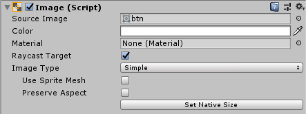

# Image组件

UGUI中，`Image`是个相当常用的组件，它直接和UI控件的外观相关，像`Button`、`Dropdown`等控件对象，都是可以基于`Image`组件来调整外观的，这篇笔记我们来详细学习一下。

## Image属性介绍

Image中，和显示相关的属性包括图片（Sprite）、颜色（会和图片叠加显示）、UI材质。

Raycast Target可以指定该图片的非透明像素是否会影响射线检测。上一节中，我们遇到了鼠标拖拽的UI控件挡住了后面控件的点击检测，就是通过设置这个属性解决的。

## ImageType

`Image`组件提供了4种类型：

* Simple：默认模式
* Sliced：九宫格（9patch）模式，图片会按照九宫格模式缩放，使用该模式前，需要先将图片（Sprite）用Sprite Editor编辑出九宫格，这个最为常用
* Tiled：瓦片模式
* Filled：填充模式

### Sliced

Sliced模式是GUI开发中非常常见的一种背景图填充模式，Unity中使用Sprite Editor能够轻松划分所需要的九宫格。

导入图片后，我们将其切换为Sprite模式，点击Sprite Editor即可编辑。

### Filled

Filled模式很有意思，它可以选择横向、纵向或者角度填充模式，并设定填充比例。

图中，我们设定了`Radial 360`的填充模式，它可以实现类似RPG游戏中的技能冷却的效果。
