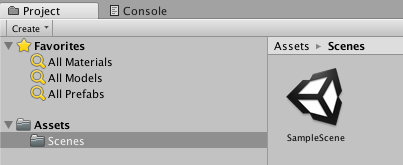

# 游戏场景 Scene

Scene（场景）这个概念比较好理解，就像是一个游戏的场景或是一个关卡。相当于Game Maker Studio里的Room，RPG Maker里的一张地图。

新建一个3D工程后，编辑器会自动创建一个Scenes文件夹，以及一个默认的场景。

我们所做的工作，其实就是在一个场景上添加各种物件，实现各种游戏逻辑。做完一个场景后，不要忘记点击保存（或按Ctrl+S）。通常，我们做的游戏会有多个场景。
