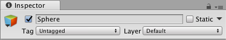
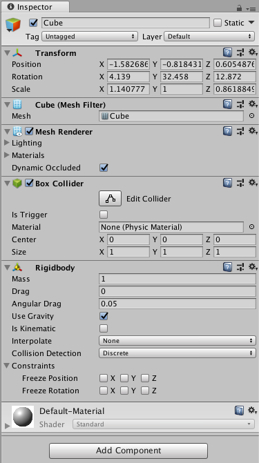

# 游戏对象和组件

## Gamebject 游戏对象

Unity编辑器中，GameObject（游戏对象）是最重要的概念。不仅游戏中的摆放的物体是GameObject，光源，声音源等都是Gamebject。

创建一个Scene后，有两个默认的GameObject，光源和摄像机。

### 激活和取消激活GameObject

我们可以通过图中勾选，选择是否激活某个Gamebject。未激活的对象在游戏中会处于“暂时消失”的状态，实际并没有销毁。代码中，我们可以通过读取GameObject的`activeSelf`属性得到某个对象是否激活。

注意：假设A有子物体B，现在A被设置为非激活状态，场景中的A和B就都消失了。然而，如果在代码中访问`B.activeSelf`，其值仍为`True`，在Unity编辑器里选中子对象，他也仍是打勾状态。

### GameObject名字和标签（tag）

每个GameObject都有一个名字，脚本中我们可以通过`GameObject.Find()`函数，通过游戏对象的名字进行查找，获取游戏对象的引用。

我们可以给若干个游戏对象附加一个tag（标签），表示一种类型的对象。在脚本中，可以使用`Gamebject.FindWithTag()`和`GameObject.FindGameObjectsWithTag()`，返回一个GameObject或是GameObject数组。

### static GameObject

我们可以把静止不变的Gamebject设置为static，这样的好处是可以提高图形绘制时的性能。Unity引擎运行时会检查“static”的物体，并在操作时尽量进行批处理。

## Component 组件

一个Gamebject可以包含多个Component，根据我们要创建什么样的对象，就应添加对应的组件。比如需要用到物理系统的对象，就要添加刚体组件（Rigidbody），需要碰撞检测的组件，就要添加碰撞盒（Collider）。每种组件都有一组属性，通过组合这些组件和调节组件的属性，我们就能定制出我们想要的GameObject了。

一个Cube的例子：

我们可以看到`Mesh Filter`和`Mesh Renderer`，这两个组件说明了在三维空间中该画出怎样的形状。`Box Collider`决定如何进行碰撞检测。我们手动添加了`Rigidbody`，这样物理引擎就会作用于我们的Cube。除此之外，一个GameObject必须有一个`Transform`组件，它代表着该GameObject在三维空间中的位置和旋转、缩放状态，它是没法移除的。

Unity内置了大部分常用的组件，我们也可以编写我们自己的组件。

### 组件的属性

实际上，Component就是一个类，里面的参数就是这个类的属性，最常见的属性就是一个值，比如布尔类型或是数字（整形或浮点数）。其次，也可以包含引用类型，这些引用可以用拖拽的方式赋值，非常的方便。

## prefab 预制体

创建和编辑GameObject涉及到一个复用的问题，比如游戏中有若干个NPC，它们有些相似的属性，那么我们难道还要一个一个去从零编辑他们的属性吗？此时，我们可以创建一个prefab。将一个GameObject拖到下面的文件夹里，就可以创建prefab了。把prefab拖进场景，即可创建新的GameObject。注意，修改了prefab的属性会反映到所有该prefab生成的GameObject，但GameObject单独编辑不会对其他对象和prefab有任何影响。

prefab的另一个用处是方便用脚本批量生成物体，比如打出去的子弹，我们不可能把子弹在游戏一开始就放到场景里，而是使用脚本生成的，我们可以使用`Object.Instantiate()`来通过prefab生成游戏对象。
