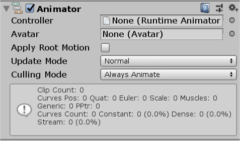
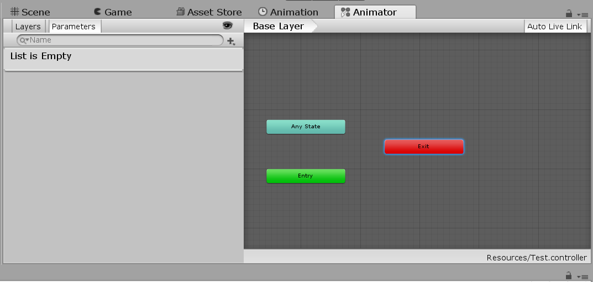
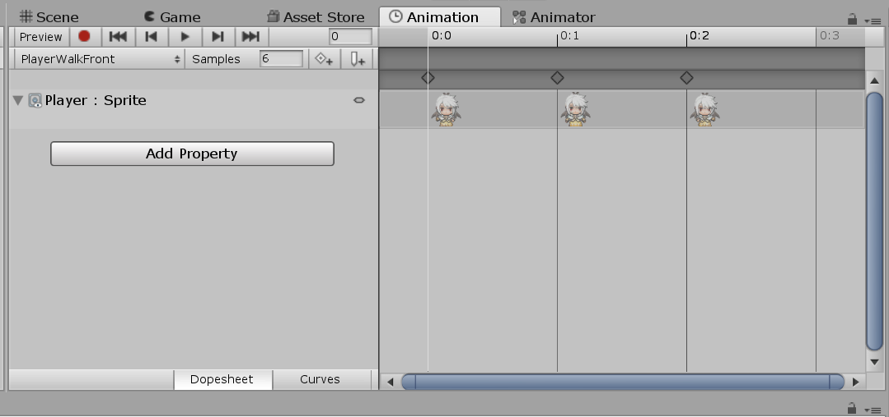
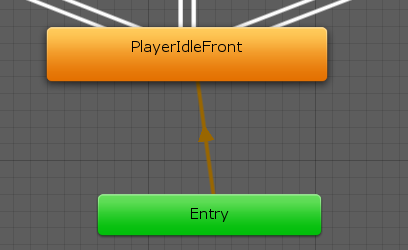
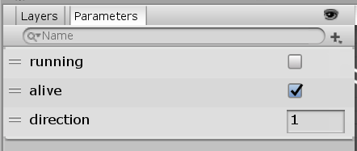
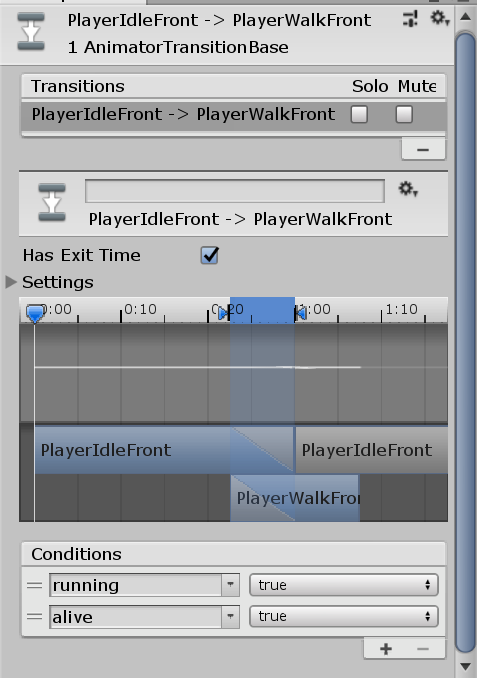
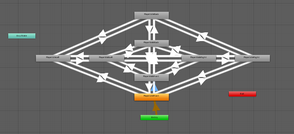

# Animator 动画状态机

无论是2D还是3D游戏，动画都是必不可少的。2D中，动画可能是序列帧，或是某个Sprite（精灵）的位移、旋转、缩放，甚至2D骨骼动画，3D中可能是模型录制好的骨骼动画。以2D序列帧动画为例，一个角色有向左跑、向右跑等动作，因此有许多组序列帧，因此Unity引入了动画状态机的概念。

Animator包含了一个用于控制动画的有限状态机，我们可以通过几个parameter触发动画播放状态之间的状态转移，也可以直接通过代码调用一个状态。下面例子中，我们分别演示这两种方式，在一个2D的Sprite上实现动画效果。

## 创建Sprite和Animator组件

我们可以把一个Sprite拖进Scene视图，然后点击`Add Component`按钮，给这个Sprite添加一个`Animator`组件。拥有Animator的Sprite，其`Sprite Renderer`组件里配置的Sprite图像在运行时就没有效果了，取而代之的是动态的动画效果。



## Animator所需的两种文件


Animator需要两种文件，一个是`Animator Controller`（左侧图标，保存动画状态机配置的文件），一个是`Animation Clip`（右侧图标，保存一个动画的文件）。

在Project视图中，我们可以右键创建一个`Animator Controller`。



上图是Animator视图，用于动画状态机配置，我们每创建一个`Animation Clip`，都会在其中代表一个动画状态，我们可以通过配置动画之间的转移条件实现动画。



上图是Animation视图，用于创建序列帧动画。点击`Create New Clip...`，Unity要求我们保存为一个动画文件，然后选中几个序列帧图片拖进去，这样就很方便的创建了一个序列帧动画。创建位移/缩放/旋转动画也很方便，选择一个关键帧，点击左上角红色圆点按钮，直接在Scene中改变Sprite，所做的改变就会自动记录到关键帧中，Unity会自动创建补间动画。

注意：Animation面板中的操作必须在Scene中，选中被附加动画的GameObject时才有效

* Samples：采样率，即指定一秒多少帧，一次采样对应右侧时间轴的一个刻度



创建好若干了Clip后，Animator视图中会显示响应的状态，在状态上右键，选择`Make Transition`，即可创建动画状态机的状态转移。



在Animator视图左侧，可以看到参数设置，状态转移就是通过这些参数实现的。



选择一个状态转移（就是那些带箭头的线），在Inspector视图中，我们可以配置触发状态转移的参数。

* Has Exit Time：状态转移触发后的延迟

## 设置状态机参数

这里演示如何在脚本中设置状态机参数，以触发状态转移。

获取Animator组件：

```csharp
Animator animator = GetComponent<Animator>();
```

设置动画状态机参数：

```csharp
animator.SetInteger("direction", direction);
animator.SetBool("running", running);
animator.SetBool("alive", alive);
```

## 直接调用某个状态

有时候我们不希望通过设置状态机参数触发状态转移实现动画切换，而是希望直接通过代码调用某个动画。这种情况很常见，比如玩家4方向行走序列帧，共有4方向，行走/停止8个动画，几乎每两个动画之间都有状态转移关系，如果设置动画状态机就要拖拽64条转移线（实际情况肯定不止8个动画），这太麻烦了，这种情况说白了就是控制流程根本就不是个状态机。强行使用状态机，最后结果很可能搞成如下图所示的样子：



而且一运行还特么有bug！这种情况下，最好我们手动调用某个动画，而不是通过状态转移控制动画。

直接调用动画状态实现主角四方向行走的代码：

```csharp
using System.Collections;
using System.Collections.Generic;
using UnityEngine;

public class PlayerControl : MonoBehaviour {

    private Animator animator;

    private int direction = 1;
    private bool running = false;

    void Start()
    {
        animator = GetComponent<Animator>();
    }

	void Update ()
    {
		if(Input.GetAxis("Horizontal") > 0)
        {
            //向右
            direction = 4;
            running = true;
        }
        else if(Input.GetAxis("Horizontal") < 0)
        {
            //向左
            direction = 3;
            running = true;
        }

        if (Input.GetAxis("Vertical") > 0)
        {
            //向上（back）
            direction = 2;
            running = true;
        }
        else if (Input.GetAxis("Vertical") < 0)
        {
            //向下（front）
            direction = 1;
            running = true;
        }

        if(Input.GetAxis("Horizontal") == 0 && Input.GetAxis("Vertical") == 0)
        {
            //无行走操作
            running = false;
        }

        //调用动画
        if(running)
        {
            if(direction == 1)
            {
                animator.Play("PlayerWalkFront");
            }
            else if (direction == 2)
            {
                animator.Play("PlayerWalkBack");
            }
            else if (direction == 3)
            {
                animator.Play("PlayerWalkLeft");
            }
            else if (direction == 4)
            {
                animator.Play("PlayerWalkRight");
            }
        }
        else
        {
            if (direction == 1)
            {
                animator.Play("PlayerIdleFront");
            }
            else if (direction == 2)
            {
                animator.Play("PlayerIdleBack");
            }
            else if (direction == 3)
            {
                animator.Play("PlayerIdleLeft");
            }
            else if (direction == 4)
            {
                animator.Play("PlayerIdleRight");
            }
        }

        Debug.Log(direction);
        Debug.Log(running);
    }
}
```
