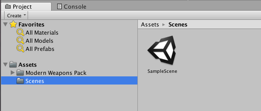

# Project视图

Project视图中，我们可以管理整个项目的文件目录结构，比如我们的项目中引用的模型、贴图等资源，各种资源会有相应的图标显示。

在Project视图右上角，可以看到搜索功能，我们可以输入关键字进行搜索，支持输入多个关键字。除此之外，后面两个按钮`Search by Type`和`Search by Label`可以进一步对搜索进行定制，分别对应搜索关键字中`t:`和`l:`，在资源较多时，搜索是比较方便的功能。
